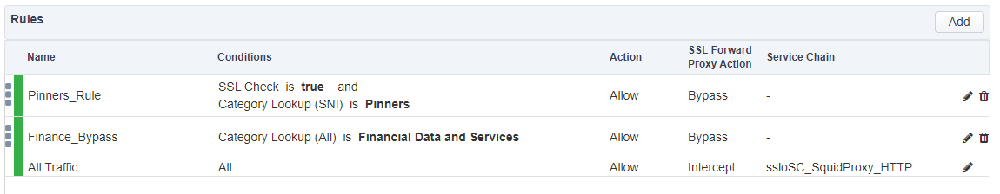

.. role:: red
.. role:: bred

Review the current SSL Orchestrator deployment
================================================================================

-  Start a TMUI session on **SSL Orchestrator** and log in (*Components > SSL Orchestrator > ACCESS > TMUI*)

      `Link to user credentials (if needed) <../labinfo.html>`_

-  Select **SSL Orchestrator** from the left-hand menu and then click on **Configuration**. When the SSL Orchestrator dashboard finishes loading, the following deployment should already be present.

   |config-dashboard|

-  Select **Security Policies** from the horizontal menu. You should now be presented with following screen:

   |security-policy-overview|

   -  Click on **ssloP\_f5labs\_explicit** (in the **Name** column) and you will see the rules that are currently configured under this security policy.

   |initial-security-policy|

.. |config-dashboard| image:: ../images/config-dashboard.png
   :alt: SSL Orchestrator Configuration Dashboard

.. |security-policy-overview| image:: ../images/security-policy-overview.png
   :alt: Security Policy Overview

