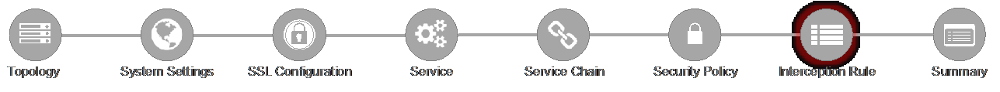

.. role:: red
.. role:: bred

Lab 1.10: Egress Setting
------------------------

Traffic egress settings are now defined per-topology and manage both the
gateway route and outbound SNAT settings.

- **Manage SNAT Settings** - enables per-topology instance SNAT settings. For
  this lab, select :red:`Auto Map`.

- **Gateways** - enables per-topology instance gateway routing. Options are
  to use the system default route, to use an existing gateway pool, or to
  create a new gateway. For this lab, select :red:`Create New`.

- **IPv4 Outbound Gateways** - when creating a new gateway, this section
  provides the ratio and gateway address settings.

- **Ratio** - multiple gateway IP addresses are load balanced in an LTM pool,
  and the ratio setting allows SSLO to proportion traffic to the gateway
  members, as required. A ratio on 1 for all members evenly distributes the
  load across them. For this lab, select 1.

- **Address** - this is the next hop gateway IP address. For this lab, enter
  :red:`10.30.0.1`.

- Click :red:`Save & Next`.
