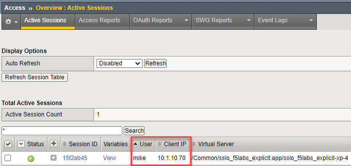

.. role:: red
.. role:: bred

Verify that user information is being identified on the F5 SSL Orchestrator
================================================================================

1.  On the **Windows Client**, use Chrome to browse to ``https:\\www.f5.com``.

2.  On SSL Orchestrator select, **Access > Overview > Active Sessions** from the Main menu on the left.
  
   You should now see an active session similar to the example below.

   |active-sessions-mike|

.. tip::

   Click the **Refresh Session Table** button if the table is empty

3.  Click on the **View** link to the left of the username you are logged in with to see more attributes associated with that user's access session, including attributes retrieved from Active Directory, such as: memberOf, sAMAccountName, and userPrincipalName.

   |session-variables-mike|

.. |session-variables-mike| image:: ../images/session-variables-mike.png
   :alt: Mike's Session Variables