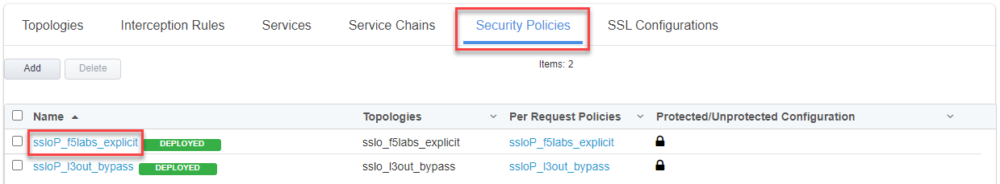
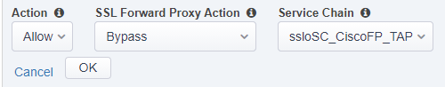
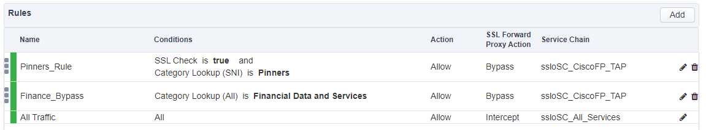

.. role:: red
.. role:: bred

Update Service Chains on existing Security Policy rules
================================================================================

Update the existing Security Policy rules to use the new Service Chains you just created.

From the SSL Orchestrator Configuration screen:

-  Click on **Security Policies** from the horizontal menu.

-  Click the Security Policy named **ssloP\_f5labs\_explicit**.

   |security-policy-overview|

   |

-  Click on the pencil icon (|pencil|) next to the **Pinners\_Rule** to modify this rule.

-  In the properties section that appears, select **ssloSC\_CiscoFP\_TAP** from the **Service Chain** dropdown.

-  Click the **OK** button to accept the change.

   |policy-rule-CiscoFP-TAP|

   |

-  Now edit the **Finance\_Bypass** rule. Click on the pencil icon (|pencil|) to modify this rule.

-  In the properties section that appears, select **ssloSC\_CiscoFP\_TAP** from the **Service Chain** dropdown.

-  Click the **OK** button to accept the change.

   |

-  Now edit the **All Traffic**. Click on the pencil icon (|pencil|) to modify this rule.

-  In the properties section that appears, select **ssloSC\_All\_Services** from the **Service Chain** dropdown.

-  Click the **OK** button to accept the change.

   |

-  The Security Policy rules should now look like this:

   |updated-security-policy|

-  Click the **Deploy** button.

-  On the pop-up dialog, click the **OK** button to confirm that you want to make the changes.

-  When successfully deployed, click the **OK** button to return to the SSL Orchestrator Configuration screen.

.. |pencil| image:: ../images/pencil.png
   :width: 20px
   :height: 20px
   :alt: pencil

