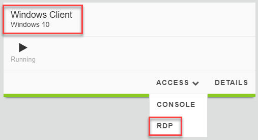

.. role:: red
.. role:: bred

Verify authentication is currently disabled
~~~~~~~~~~~~~~~~~~~~~~~~~~~~~~~~~~~~~~~~~~~~~~~~~~~

-  Start a TMUI session on **SSL Orchestrator** and log in if prompted **Components > SSL Orchestrator > ACCESS > TMUI**)

-  From the Main menu on the left, select **Access > Overview > Active Sessions**. The following screen should appear. You should see an **Active Session Count** of **0** and that there are no sessions listed in the table.

   |active-sessions-none|

|

.. important::

   For this lab exercise, you will be using the :bred:`WINDOWS CLIENT` machine instead of the Ubuntu18.04 Client machine
   that you used in the other lab exercises.

-  Start an RDP session to the **Windows Client** (**Components > Windows Client > ACCESS > RDP**)

-  Login in as user: ``F5LABS\mike``

-  Enter password: ``agility``
  
-  Using Firefox, browse to various websites.

-  Refresh the previously shown TMUI screen. You should still see an **Active Session Count** of **0**.

.. |active-sessions-none| image:: ../images/active-sessions-none.png
   :width: 639px
   :height: 330px
   :alt: Active Sessions (None)
