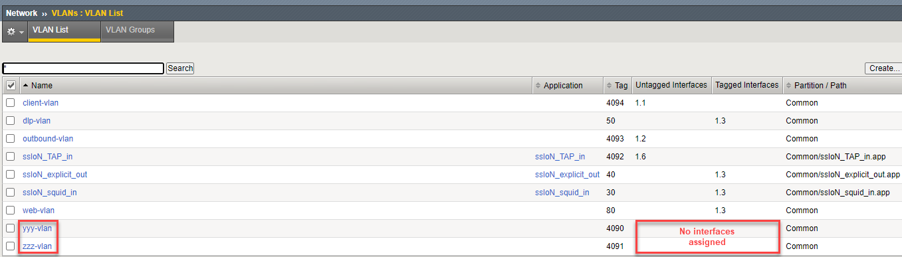

.. role:: red
.. role:: bred

Create Two Empty VLANs
================================================================================

A topology must be bound to a unique VLAN. Since the layer topologies won't be listening on actual client-facing VLANs, you will need to create a separate empty VLAN for each topology you intend to create. An empty VLAN has no interfaces assigned.

1. Navigate to **Network > VLANs** and click on the **Create** button to add a new VLAN.

2. Name this VLAN:  ``zzz-vlan`` and then click on **Repeat**. Do not select any interfaces.

   .. image:: ../images/create-vlan.png
      :alt: Empty VLAN

3. Since you are not attaching any interfaces to this VLAN, you will receive a confirmation pop-up.

   .. image:: ../images/vlan-confirm-empty.png
      :alt: Empty VLAN Confirmation

4.  Click on **OK** to continue.

5. Since we clicked **Repeat**, we are automatically ready to create the second empty VLAN.

6. Name this VLAN:  ``yyy-vlan`` and then click on **Finished**.

7. Since you are not attaching any interfaces to this VLAN, you will receive a confirmation pop-up. Click on **OK** to continue and return to the VLAN List.

|

