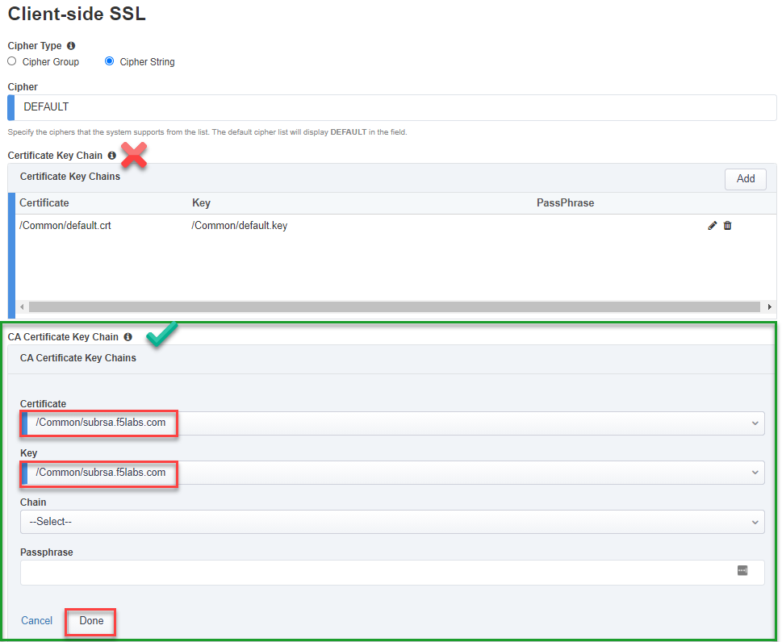
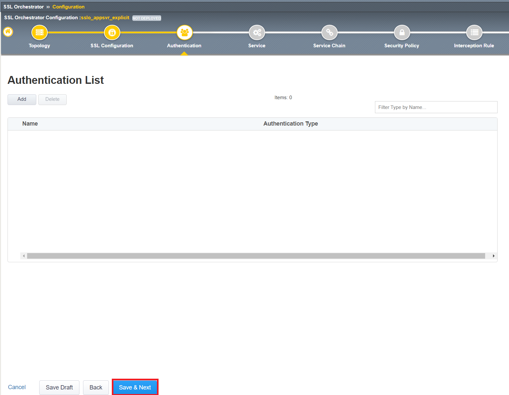
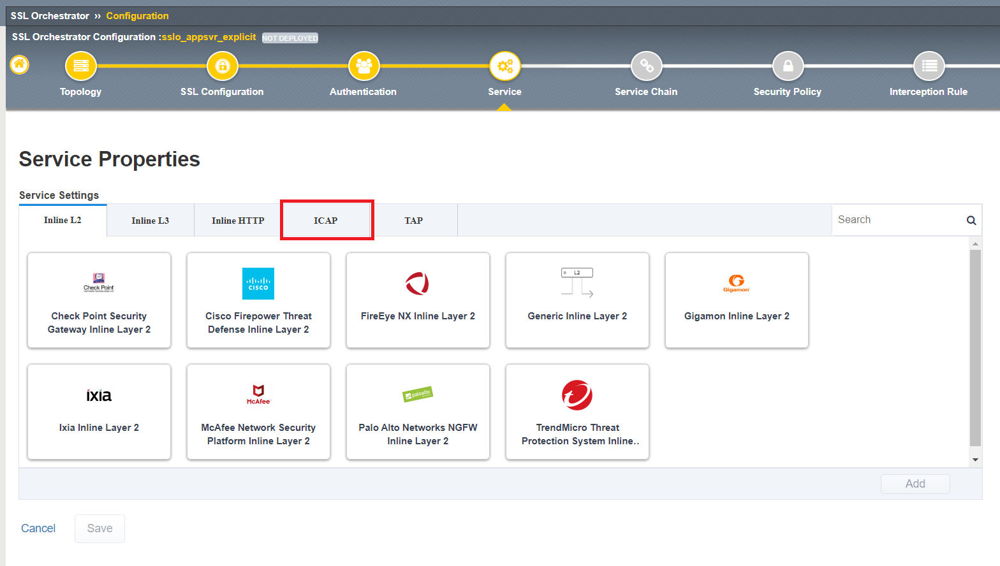
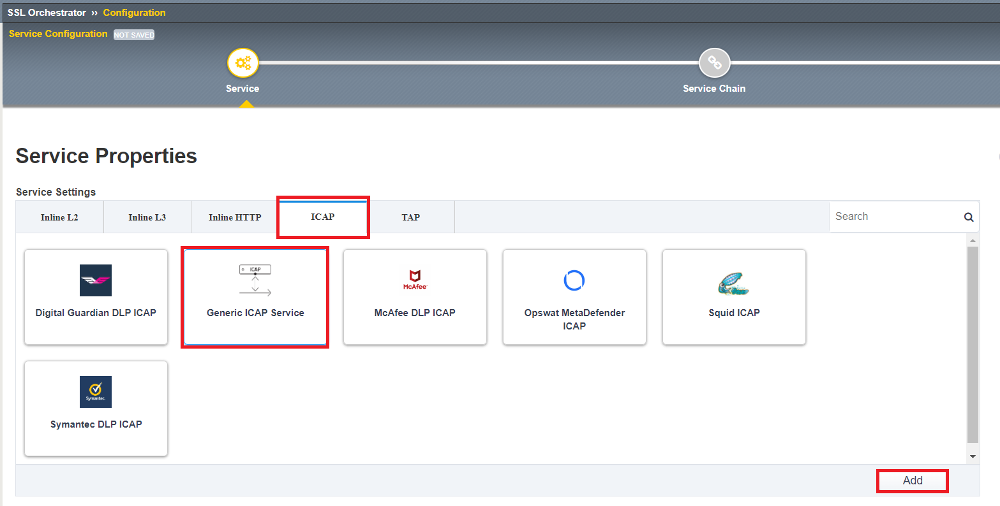
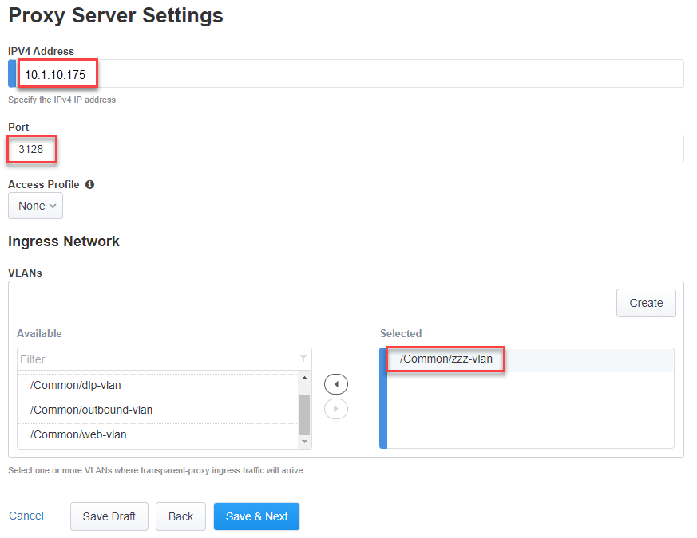
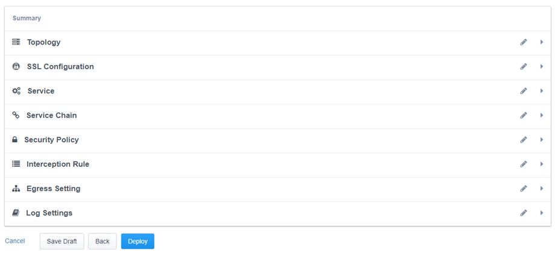
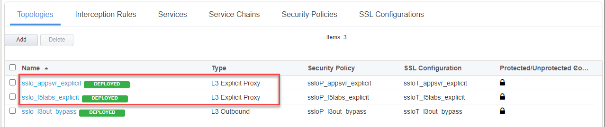

.. role:: red
.. role:: bred

Create Secondary Topology
================================================================================

You will need to add an L3 Explicit topology for the outbound application server traffic. This topology will decrypt TLS and send traffic to a service chain consisting of:

   #. New ICAP-based antivirus service
   #. Existing Cisco Firepower TAP service

L3 Explicit Topology
------------------------

1.  Navigate to **SSL Orchestrator > Configuration** and **Add** a new topology.

2.  Scroll to the bottom of the Configuration introduction page and click on the **Next** button.

3.  Enter ``appsvr_explicit`` as the topology name. Ensure that the name is entered exactly as shown because it will be referenced in a later step.

4.  Select the **L3 Explicit Proxy** topology type.

.. image:: ../images/l3-explicit-topology.png
   :alt: L3 Explicit Proxy

5.  Click the **Save & Next** button to continue.

SSL Configurations
-------------------

6.  In the **CA Certificate Key Chain** section, click on the pencil icon to edit.

7.  Select **subrsa.f5labs.com** for both **Certificate** and **Key**.

.. warning:: 
   Ensure that you are editing the **CA Certificate Key Chain** shown above, not the *Certificate Key Chain*.  They look very similar.

8.  Click **Done**. The **SSL** settings have now been configured.

|

9.  Click the **Save & Next** button to continue.

Authentication List
--------------------

This section allows you to add Online Certificate Status Protocol (OCSP) Responders to validate the revocation status of a digital certificate. Since we are not using certificate-based authentication in this lab, we will skip this section and click **Save & Next** at the bottom of the page.

ICAP service
---------------

10.  On the **Services List** screen, click the **Add Service** button.

11.  Click  **ICAP** under the **Service Settings** heading

12.  Select **Generic ICAP Service** and click the **Add** button

13.  On the **Service Properties** screen, enter the following values:

   -  Enter ``CLAM_AV`` in the **Name** field.

   -  Enter ``ClamAV`` in the **Description** field.

   -  In the **ICAP Devices** section, click on the **Add** button.

   -  Enter ``198.19.97.50`` in the **IP Address** field.

   -  Leave the **Port** set to ``1344`` (default for ICAP).

   -  Click on **Done** to add the ICAP device.
   
   -  Enter ``/avscan`` in the **Request Modification URI Path** field.
   
   -  Enter ``/avscan`` in the **Response Modification URI Path** field.

   -  Enter ``1048576`` in the **Preview Max Length(bytes)** field.  

   .. image:: ../images/internal-layered-new-sc.png
      :alt: ICAP Service
      :align: left

   .. image:: ../images/service-icap-3.png
      :alt: ICAP Service
      :align: left

   -  Click **Save** to return to the **Services List**.

.. image:: ../images/services-after-icap.png
   :alt: Services List After Adding ICAP
   :align: left

14.  Click the **Save & Next** button to continue.

Service Chain
----------------

You now need to create a new Service Chain containing the CLAM_AV and Cisco Firepower TAP services.

15.  On the **Services Chain List** screen, click the **Add** button.

16.  On the **Services Chain Properties** screen, enter the following values:

   -  Enter ``CAV_CiscoFP`` in the **Name** field.

   -  Enter ``ClamAV and Cisco Firepower TAP`` in the **Description** field.

   -  **Services -** select the **CLAM_AV** and **CiscoFP** services under **Services Available** and move them to **Selected Service Chain Order**

   .. image:: ../images/internal-layered-new-sc.png
      :alt: New service chain for Clam AV and Cisco Firepower TAP
      :align: left

17.  Click the **Save** button to return to the **Service Chain List**.

18.  Click the **Save & Next** button to continue.

Security Policy
-----------------

You now need to create a new Security Policy for the **appsvr_explicit** topology.

19.  On the **Security Policy** screen, modify the **All Traffic** rule by clicking on the pencil icon.

20.  Select the **ssloSC\_SC\_CAV\_CiscoFP** Service Chain.

21.  Click the **OK** button.

.. image:: ../images/internal-layered-policy.png
   :alt: New security policy for application server traffic
   :align: left

22.  Click the **Save & Next** button to continue.

Interception Rule / Proxy Server Settings
-------------------------------------------

23.  Skip down to the **Proxy Server Settings** section.

24.  Enter ``10.1.10.175`` in the  **IPV4 Address** field.

   .. note::
      An IP address is required for an explicit proxy configuration, but it won't actually be referenced in this design since it is associated with an empty VLAN.

25.  Leave the **Port** set to ``3128`` (default value).

26.  In the **VLANs** section, select the **/Common/zzz-vlan** VLAN and and move it to Selected column.

27.  Click the **Save & Next** button.

Egress Settings
-----------------

28.  On the Egress Settings screen, select **Auto Map** in the **Manage SNAT Settings** field.

.. image:: ../images/internal-layered-egress.png
   :alt: 
   :align: left

29.  Click the **Save & Next** button.

Log Settings
--------------

30.  On the Log Settings screen, leave all the default values.

.. image:: ../images/internal-layered-log.png
   :alt: 
   :align: left

-  Click the **Save & Next** button to continue.

Summary
----------

31.  Click the **Deploy** button.

32.  When successfully deployed, click the **OK** button to return to the SSL Orchestrator Configuration screen.

You should now have two L3 Explicit topologies. The third topology is an L3 Outbound (transparent) topology that is not applicable to this lab exercise.

