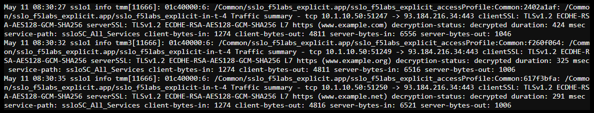

.. role:: red

Enabling SSL Orchestrator connection summary logging
~~~~~~~~~~~~~~~~~~~~~~~~~~~~~~~~~~~~~~~~~~~~~~~~~~~~

Before enabling connection summary logging, view the logging activity when all SSL Orchestrator logging facilities are set to their default value of Error:

- Start a Web Shell to **SSL Orchestrator** (Components > SSL Orchestrator > ACCESS > Web Shell)

- Type the following command to watch for new output in /var/log/apm:

.. code-block:: bash
  
   tail -f /var/log/apm

- In another window/tab, start an RDP session to the **Windows 10 Desktop** *(Components > Windows 10 Desktop > ACCESS > RDP)*

- Open **Firefox** and browse to a few websites

- You shouldn't see any connection summary information at this point

To enable SSL Orchestrator connection summary logging perform the following procedure:

- Start a TMUI session to **SSL Orchestrator** and log in if prompted *(Components > SSL Orchestrator > ACCESS > TMUI)*

- From the Main menu on the left, select **SSL Orchestrator > Configuration**

- Click on the existing topology (:red:`sslo_f5labs_explicit`)

- On the Summary screen that appears, click the edit icon (|pencil|) to the right of **Log Settings**

- From the **SSL Orchestrator Generic** drop down, select :red:`Information`

- Click the **Save & Next** button

- Click the **Deploy** button

- After the you receive confirmation that the deployment was successful return to your **Windows 10 Desktop** RDP session and browse to a few more websites. This time you should see "Traffic summary" messages appearing in the log file, like the example below:

  |sslo-generic-info-log|

.. |pencil| image:: ../images/pencil.png
   :width: 20px
   :height: 20px
   :alt: Pencil Icon
