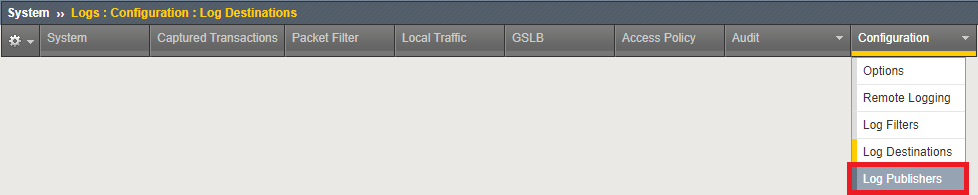
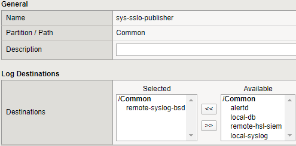

.. role:: red

Sending connection summary log messages to a remote high-speed log server
~~~~~~~~~~~~~~~~~~~~~~~~~~~~~~~~~~~~~~~~~~~~~~~~~~~~~~~~~~~~~~~~~~~~~~~~~

To redirect SSL Orchestrator connection summary logging to a remote high-speed logging server, such as a SIEM, perform the following procedure:

-  Start a TMUI session to **SSL Orchestrator** and log in if prompted *(Components > SSL Orchestrator > ACCESS > TMUI)*

-  From the Main menu on the left, select **System > Logs > Configuration > Log Destinations**

-  On the Log Destinations screen click the **Create...** button

-  In the **Name** field, specify a name (ex. :red:`remote-hsl-siem`)

-  From the **Type** drop down, select :red:`Remote High-Speed Log`

-  From the **Pool Name** drop down, select :red:`siem-hsl-pool`

.. NOTE: This pool contains a single pool member, your Windows 10 Desktop (10.1.10.50:514).

-  From the **Protocol** drop down, select :red:`UDP`

-  Your configuration should look like this:

  |remote-hsl-siem|

-  Click the **Repeat** button to save this Log Destination and create one more

-  In the **Name** field, specify a name (ex. :red:`remote-syslog-bsd`)

-  From the **Type** drop down, change the selection to :red:`Remote Syslog`

-  From the **Forward To** drop down, select the Log Destination you just finished creating (ex. :red:`remote-hsl-siem`)

-  Your configuration should look like this:

  |remote-syslog-bsd|

-  Click the **Finished** button

.. TIP: You should now have two new Log Destinations. The first Log Destination you configured (ex. remote-hsl-siem) specifies the destination pool you want to send log data to. The second Log Destination you configured (ex. remote-syslog-bsd) applies BSD Syslog formatting to your log messages.

- From the horizontal navigation menu hover over **Configuration** and click on **Log Publishers**

  |menu-log-publishers|

-  A list of built-in log publishers should appear. Click on **sys-sslo-publisher**

-  To change the destination from the default "on-box" destination to the remote SIEM, select **local-syslog** from the **Selected** field and click the **>>** button. Then, select **remote-syslog-bsd** from the **Available** field and click the **<<** button. Your publisher should now look like this:

  |sys-sslo-publisher|

-  Click the **Update** button

.. TIP: The sys-sslo-publisher is now configured to send SSL Orchestrator log messages to your "Remote Syslog" Log Destination. This Log Destination formats the log messages in Syslog BSD format and then sends the log messages to a second Log Destination, the "Remote HSL" destination, which sends the log messages off-box to your SIEM (or in this lab, your Windows 10 Desktop).

-  On your Windows 10 Desktop, launch **Kiwi Syslog Server Console** from the desktop

  |kiwi-syslog-icon|

-  Browse to a few websites and you should notice connection summary log data is appearing in the Kiwi console similar to the example below:

  |kiwi-syslog-logs|

.. NOTE: If you don't see logs similar to the example above, check the log settings for the L3 Explicit Proxy topology. SSL Orchestrator Generic should be set to Information, all other facilities should be set to Error.

.. |remote-hsl-siem| image:: ../images/remote-hsl-siem.png
   :width: 415px
   :height: 236px
   :alt: Remote HSL SIEM Log Destination

.. |remote-syslog-bsd| image:: ../images/remote-syslog-bsd.png
   :width: 415px
   :height: 207px
   :alt: Remote Syslog BSD Log Destination

.. |kiwi-syslog-icon| image:: ../images/kiwi-syslog-icon.png
   :width: 74px
   :height: 98px
   :alt: Kiwi Syslog Server Console Icon

.. |kiwi-syslog-logs| image:: ../images/kiwi-syslog-logs.png
   :width: 1008px
   :height: 481px
   :alt: Kiwi Syslog Server Console Logs