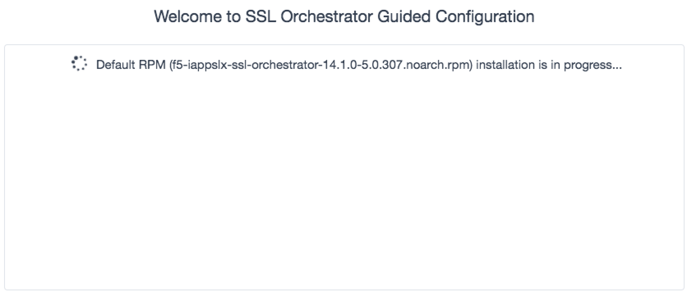
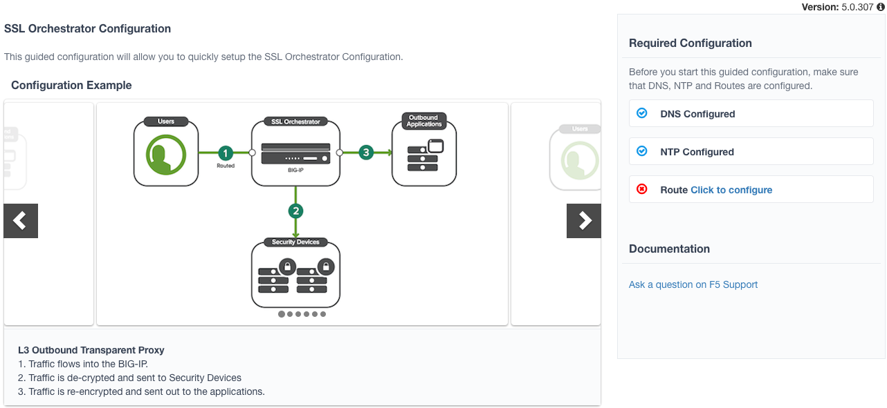
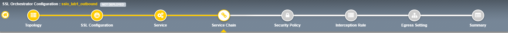
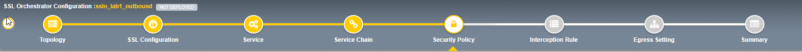
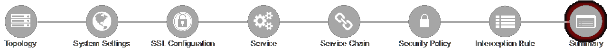

.. role:: red
.. role:: bred

Lab 1 – Create a transparent forward Proxy SSLO
===============================================

The majority of enterprise forward proxy configurations will involve a single
F5 platform performing the SSL visibility task. The SSL Orchestrator has been
designed with that principle in mind and performs robust security service
chaining of security devices attached to a single appliance. SSL Orchestrator
5.0 now makes configuration of a single-box deployment simple and intuitive.
Please follow the steps below to create a transparent forward proxy SSL
Orchestrator configuration.

**Step 1: Review the lab environment and map out the services and endpoints**

Review the “SSL Orchestrator Lab Environment” section above. This lab will
attach one of each type of security service (HTTP, ICAP, L2, L3, TAP) to SSLO
for an outbound forward proxy traffic flow. Afterwards, an internal client will
be able to access remote (Internet) resources through SSLO, providing
decrypted, inspectable traffic to the security services.

- The client is attached to a :red:`10.20.0.0/24` network and is assigned the
  IP :red:`10.20.0.60`. This network is attached to the BIG-IP 1.1 interface.

- The **L2 device** is an Ubuntu 14.04 LTS server configured to bridge its eth1
  and eth2 interfaces. Its inbound VLAN (traffic to it) is attached to the
  BIG-IP :red:`1.6` interface. Its outbound interface (traffic coming from it)
  is attached to the BIG-IP :red:`1.7` interface.

- The **L3 device** is an Ubuntu 14.04 LTS server configured to route between
  its eth1.10 and eth1.20 (tagged) interfaces. Its inbound VLAN (traffic to it)
  is attached to the BIG-IP :red:`1.3 (VLAN tag 30)` interface and has an IP of
  :red:`198.19.64.64/25`. Its outbound interface (traffic coming from it) is
  attached to the BIG-IP :red:`1.3 (VLAN tag 60)` interface and has an IP of
  :red:`198.19.64.130/25`. Its default gateway is :red:`198.19.64.245`, which
  will be a VLAN self-IP on the BIG-IP.

- The **TAP** device is an Ubuntu 14.04 LTS server configured with a single
  eth1 interface. That interface is attached to the BIG-IP :red:`1.4` interface.

- The **DLP/ICAP** device is an Ubuntu 14.04 LTS server configured with a
  single eth1 interface. That interface is attached to the BIG-IP :red:`1.5`
  interface and has an IP of :red:`10.70.0.10 and listening on port 1344`. The
  box is running c-icap and Squid/Clamav.

- The **Explicit Proxy device** is an Ubuntu 14.04 LTS server configured with
  Squid. Its interfaces are eth1.30 and eth1.40 (tagged). Its inbound VLAN
  (traffic to it) is attached to the BIG-IP :red:`1.3 (VLAN tag 110)` interface
  and has an IP of :red:`198.19.96.66/25`. Its outbound interface (traffic
  coming from it) is attached to the BIG-IP :red:`1.3 (VLAN tag 120)` interface
  and has an IP of :red:`198.19.96.136/25`. Its default gateway is
  :red:`198.19.96.245:red:`, which will be a VLAN self-IP on the BIG-IP.

- The outbound network is attached to the BIG-IP :red:`1.2` interface, in the
  :red:`10.30.0.0/24` subnet, and has a gateway of :red:`10.30.0.1`.

- In the lab, client inbound, Internet outbound, and DLP VLANs and self-IPs are
  already created.

**Step 2: Fulfill the SSL Orchestrator prerequisites**

There are a number of objects that SSL Orchestrator does not create and expects
to exist before deploying the iApp. You must create the following objects
before starting the iApp:

- **Import the CA certificate and private key** – in order to terminate and
  re-encrypt outbound SSL traffic, SSL Forward Proxy must re-issue, or rather
  “forge” a new server certificate to the client. In order to perform this
  re-issuance process, the BIG-IP must possess a certificate authority (CA)
  certificate and associated private key. :red:`This lab environment already
  has a subordinate CA certificate and private key installed`.

- **Create the client inbound VLAN and self-IP** – create the VLAN and self-IP
  that connects the client to the BIG-IP. In this lab that’s the
  :red:`10.20.0.0/24` subnet and interface :red:`1.1` on the BIG-IP. This lab
  environment already has this VLAN and self-IP created.

- **Create the Internet outbound VLAN and self-IP** – create the VLAN and
  self-IP that connects the BIG-IP to the outbound Internet router. In this lab
  that’s the :red:`10.30.0.0/24` subnet and interface :red:`1.2` on the BIG-IP.
  :red:`This lab environment already has this VLAN and self-IP created`.

- **Create the DLP VLAN and self-IP** – if it is desired to isolate the
  DLP/ICAP device, create the VLAN and self-IP that connects the DLP device to
  the BIG-IP. In this lab that’s the :red:`10.70.0.0/24` subnet and interface
  :red:`1.5` on the BIG-IP. The DLP security device is listening on
  :red:`10.70.0.10` and ICAP is listening on port :red:`1344`. :red:`This lab
  environment already has this VLAN and self-IP created`.

- **Create the default internet route for outbound traffic** – the iApp
  provides an option to leverage a defined gateway pool or use the system
  default route. If a gateway pool is not used, they system route table will
  need to have a default route used to reach Internet destination. :red:`We’ll
  use a gateway pool defined within SSLO`.

.. note:: As a general rule, avoid using names with dashes (ex. sslo-demo-1)
   while creating objects in SSL Orchestrator. Underscores (ex. sslo\_demo\_1)
   and camel-casing (ex. ssloDemo1) are preferred.

**Step 3: Create the SSL Orchestrator deployment through Guided Configuration**

The SSL Orchestrator Guided Configuration presents a completely new and
streamlined user experience. This workflow-based architecture provides
intuitive, re-entrant configuration steps tailored to the selected
topology.

.. image:: ../images/image3.png

The following steps will walk through the Guided Configuration (GC) to build a
simple transparent forward proxy. 

.. note:: The following provides verbose details on each setting. For a more
   concise set of lab steps, without details, skip to the bottom of this lab
   (Lab 1).

- **Initialization** – if this is the first time accessing SSLO in a new BIG-IP
  build, upon first access, GC will automatically load and deploy the built-in
  SSLO package.

- **Configuration review and prerequisites** – take a moment to review the
  topology options and workflow configuration steps involved. Optionally
  satisfy any of the :red:`DNS, NTP and Route` prerequisites from this page.
  Keep in mind, however, that aside from NTP, the SSLO GC will provide an
  opportunity to define DNS and route settings later in the workflow. No other
  configurations are required on this page, so click :red:`Next`.

.. note:: NTP settings have already been defined in this lab.

.. image:: ../images/image6.png

- **Topology Properties** – SSLO now creates discreet configurations based on
  the selected topology. For example, in previous versions of SSLO, a
  transparent and explicit forward proxy might be defined together. In SSLO
  5.0, these are configured separately. An explicit forward proxy topology will
  ultimately create an explicit proxy listener and its relying transparent
  proxy lister, but the transparent listener will be bound only to the explicit
  proxy tunnel. If a subsequent transparent forward proxy topology is
  configured, it will not overlap the existing explicit proxy objects. The
  Topology Properties page provides the following options:

  The Protocol option presents four protocol types:

  - **TCP** – this option creates a single TCP wildcard interception rule for
    the L3 Inbound, L3 Outbound L3, and L3 Explicit Proxy topologies.

  - **UDP** – this option creates a single UDP wildcard interception rule for
    L3 Inbound and L3 Outbound topologies.

  - **Other** – this option creates a single any protocol wildcard interception
    rule for L3 Inbound and L3 Outbound topologies, typically used for
    non-TCP/UDP traffic flows.

  - **Any** – this option creates the TCP, UDP and non-TCP/UDP interception
    rules for outbound traffic flows.

  The SSL Orchestrator Topologies option page presents six topologies:

  - **L3 Explicit Proxy** – this is the traditional explicit forward proxy.

  - **L3 Outbound** – this is the traditional transparent forward proxy.

  - **L3 Inbound** – this is a reverse proxy “gateway” configuration. In its
    simplest form, this topology builds an SSLO environment designed to sit
    **in front of** another ADC or routed path. Advanced options allow it to
    define a pool for more directed traffic flow, but alone does not provide
    the same flexibility afforded a typical LTM reverse proxy virtual server.
    It also must perform re-encryption on egress. The primary use case for
    this topology is as a gateway SSL visibility solution, potentially
    sitting at a boundary edge in front of multiple internal ADC environments.

  - **L2 Inbound** – the layer 2 topology options insert SSLO as a
    bump-in-the-wire in an existing routed path, where SSLO presents no IP
    addresses on its outer edges. The L2 Inbound topology provides a
    transparent path for inbound traffic flows.

  - **L2 Outbound** – the layer 2 topology options insert SSLO as a
    bump-in-the-wire in an existing routed path, where SSLO presents no IP
    addresses on its outer edges. The L2 Outbound topology provides a
    transparent path for outbound traffic flows.

  .. important:: It is important to distinguish SSLO’s layer 2 topology from
     those of other traditional layer 2 SSL visibility vendors. “True” layer
     2 solutions like Blue Coat’s SSL visibility appliance (SSLVA) limit the
     types of devices that can be inserted into the inspection zone to layer
     2 and below, and devices must be directly connected to the appliance.
     SSLO’s layer 2 topology only exists at the outer edges. Inside the
     inspection zone, full-proxy routing is still happening, so layer 3 and
     HTTP services can still function normally.

  - **Existing Application** – this topology is designed to work with existing
    LTM applications. Whereas the L3 Inbound topology provides an inbound
    gateway function for SSLO, Existing Application works with LTM virtual
    servers that already perform their own SSL handling and client-server
    traffic management. The Existing Application workflow proceeds directly to
    service creation and security policy definition, then exits with an
    SSLO-type access policy and per-request policy that can easily be consumed
    by an LTM virtual server.

.. image:: ../images/image7.png

For this lab:

- **Name**: some name (ex. “demo”)
- **Protocol**: :red:`Any` – this will create separate TCP, UDP and non-TCP/UDP
  interception rules.
- **IP Family**: :red:`IPv4`
- **Topology**: :red:`L3 Outbound`
- Click :red:`Save & Next.`

.. image:: ../images/image8.png

- **SSL Configurations** – this page defines the specific SSL settings for the
  selected topology, in this case a forward proxy, and controls both
  client-side and server-side SSL options. If existing SSL settings are
  available (from a previous workflow), it can be selected and re-used.
  Otherwise the SSL Configurations page creates new SSL settings for this
  workflow. For this lab, create a new SSL profile,

  - **Client-side SSL**

    - **Cipher Type** – cipher type can be a Cipher Group or Cipher String.
      If the former, select a previously-defined cipher group (from Local
      Traffic – Ciphers – Groups). If the latter, enter a cipher string that
      appropriately represents the client-side TLS requirement. For most
      environments, DEFAULT is optimal. For this lab, lease Cipher String
      selected.

    - **Certificate Key Chain** – the certificate key chain represents the
      certificate and private key used as the “template” for forged server
      certificates. While re-issuing server certificates on-the-fly is
      generally easy, private key creation tends to be a CPU-intensive
      operation. For that reason, the underlying SSL Forward Proxy engine
      forges server certificates from a single defined private key. This
      setting gives customers the opportunity to apply their own template
      private key, and optionally store that key in a FIPS-certified HSM for
      additional protection. The built-in “default” certificate and private
      key uses 2K RSA and is generated from scratch when the BIG-IP system is
      installed. The pre-defined default.crt and default.key can be left as
      is. Click Done.

    - **CA Certificate Key Chain** – an SSL forward proxy must re-sign, or
      “forge” remote server certificate to local clients using a local
      certificate authority (CA) certificate, and local clients must trust
      this local CA. This setting defines the local CA certificate and
      private key used to perform the forging operation. Click the pencil
      icon to Edit, then select subca.f5demolabs.com for both Certificate and
      Key, and click Done.

      SSL Settings minimally require RSA-based template and CA certificates
      but can also support Elliptic Curve (ECDSA) certificates. In this case,
      SSLO would forge an EC certificate to the client if the TLS handshake
      negotiated an ECDHE\_ECDSA cipher. To enable EC forging support, add
      both an EC template certificate and key, and EC CA certificate and key.

    - **[Advanced] Bypass on Handshake Alert** – this setting allows the
      underlying SSL Forward Proxy process to bypass SSL decryption if an SSL
      handshake error is detected on the server side. It is recommended to
      leave this disabled.

    - **[Advanced] Bypass on Client Certificate Failure** – this setting
      allows the underlying SSL Forward Proxy process to bypass SSL
      decryption if it detects a Certificate request message from the server,
      as in when a server requires mutual certificate authentication. It is
      recommended to leave this disabled.
      
      The above two Bypass options can create a security vulnerability. If a
      colluding client and server can force an SSL handshake error, or force
      client certificate authentication, they can effectively bypass SSL
      inspection. It is recommended that these settings be left disabled.

  - **Server-side SSL**

    - **Cipher Type** – cipher type can be a Cipher Group or Cipher String.
      If the former, select a previously-defined cipher group (from Local
      Traffic – Ciphers – Groups). If the latter, enter a cipher string that
      appropriately represents the server-side TLS requirement. For most
      environments, DEFAULT is optimal.

    - **Trusted Certificate Authority** – browser vendors routinely update
      the CA certificate stores in their products to keep up with industry
      security trends, and to account for new and revoked CAs. In the SSL
      forward proxy use case, however, the SSL visibility product now
      performs all server-side certificate validation, in lieu of the client
      browser, and should therefore do its best to maintain the *same*
      industry security trends. BIG-IP ships with a CA certificate bundle
      that maintains a list of CA certificates common to the browser vendors.
      However, a more comprehensive bundle can be obtained from the F5
      Downloads site. For this lab, select the built-in ca-bundle.crt.

    - **[Advanced] Expire Certificate Response** – SSLO performs validation
      on remote server certificates and can control what happens if it
      receives an expired server certificate. The options are **drop**, which
      simply drops the traffic, and **ignore**, which mirrors an expired
      forged certificate to the client. The default and recommended behavior
      for forward proxy is to drop traffic on an expired certificate.

    - **[Advanced] Untrusted Certificate Authority** – SSLO performs
      validation on remote server certificates and can control what happens
      if it receives an untrusted server certificate, based on the Trusted
      Certificate Authority bundle. The options are **drop**, which simply
      drops the traffic, and **ignore**, which allows the traffic and forges
      a good certificate to the client. The default and recommended behavior
      for forward proxy is to drop traffic on an untrusted certificate.

    - **[Advanced] OCSP** – this setting selects an existing or can create a
      new OCSP profile for server-side Online Certificate Status Protocol
      (OCSP) and OCSP stapling. With this enabled, if a client issues a
      Status\_Request message in its ClientHello message (an indication that
      it supports OCSP stapling), SSLO will issue a corresponding
      Status\_Request message in its server-side TLS handshake. SSLO will
      then forge the returned OCSP stapling response back to the client. If
      the server does not respond with a staple but contains an Authority
      Info Access (AIA) field that points to an OCSP responder URL, SSLO will
      perform a separate OCSP request. The returned status is then mirrored
      in the stapled client-side TLS handshake.

    - **[Advanced] CRL** – this setting selects an existing or can create a
      new CRL profile for server-side Certificate Revocation List (CRL)
      validation. With this enabled, SSLO attempts to match server
      certificates to locally-cached CRLs.

  - Click Save & Next.

.. image:: ../images/image9.png

- **Services List** – the Services List page is used to define security
  services that attach to SSLO. The 5.0 SSLO Guided Configuration now includes
  a services catalog that contains common product integrations. Beneath each of
  these catalog options is one of the five basic service types. The service
  catalog also provides “generic” security services. Depending on screen
  resolution, it may be necessary to scroll down to see additional services.

  .. image:: ../images/image10.png

  This lab will create one of each type of security service. Click Add Service,
  then either select a service from the catalog and click Add, or simply
  double-click the service to go to its configuration page.

  - **Inline layer 2 service** – select the FireEye Inline Layer 2 service from
    the catalog and click Add, or simply double-click the FireEye Inline Layer 2
    service, or any other Inline Layer 2 service in the catalog.

    - **Name** – provide a unique name to this service (example “FireEye”).

    - **Network Configuration** – paths define the network interfaces that take
      inspectable traffic to the inline service and receive traffic from the
      service. Click Add.

      - **Ratio** – inline security services are natively load balanced, so
        this setting defines a ratio, if any for the load balanced pool
        members. Enter 1.

      - **From BIGIP VLAN** – this is the interface taking traffic to the
        inline service. Select the Create New option, enter a unique name (ex.
        FireEye\_in), select the F5 interface connecting to the inbound side of
        the service, and add a VLAN tag value if required. For this lab, select
        interface 1.6.

      - **To BIGIP VLAN** – this is the interface receiving traffic from the
        inline service. Select the Create New option, enter a unique name (ex.
        FireEye\_out), select the F5 interface connecting to the outbound side
        of the service, and add a VLAN tag value if required. For this lab,
        select interface 1.7.

      - Click Done.

  - **Service Action Down** – SSLO also natively monitors the load balanced
    pool of security devices, and if all pool members fail, can actively
    bypass this service (**Ignore**), or stop all traffic (**Reset**,
    **Drop**). For this lab, leave it set to Ignore.

  - **Enable Port Remap** – this setting allows SSLO to remap the port of
    HTTPS traffic flowing across this service. This is advantageous when a
    security service defines port 443 traffic as encrypted HTTPS and natively
    ignores it. By remapping HTTPS traffic to, say, port 8080, the security
    service will inspect the traffic. For this lab, enable (check) this option
    and enter a port value value (ex. 8080).

  - **iRules** – SSLO now allows for the insertion of additional iRule logic
    at different points. An iRule defined at the service only affects traffic
    flowing across this service. It is important to understand, however, that
    these iRules must not be used to control traffic flow (ex. pools, nodes,
    virtuals, etc.), but rather should be used to view/modify application
    layer protocol traffic. For example, an iRule assigned here could be used
    to view and modify HTTP traffic flowing to/from the service. Additional
    iRules are not required, however, so leave this empty.

  - Click Save.

- **Inline layer 3 service** – select the Generic Inline Layer 3 service from
  the catalog and click Add, or simply double-click the Generic Inline Layer 3
  service.

  - **Name** – provide a unique name to this service (example “IPS”).

  - **IP Family** – this setting defines the IP family used with this layer 3
    service. Leave it set to IPv4.

  - **Auto Manage Addresses** – when enabled the Auto Manage Addresses setting
    provides a set of unique, non-overlapping, non-routable IP addresses to be
    used by the security service. If disabled, the To and From IP addresses
    must be configured manually. It is recommended to leave this option
    enabled (checked).

    In environments where SSLO is introduced to existing security devices, it
    is a natural tendency to not want to have to move these devices. And while
    SSLO certainly allows it, by not moving the security devices into
    SSLO-protected enclaves, customers run the risk of exposing sensitive
    decrypted traffic, unintentionally, to other devices that may be connected
    to these existing networks. It is therefore *highly* recommended, and a
    security best practice, to remove SSLO-integrated security devices from
    existing networks and place them entirely within the isolated enclave
    created and maintained by SSLO.

  - **To Service Configuration** – the “To Service” defines the network
    connectivity from SSLO to the inline security device.

    - **To Service** – with the Auto Manage Addresses option enabled, this IP
      address will be pre-defined, therefore the inbound side of the service
      must match this IP subnet. With the Auto Manage Addresses option
      disabled, the IP address must be defined manually. For this lab, leave
      the 198.19.64.7/25 address intact.

    - **VLAN** – select the Create New option, provide a unique name (ex.
      IPS\_in), select the F5 interface connecting to the inbound side of the
      service, and add a VLAN tag value if required. For this lab, select
      interface 1.3 and VLAN tag 50.

  - **Service Down Action** – SSLO also natively monitors the load balanced
    pool of security devices, and if all pool members fail, can actively
    bypass this service (**Ignore**), or stop all traffic (**Reset**,
    **Drop**). For this lab, leave it set to Ignore.

  - **L3 Devices** – this defines the inbound-side IP address of the inline
    layer 3 service, used for routing traffic to this device. Multiple load
    balanced IP addresses can be defined here. Click Add, enter 198.19.64.64,
    then click Done.

  - **From Service Configuration** – the “From Service” defines the network
    connectivity from the inline security device to SSLO.

    - **From Service** – with the Auto Manage Addresses option enabled, this
      IP address will be pre-defined, therefore the outbound side of the
      service must match this IP subnet. With the Auto Manage Addresses
      option disabled, the IP address must be defined manually. For this lab,
      leave the 198.19.64.245/25 address intact.

    - **VLAN** – select the Create New option, provide a unique name (ex.
      IPS\_out), select the F5 interface connecting to the outbound side of
      the service, and add a VLAN tag value if required. For this lab, select
      interface 1.3 and VLAN tag 60.

  - **Enable Port Remap** – this setting allows SSLO to remap the port of
    HTTPS traffic flowing across this service. This is advantageous when a
    security service defines port 443 traffic as encrypted HTTPS and natively
    ignores it. By remapping HTTPS traffic to, say, port 8181, the security
    service will inspect the traffic. For this lab, enable (check) this option
    and enter a port value value (ex. 8181).

  - **Manage SNAT Settings** – SSLO now defines an option to enable SNAT
    (source NAT) across an inline layer 3/HTTP service. The primary use case
    for this is horizontal SSLO scaling, where independent SSLO devices are
    scaled behind a separate load balancer but share the same inline layer
    3/HTTP services. As these devices must route back to SSLO, there are now
    multiple SSLO devices to route back to. SNAT allows the layer 3/HTTP
    device to know which SSLO sent the packets for proper routing. SSLO
    scaling also requires that the Auto Manage option be disabled, to provide
    separate address spaces on each SSLO. For this, leave it set to None.

  - **iRules** – SSLO now allows for the insertion of additional iRule logic
    at different points. An iRule defined at the service only affects traffic
    flowing across this service. It is important to understand, however, that
    these iRules must not be used to control traffic flow (ex. pools, nodes,
    virtuals, etc.), but rather should be used to view/modify application
    layer protocol traffic. For example, an iRule assigned here could be used
    to view and modify HTTP traffic flowing to/from the service. Additional
    iRules are not required, however, so leave this empty.

  - Click Save.

- **Inline HTTP service** – an inline HTTP service is defined as an explicit or
  transparent proxy for HTTP (web) traffic. Select the WSA HTTP Proxy service
  from the catalog and click Add, or simply double-click the WSA HTTP Proxy
  service, or any other HTTP Proxy service in the catalog.

  - **Name** – provide a unique name to this service (example “Proxy”).

  - **IP Family** – this setting defines the IP family used with this layer 3
    service. Leave it set to IPv4.

  - **Auto Manage Addresses** – when enabled the Auto Manage Addresses setting
    provides a set of unique, non-overlapping, non-routable IP addresses to be
    used by the security service. If disabled, the To and From IP addresses
    must be configured manually. It is recommended to leave this option
    enabled (checked).

    In environments where SSLO is introduced to existing security devices, it
    is a natural tendency to not want to have to move these devices. And while
    SSLO certainly allows it, by not moving the security devices into
    SSLO-protected enclaves, customers run the risk of exposing sensitive
    decrypted traffic, unintentionally, to other devices that may be connected
    to these existing networks. It is therefore *highly* recommended, and a
    security best practice, to remove SSLO-integrated security devices from
    existing networks and place them entirely within the isolated enclave
    created and maintained by SSLO.

  - **Proxy Type** – this defines the proxy mode that the inline HTTP service
    is in. For this lab, set this option to Explicit.

  - **To Service Configuration** – the “To Service” defines the network
    connectivity from SSLO to the inline security device.

    - **To Service** – with the Auto Manage Addresses option enabled, this IP
      address will be pre-defined, therefore the inbound side of the service
      must match this IP subnet. With the Auto Manage Addresses option
      disabled, the IP address must be defined manually. For this lab, leave
      the 198.19.96.7/25 address intact.

    - **VLAN** – select the Create New option, provide a unique name (ex.
      Proxy\_in), select the F5 interface connecting to the inbound side of
      the service, and add a VLAN tag value if required. For this lab, select
      interface 1.3 and VLAN tag 110.

  - **Service Down Action** – SSLO also natively monitors the load balanced
    pool of security devices, and if all pool members fail, can actively
    bypass this service (**Ignore**), or stop all traffic (**Reset**,
    **Drop**). For this lab, leave it set to Ignore.

  - **HTTP Proxy Devices** – this defines the inbound-side IP address of the
    inline HTTP service, used for passing traffic to this device. Multiple
    load balanced IP addresses can be defined here. For a transparent proxy
    HTTP service, only an IP address is required. For an explicit proxy HTTP
    service, the IP address and listening port is required. Click Add, enter
    198.19.96.66 for the IP Address, and 3128 for the Port, then click Done.

  - **From Service Configuration** – the “From Service” defines the network
    connectivity from the inline security device to SSLO.

    - **From Service** – with the Auto Manage Addresses option enabled, this
      IP address will be pre-defined, therefore the outbound side of the
      service must match this IP subnet. With the Auto Manage Addresses
      option disabled, the IP address must be defined manually. For this lab,
      leave the 198.19.96.245/25 address intact.

    - **VLAN** – select the Create New option, provide a unique name (ex.
      Proxy\_out), select the F5 interface connecting to the outbound side of
      the service, and add a VLAN tag value if required. For this lab, select
      interface 1.3 and VLAN tag 120.

  - **Manage SNAT Settings** – SSLO now defines an option to enable SNAT
    (source NAT) across an inline layer 3/HTTP service. The primary use case
    for this is horizontal SSLO scaling, where independent SSLO devices are
    scaled behind a separate load balancer but share the same inline layer
    3/HTTP services. As these devices must route back to SSLO, there are now
    multiple SSLO devices to route back to. SNAT allows the layer 3/HTTP
    device to know which SSLO sent the packets for proper routing. SSLO
    scaling also requires that the Auto Manage option be disabled, to provide
    separate address spaces on each SSLO. For this, leave it set to None.

  - **Authentication Offload** – when an Access authentication profile is
    attached to an explicit forward proxy topology, this option will present
    the authenticated username value to the service as an X-Authenticated-User
    HTTP header. For this lab, leave it disabled (unchecked).

  - **iRules** – SSLO now allows for the insertion of additional iRule logic
    at different points. An iRule defined at the service only affects traffic
    flowing across this service. It is important to understand, however, that
    these iRules must not be used to control traffic flow (ex. pools, nodes,
    virtuals, etc.), but rather should be used to view/modify application
    layer protocol traffic. For example, an iRule assigned here could be used
    to view and modify HTTP traffic flowing to/from the service. Additional
    iRules are not required, however, so leave this empty.

  - Click Save.

- **ICAP service** – an ICAP service is an RFC 3507-defined service that
  provides some set of services over the ICAP protocol. Select the Digital
  Guardian ICAP service from the catalog and click Add, or simply double-click
  the Digital Guardian ICAP service, or any other ICAP service in the catalog.

  - **Name** – provide a unique name to this service (example “DLP”).

  - **IP Family** – this setting defines the IP family used with this layer 3
    service. Leave it set to IPv4.

  - **ICAP Devices** – this defines the IP address of the ICAP service, used
    for passing traffic to this device. Multiple load balanced IP addresses
    can be defined here. Click Add, enter 10.70.0.10 for the IP Address, and
    1344 for the Port, and then click Done.

  - **ICAP Headers** – select either **Default** or **Custom** to specify
    additional ICAP headers. To add custom headers, select Custom, otherwise
    leave as Default.

  - **OneConnect** – the F5 OneConnect profile improves performance by reusing
    TCP connections to ICAP servers to process multiple transactions. If the
    ICAP servers do not support multiple ICAP transactions per TCP connection,
    do not enable this option. For this lab, leave the OneConnect setting
    enabled.

  - **Request URI Path** – this is the RFC 3507-defined URI request path to
    the ICAP service. Each ICAP security vendor will differ with respect to
    request and response URIs, and preview length, so it is important to
    review the vendor’s documentation. In this lab, enter /squidclamav.

  - **Response URI Path** – this is the RFC 3507-defined URI response path to
    the ICAP service. Each ICAP security vendor will differ with respect to
    request and response URIs, and preview length, so it is important to
    review the vendor’s documentation. In this lab, enter /squidclamav.

  - **Preview Max Length(bytes)** – this defines the maximum length of the
    ICAP preview. Each ICAP security vendor will differ with respect to
    request and response URIs, and preview length, so it is important to
    review the vendor’s documentation. A zero-length preview length implies
    that data will be streamed to the ICAP service, similar to an HTTP
    100/Expect process, while any positive integer preview length defines the
    amount of data (in bytes) that are transmitted first, before streaming the
    remaining content. The ICAP service in this lab environment does not
    support a complete stream, so requires a modest amount of initial preview.
    In this lab, enter 524288.

  - **Service Down Action** – SSLO also natively monitors the load balanced
    pool of security devices, and if all pool members fail, can actively
    bypass this service (**Ignore**), or stop all traffic (**Reset**,
    **Drop**). For this lab, leave it set to Ignore.

  - **HTTP Version** – this defines whether SSLO sends HTTP/1.1 or HTTP/1.0
    requests to the ICAP service.

  - **ICAP Policy** – an ICAP policy is a pre-defined LTM CPM policy that can
    be configured to control access to the ICAP service based on attributes of
    the HTTP request or response. ICAP processing is enabled by default, so an
    ICAP CPM policy can be used to disable the request and/or response ADAPT
    profiles.

  - Click Save.

- **TAP service** – a TAP service is a passive device that simply receives a
  copy of traffic. Select the Cisco Sourcefire TAP service from the catalog and
  click Add, or simply Double-click the Cisco Sourcefire TAP service, or any
  other TAP service in the catalog.

  - **Name** - provide a unique name to this service (example “TAP”).

  - **Mac Address** – for a tap service that is not directly connected to the
    F5, enter the device’s MAC address. For a tap service that is directly
    connected to the F5, the MAC address does not matter and can be
    arbitrarily defined. For this lab, enter 12:12:12:12:12:12.

  - **VLAN** – this defines the interface connecting the F5 to the TAP
    service. Click Create New and provide a unique name (ex. TAP\_in).

  - **Interface** – select the 1.4 interface.

  - **Enable Port Remap** – this setting allows SSLO to remap the port of
    HTTPS traffic flowing to this service. For this lab, leave the option
    disabled (unchecked).

  - Click Save.

- Click Save & Next.

- **Service Chain List** – service chains are arbitrarily-ordered lists of
  security devices. Based on environmental requirements, different service
  chains may contain different re-used sets of services, and different types of
  traffic can be assigned to different service chains. For example, HTTP
  traffic may need to go through all of the security services, while non-HTTP
  traffic goes through a subset, and traffic destined to a financial service
  URL can bypass decryption and still flow through a smaller set of security
  services.

  .. image:: ../images/image12.png

- Click Add to create a new service chain containing all of the security
  services.

- **Name** – provide a unique name to this service (ex.“my\_service\_chain”).

- **Services** – select any number of desired service and move them into the
  **Selected Service Chain Order** column, optionally also ordering them as
  required. In this lab, select all of the services.

- Click Save.

- Click Add to create a new service chain for just the L2 (ex. FireEye) and TAP
  services.

  - **Name** – provide a unique name to this service (ex.
    “my\_sub\_service\_chain”).

  - **Services** – select the inline layer 2 (ex. FireEye) and TAP services.

  - Click Save.

- Click Save & Next.

- **Security Policy** – security policies are the set of rules that govern how
  traffic is processed in SSLO. The “actions” a rule can take include,

  - Whether or not to allow the traffic

  - Whether or not to decrypt the traffic

  - Which service chain (if any) to pass the traffic through

  The SSLO Guided Configuration presents an intuitive rule-based, drag-and-drop
  user interface for the definition of security policies.

  .. image:: ../images/image14.png

  In the background, SSLO maintains these security policies as visual
  per-request policies. If traffic processing is required that exceeds the
  capabilities of the rule-based user interface, the underlying per-request
  policy can be managed directly.

  .. note:: That once the per-request policy is manipulated, the rules-based
    interface can no longer be used.

  For the lab, create an additional rule to bypass SSL for “Financial Data and
  Services” and “Health and Medicine” URL categories.

  - Click Add to create a new rule.

    - **Name** – provide a unique name for the rule (ex. “urlf\_bypass”).

    - **Conditions**

      - **Category Lookup (All)** – add Financial Data and Services and Health
        and Medicine.

        The Category Lookup (All) condition provides categorization for TLS
        SNI, HTTP Connect and HTTP Host information.

    - **Action** – select Allow.

    - **SSL Forward Proxy Action** – select Bypass.

    - **Service Chain** – select the L2/TAP service chain.

    - Click OK.

    .. image:: ../images/image15.png

  - Notice in the list of rules that the **All Traffic** rule intercepts but
    does not send traffic to a service chain. For the lab, edit this rule to
    send all intercepted traffic to a service chain.

    - Click the pencil icon to edit this rule.

    - Service Chain – select the service chain containing all of the services.

    - Click OK.

    .. image:: ../images/image16.png

    - Click Save & Next.

.. image:: ../images/image17.png

- **Interception Rule** – interception rules are based on the selected topology
  and define the “listeners”, analogous to LTM virtual servers, that accept and
  process different types of traffic (ex. TCP, UDP, other). The resulting LTM
  virtual servers will bind the SSL settings, VLANs, IPs, and security policies
  created in the topology workflow.

  - **Ingress Network (VLANs)** – this defines the VLANs through which traffic
    will enter. For a transparent forward proxy topology, this would be a
    client-side VLAN. Select client-net.

  - **L7 Interception Rules** – FTP and email protocol traffic are all
    “server-speaks-first” protocols, and therefore SSLO must process these
    separately from typical client-speaks-first protocols like HTTP. This
    selection enables processing of each of these protocols, which create
    separate port-based listeners for each. As required, selectively enable
    the additional protocols that need to be decrypted and inspected through
    SSLO.

  - Click Save & Next.

.. image:: ../images/image18.png

- **Egress Setting** – traffic egress settings are now defined per-topology and
  manage both the gateway route and outbound SNAT settings.

  - **Manage SNAT Settings** – enables per-topology instance SNAT settings. For
    this lab, select Auto Map.

  - **Gateways** – enables per-topology instance gateway routing. Options are
    to use the system default route, to use an existing gateway pool, or to
    create a new gateway. For this lab, select Create New.

  - **IPv4 Outbound Gateways** – when creating a new gateway, this section
    provides the ratio and gateway address settings.

  - **Ratio** – multiple gateway IP addresses are load balanced in an LTM pool,
    and the ratio setting allows SSLO to proportion traffic to the gateway
    members, as required. A ratio on 1 for all members evenly distributes the
    load across them. For this lab, select 1.

  - **Address** – this is the next hop gateway IP address. For this lab, enter
    10.30.0.1.

  - Click Save & Next.

- **Summary** – the summary page presents an expandable list of all of the
  workflow-configured objects. To expand the details for any given setting,
  click the corresponding arrow icon on the far right. To edit any given
  setting, click the corresponding pencil icon. Clicking the pencil icon will
  send the workflow back to the selected settings page.

  - When satisfied with the defined settings, click Deploy.

Upon successfully deploying the configuration, SSL Orchestrator will now
display a **Dashboard** view:

.. image:: ../images/image20.png

The **Interception Rules** tab shows the listeners that were created per the
selected topology.

.. image:: ../images/image21.png

In the above,

- The **-in-t-4** listener defines normal TCP IPv4 traffic.

- The **-in-u-4** listener defines normal UDP IPv4 traffic.

- The **-ot-4** listener defines normal non-TCP/non-UDP IPv4 traffic.

- The **-ftp**, **-ftps**, **-pop3**, **-smtp25** and **-smtp587**
  listeners create paths for each respective protocol.

+------------------------------------------------------------------------------------------------------------------------------------------------------------------------------------------------------------------------------------------------------+
| This completes the configuration of SSL Orchestrator as a transparent forward proxy. At this point an internal client should be able to browse out to external (Internet) resources, and decrypted traffic will flow across the security services.   |
+------------------------------------------------------------------------------------------------------------------------------------------------------------------------------------------------------------------------------------------------------+

**Step 4: Test the solution**

To test the deployed solution, use the following options:

- **Server certificate test**

  Open a browser on the client system and navigate to any remote HTTPS site,
  for example, https://www.google.com. Once the site opens in the browser,
  check the server certificate of the site and verify that it has been issued
  by the local CA configured in SSLO. This confirms that the SSL forward proxy
  functionality enabled by SSL Orchestrator is working correctly.

  .. image:: ../images/image22.png

- **Decrypted traffic analysis on the F5**

  Perform a tcpdump on the F5 system to observe the decrypted clear text
  traffic. This confirms SSL interception by SSLO.

  tcpdump –lnni [interface or VLAN name] -Xs0

  As a function of adding a new service, the UI requires a name for each
  (source and destination) network. SSL Orchestrator will then create separate
  source and destination VLANs for inline security devices, and those VLANs
  will be encapsulated within separate application service paths. For example,
  given an inline layer 2 service named “FireEye” with its “From BIGIP VLAN”
  named “**FireEye\_in**”, and its “To BIGIP VLAN” named “**FireEye\_out**”,
  its corresponding BIG-IP VLANs would be accessible via the following syntax:

  **ssloN\_** + [network name] + **.app/ssloN\_** + [network name]

  Example:

  *ssloN\_FireEye\_in.app/ssloN\_FireEye\_in*

  *ssloN\_FireEye\_in.app/ssloN\_FireEye\_in*

  A tcpdump on the source side VLAN of this FireEye service would therefore
  look like this:

  *tcpdump -lnni ssloN\_FireEye\_in.app/ssloN\_FireEye\_in -Xs0*

  The security service VLANs and their corresponding application services are
  all visible from the BIG-IP UI under Network -> VLANs.

- **Decrypted traffic analysis on the security services**

  Depending on the type of security service, it may easier to log into the
  console shell and run a similar tcpdump capture on the inbound or outbound
  interface, to tail its capture logs, or to log into its management UI and
  capture analytics. A tcpdump capture usually requires root or sudo access.

  *tcpdump -lnni [interface] -Xs0*
