.. role:: red
.. role:: bred

Create WAFaaS Security Device
================================================================================

This next section of this lab will cover how to create a WAFaaS device. We will also attach a preconfigured WAF policy that will provide protection against attacks such as SQL-Injection and other OWASP Top 10 type vulnerabilities. 

Create the ICAP service
********************************************************************************

1. Login to the BIGIP via TMUI |credentials|

|udf-sslo-tmui|

2. Click on **SSL Orchestrator** on the left-hand menu and select **Configuration**.

|menu-sslo-config|

3. Click on **Services** on the middle menu bar and then click **Add** to add new service.

|sslo-gc-services|

4. Click **ICAP**, select **Generic ICAP Service**, and then click **Add** from below.

|service-icap-1|

5. Type **WAFaaS** as the **Name**. Click **Add** next to **ICAP Devices**.

|service-icap-2|

6. Type ``192.19.97.200`` for the **IP Address** and then click **Done**.

|service-icap-ip|

7. Scroll to the bottom of the page and click **Save & Next** to finish creating the **ICAP Service**.

|service-icap-save|

Create the new service chain
********************************************************************************

8. Next we need to create a new service chain where our new WAFaaS ICAP service will be placed. Click **Add** under the **Services Chain List** to add a new service chain.

|service-chain-01|

9. Type ``WAFaaS`` as the **Name**, Select **ssloS_WAFaaS** and click **Right Arrow**, and then click **Save** at the bottom of the screen.

|service-chain-02|

10. Click **Save & Next** and the **Deploy** on the **Summary** page,

|service-chain-03|

|service-chain-04|

11. Click **OK** to acknowledge the successful deployment message.

Disable TCP monitor on the ICAP Pool
********************************************************************************

12. Click **Local Traffic>>Pools>>Pool List** on the left side menu bar. Click on the **ssloS_WAFaaS** pool.

|pool-list| 

13. Select **tcp** next to **Health Monitors** and click the **Right Arrow** to de-select it from the pool. Click **Update** down below to make adjustment.

|WAFaaS-Pool-tcp|

Remove ICAP Adapt profiles 
********************************************************************************

14. Click **Local Traffic>>Virtual Server List** and select the **ssloS_WAFaaS-t-4** virtual server. **MAKE SURE** you select the ICAP service with **t-4** next to it.

|ssloS_WAFaaS-t-4|

15. Scroll about half-way down the page and change both **Request Adapt Profile** and **Response Adapt Profile** to **None**. Click **Update** at the bottom once you have removed the **adapt profiles** from the virtual server.

|adapt-profiles|

Add WAF Policy to WAFaaS Virtual Server
********************************************************************************

16. While still viewing the properties for the **ssloS_WAFaaS-t-4** virtual server, click on the **Security** menu item.

|ssloS_WAFaaS-t-4-security|

17. Change the **Application Security Policy** to **Enabled** and select the pre-configured **WAFaaS_policy** WAF policy.

18. Change **Log Profile** to **Enabled** and select **Log illegal requests**.  Click **Update** when complete.

|ssloS_WAFaaS-t-4-security-change|

Adjust WAFaaS service profile
********************************************************************************

1.   CLick **Local Traffic>>Profiles>>Other>>Service** and click on the service profile **ssloS_WAFaaS-service** link.

|select-WAFaaS-service|

1.  Change the **Settings>Type** to **F5 Module** and then click **Update**.

|ssloS_WAFaaS-service-type|

You have successfully create the WAFaaS ICAP device. Next, we will create a new L3 inbound Existing Application topology that will utilize our new WAFaaS service device.

.. |udf-sslo-tmui| image:: ../images/udf-sslo-tmui.png
   :alt: SSL Orchestrator TMUI Access

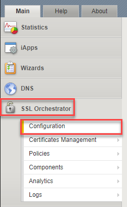

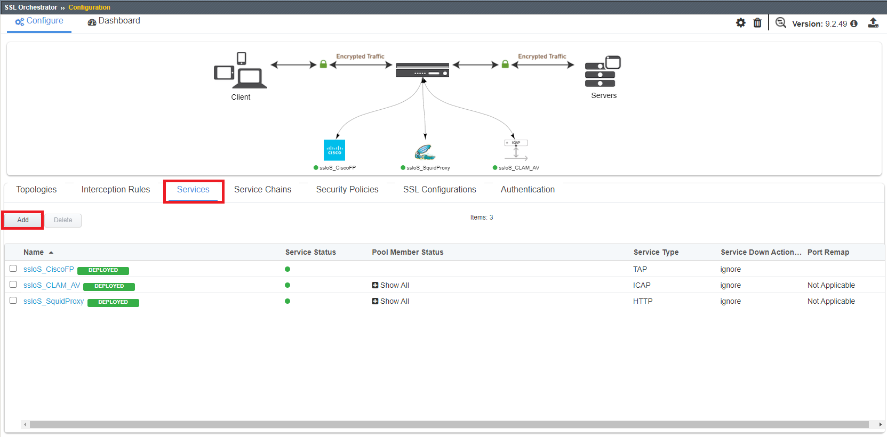

.. |service-icap-1| image:: ../images/service-icap-1.png
   :alt: ICAP service

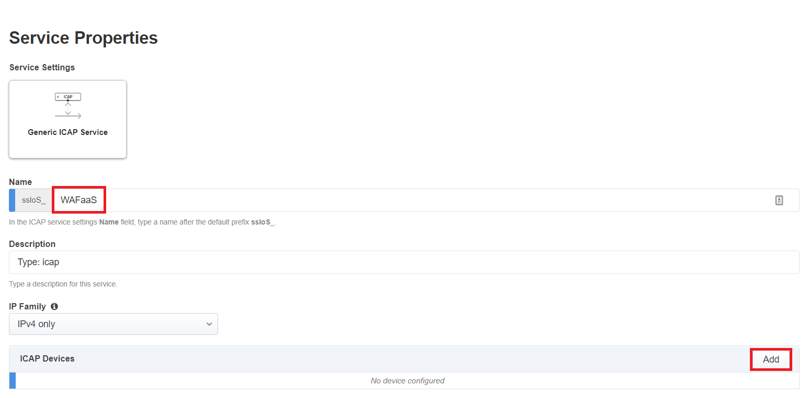

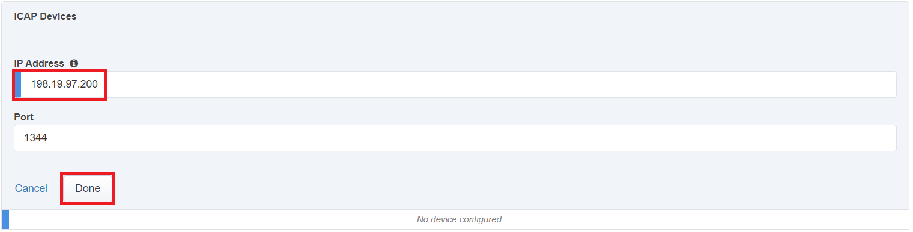

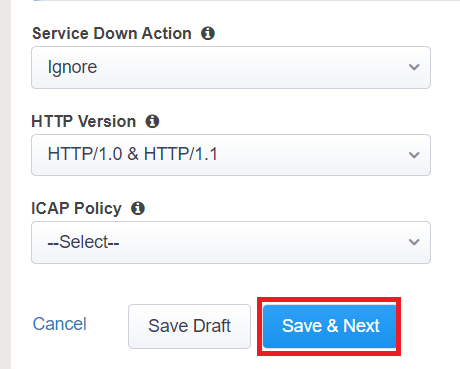

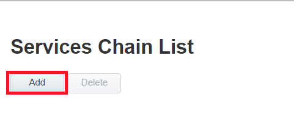

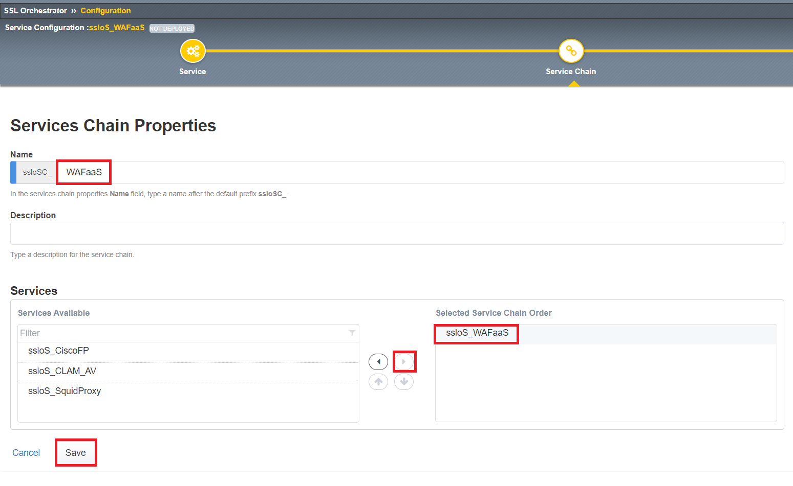

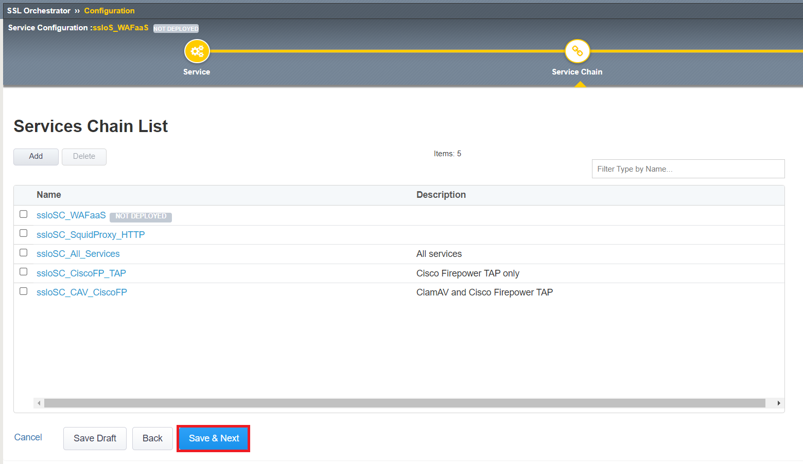

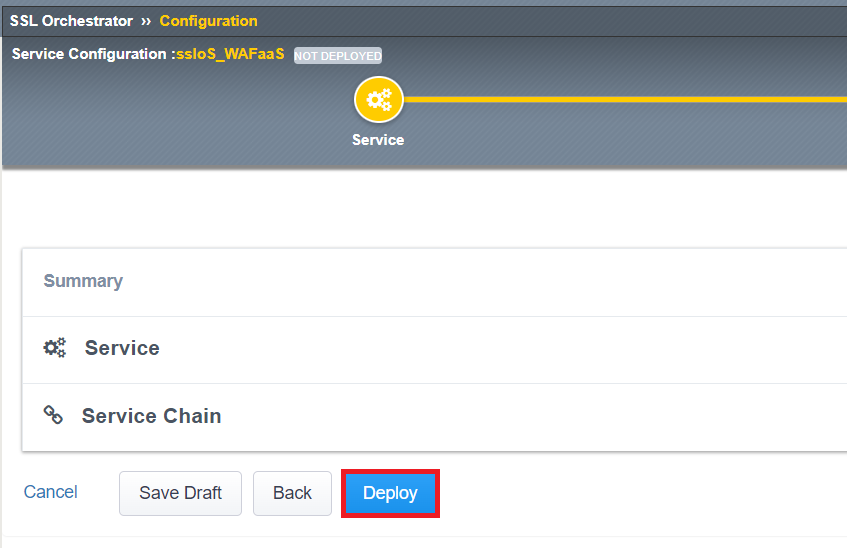

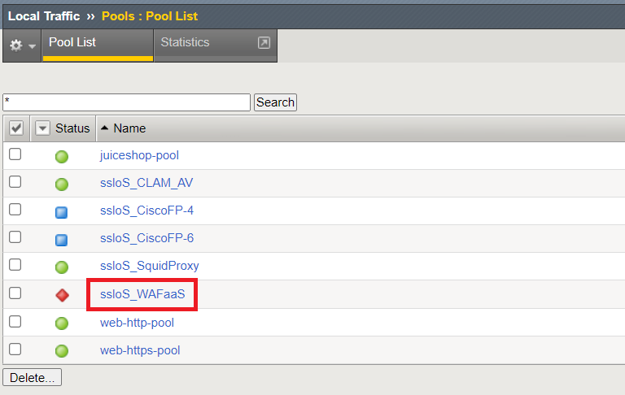

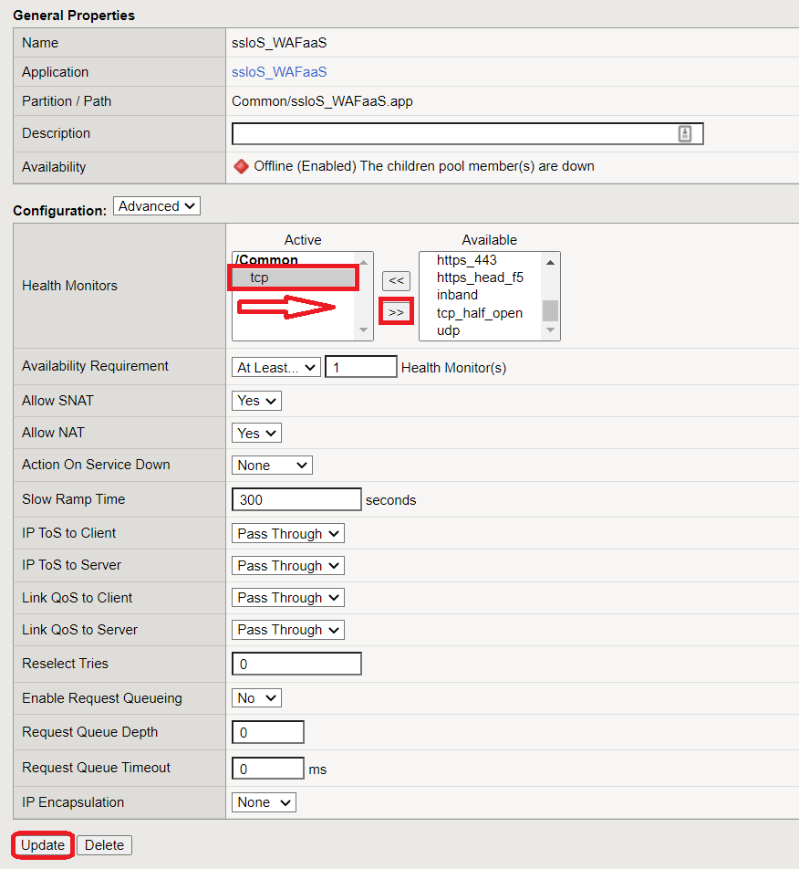

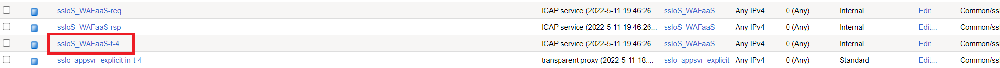

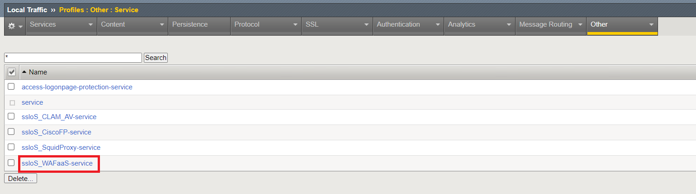

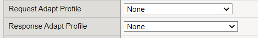

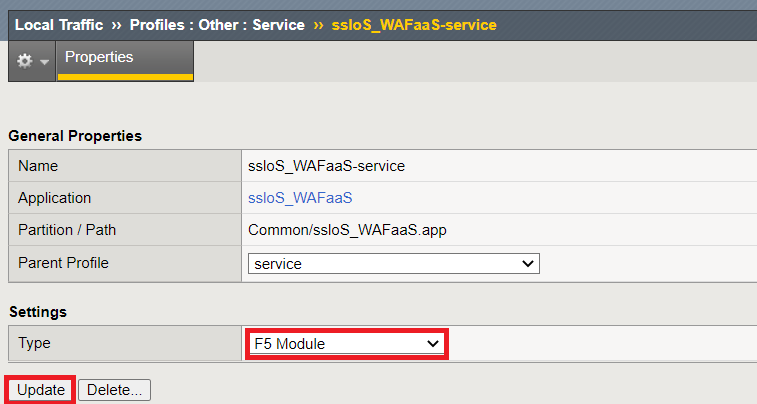

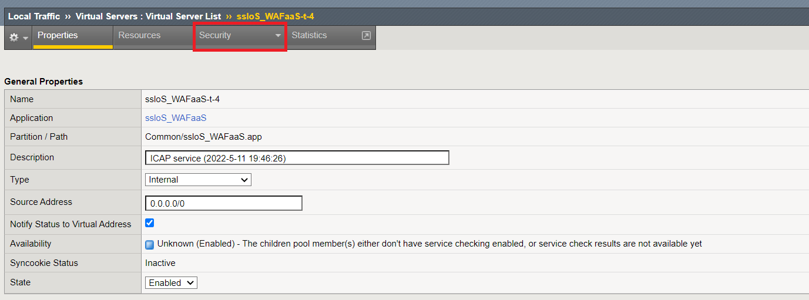

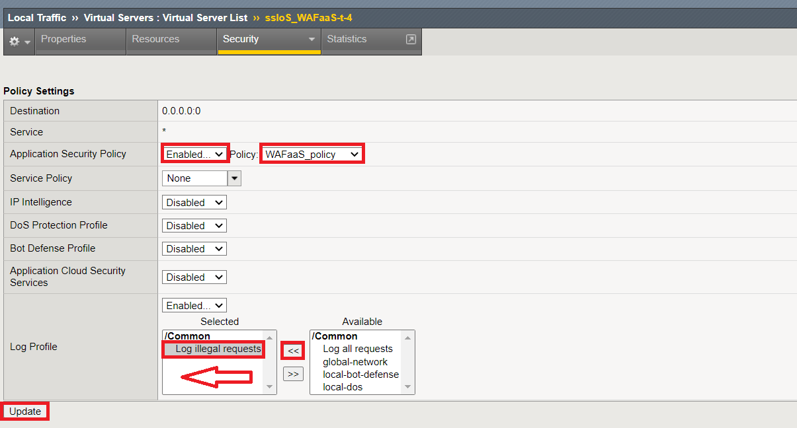

.. |credentials| raw:: html
      <a href="../labinfo.html#credentials" target="_blank"> User Credentials </a>   
