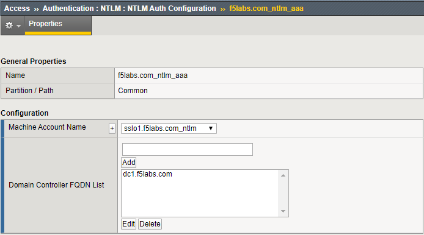
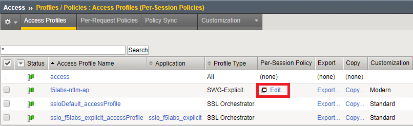
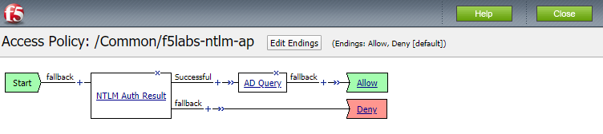

.. role:: red

Review the Access Policy and AAA configuration
~~~~~~~~~~~~~~~~~~~~~~~~~~~~~~~~~~~~~~~~~~~~~~~~~~~~~

-  From the Main menu on the left, select **Access > Authentication > NTLM > NTLM Auth Configuration**.

-  Select :red:`f5labs.com_ntlm_aaa` from the NTLM Auth Configuration list. The following screen should appear:

   |f5labs.com_ntlm_aaa|

-  Machine Account Name is the name of the security object that is added to the domain as a Computer Account. Domain Controller FQDN List contains a list of the domain servers (in this lab there is only one).

-  From the main menu select **Access > Profiles / Policies > Access Profiles (Per-Session Policies)**. The following screen should appear:

   |access_profile_list|

-  Click on the **Edit** button next to the :red:`f5labs-ntlm-ap` access profile. The following Access Policy should appear in the Visual Policy Editor:

   |f5labs-ntlm-ap_vpe|

-  Close the Visual Policy Editor

