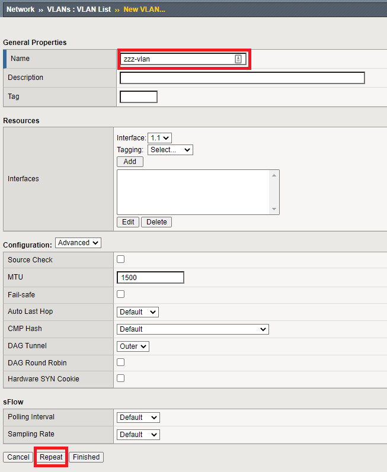

.. role:: red
.. role:: bred

Add a new L3 Explicit topology
===================================

A topology must be bound to a unique VLAN. But since the topologies in this architecture
won't be listening on an actual client-facing VLAN, you will need to create a separate dummy VLAN for each topology you
intend to create. A dummy VLAN is basically a VLAN with no interface assigned. In the BIG-IP UI, under Network -> VLANs,
click Create. Give your VLAN a name and click Finished. It will ask you to confirm since you're not attaching an interface.
Click OK to continue.

- Navigate to **Network > VLANs** and click on the **Create** button to add a new VLAN
- Name this VLAN:  ``zzz-vlan`` and then click on **Finished**. Do not select any interfaces.

Now, create a new L3 Explicit topology for the outbound application server traffic. This topology will decrypt TLS and send traffic to a service chain consisting of:

   -  New ICAP-based antivirus service
   -  Existing Cisco Firepower TAP service

-  Navigate to **SSL Orchestrator > Configuration** and **Add** a new topology.

new service - ICAP
new service chain - AV_CiscoFP

zzz-vlan

You should now have two L3 Explicit topologies.
