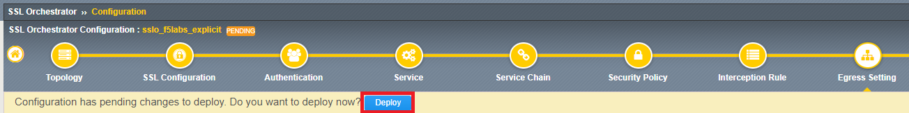

.. role:: red
.. role:: bred

Modify Existing Topology
================================================================================

Modify the existing **f5labs_explicit** topology so that it uses a different IP address and listens on an empty VLAN. The current IP address will be re-assigned to the topology steering virtual server in a later step.

-  From the Main menu on the left, select **SSL Orchestrator > Configuration**

-  In the Topology list click on **sslo_f5labs_explicit**. The topology summary screen will appear.

-  Click the edit icon (|pencil|) to the right of **Interception Rule**

   |topology-summary-IR-edit|

-  Change the **IPV4 Address** to ``10.1.10.151``.

-  In the **VLANs** section, remove **client-vlan** from the **Selected** column.

-  Add **yyy-vlan** to the **Selected** column.

-  Click **Save & Next** at the bottom of the screen

.. image:: ../images/intercept-new-ip-vlan.png
   :alt: Proxy Server Settings - New IP and VLAN

-  The **Egress Settings** screen will load. Wait a moment for the yellow "Deploy" ribbon to appear. When it does, click the **Deploy** button (see example below).

   |egress-settings-deploy-ribbon|

-  Click **OK** to acknowledge the successful deployment.

.. |topology-summary-IR-edit| image:: ../images/topology-summary-IR-edit.png
   :alt: Edit Interception Rule from Topology Summary

.. |pencil| image:: ../images/pencil.png
   :width: 20px
   :height: 20px
   :alt: Pencil Icon

