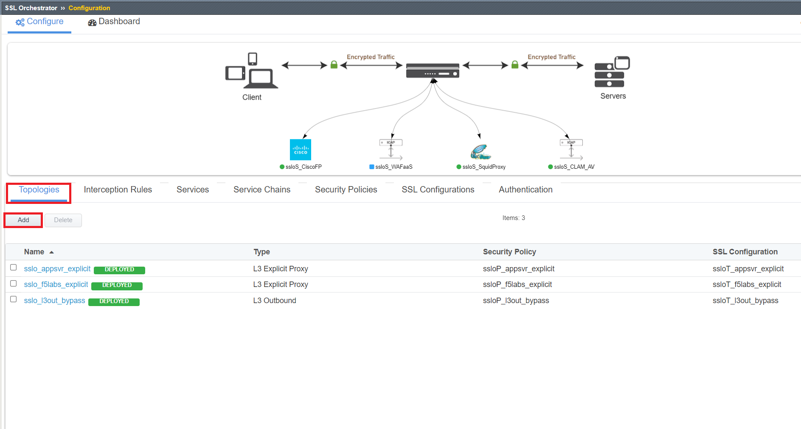
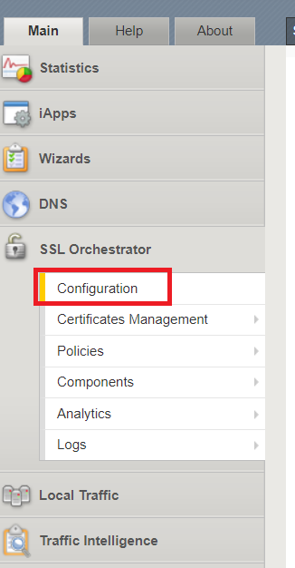

.. role:: red
.. role:: bred

Create Existing Application L3 Inbound Topology
================================================================================

Now that we have our WAFaaS device and security chain created, we will now create an **Existing Application** topology that will be used to protect our vulnerable **Juiceshop** application.

1. Click on **SSL Orchestrator** and select **Configuration**

|SSL-Orchestrator-Configuration|

2. Click **Add** under the **Topologies** menu item.

|add-topologies|

3. Click **Next** through the Topology Information page.

4. Next to **Name**,  ``WAFaaS_inbound``. Select **Existing Application** under **SSL Orchestrator Topologies**. CLick **Save & Next** once complete.

|Topology-Properties|

5. Since we already created the **WAFaaS** service, we can click **Save & Next** and go to the next page.

|services-save|

6. Since we already created the **WAFaaS** service chain, we can click **Save & Next** and go to the next page.

|service-chain-save|

7. We will need to adjust the **All Traffic** rule for our **WAFaaS_inbound** security policy. Click the |pencil| to the right of the **All Traffic** rule.

|security-policy-pencil|

8. Select the **ssloSC_WAFaaS** under **Service Chain** and click **OK**. Click **Save & Next** when complete.

|security-policy-service-chain|

9. Click **Deploy** to deploy your new **Existing Application** topology.

|WAFaaS_Inbound-topology-deploy|

10. Click **OK** to acknowledge the successful deployment.

|OK-Deployment|

|WAFaaS_Inbound-topology-complete|

Now we just need to add the access policies associated with the **WAFaaS_Inbound** topology to the **Juiceshop** Virtual Server.

11. Click on **Local Traffic>>Virtual Servers>>Virtual Server List**. Click on the link for the **juiceshop-vs** virtual server.

|juiceshop-vs-01|

12. Scroll down about 3/4 of the way down the page to find the **Access Policy** section. Next to **Access Profile**, select **ssloDefault_accessProfile** and also select **ssloP_WAFaaS_inbound_per_req_policy** next to **Per-Request Policy**. Click **Update** when done.

|virtual-server-access-policy|

Congratulations! You have now successfully deployed WAFaaS for an existing application. Let's now go back to the Ubuntu Client and run the same SQL-injection attack to see if WAF is doing its job.

.. |pencil| image:: ../images/pencil.png
   :alt: Pencil

.. |Topology-Properties| image:: ../images/Topology-Properties.png
   :alt: Adding Existing Application topology

