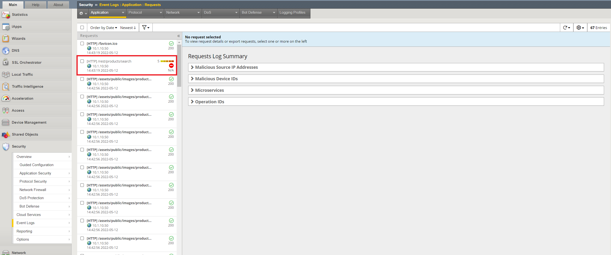

.. role:: red
.. role:: bred

Validate WAFaaS
================================================================================

Let's take a look to see if our WAFaaS is providing the protection that we are looking for.

1. RDP back into the **Ubuntu Client 18.04**. (Components > Ubuntu18.04 Client > ACCESS > XRDP)

|udf-ubuntu-client-rdp|

2. When prompted, save the RDP file to your local machine and then open it to connect.

3. At the Ubuntu Login prompt, click on the OK button to continue.

|udf-ubuntu-client-rdp2|

.. tip:: If the RDP session times out, refer to the `User Credentials <https://github.com/Doctorwooo/f5-agility-labs-sslviz/blob/master/docs/class2/labinfo.rst>`_ for the **student** user password.

4. Open the Firefox browser

5. Click on the Juiceshop bookmark on the browser bar

|juiceshop-bookmark|

6. Accept the security risk by clicking **Advanced** and **Accept the Risk and Continue**. This is due to the BIGIP using a self-signed certificate.

   .. image:: ../images/certificate-risk.png

Now we will try the same simple SQL injection attack that we used at the beginning of this lab.

  .. image:: ../images/juiceshop-rdp.png

7. Copy and Paste the following path in your browser's location bar after https://10.1.20.200/

  .. code-block:: none
   
    /rest/products/search?q=qwert%27%29%29%20UNION%20SELECT%20id%2C%20email%2C%20password%2C%20%274%27%2C%20%275%27%2C%20%276%27%2C%20%277%27%2C%20%278%27%2C%20%279%27%20FROM%20Users--

8. The browser's location bar should look like this:

  .. code-block:: none

    https://10.1.20.200/rest/products/search?q=qwert%27%29%29%20UNION%20SELECT%20id%2C%20email%2C%20password%2C%20%274%27%2C%20%275%27%2C%20%276%27%2C%20%277%27%2C%20%278%27%2C%20%279%27%20FROM%20Users--

9. The SQL-Injection attack has been successfully blocked by the WAF policy attached to your inbound topology.

.. image:: ../images/SQL-Injection-blocked.png

Let's look at the WAF logs to see where F5 Advanced WAF blocked our SQL-Injection attack.

10. Accessing the BIG-IP, on the left side bar menu goto **Security>>Event Logs>>Application>>Requests**. Click on one of the log entries that has **/rest/products/search**.

11. Lots of good information on this page regarding the attack. We can see that it was a SQL-Injection attack that was blocked, where it came from and even see the decoded attack.

LAB COMPLETE!!

.. |udf-ubuntu-client-rdp| image:: ../images/udf-ubuntu-client-rdp.png
   :alt: RDP into Ubuntu Client 

.. |udf-ubuntu-client-rdp2| image:: ../images/udf-ubuntu-client-rdp2.png
   :alt: RDP into Ubuntu Client

.. |juiceshop-bookmark| image:: ../images/juiceshop-bookmark.png
   :alt: Click on Juiceshop bookmark

