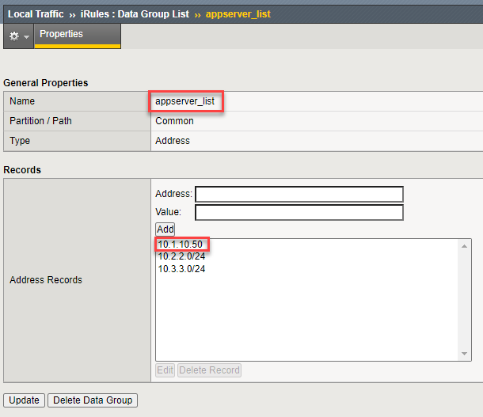
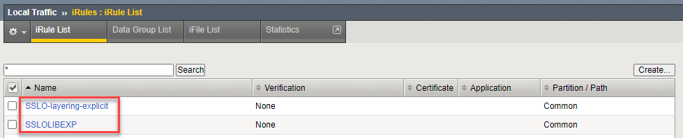
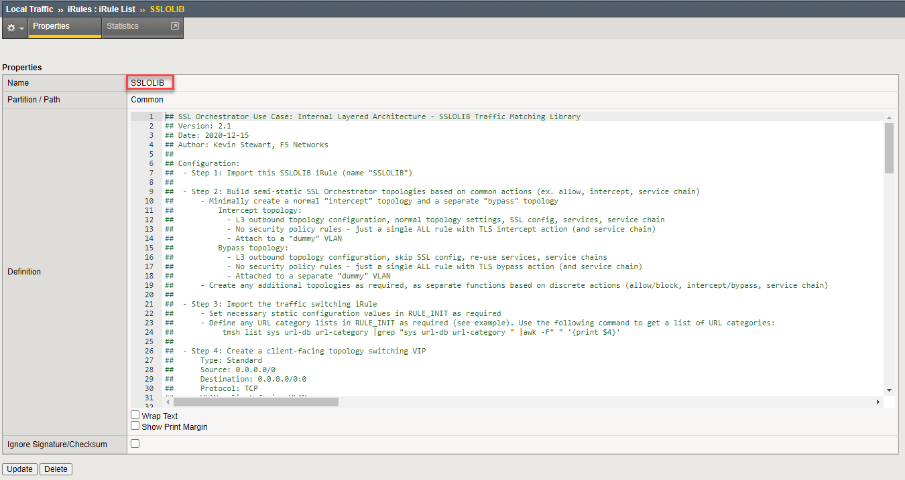
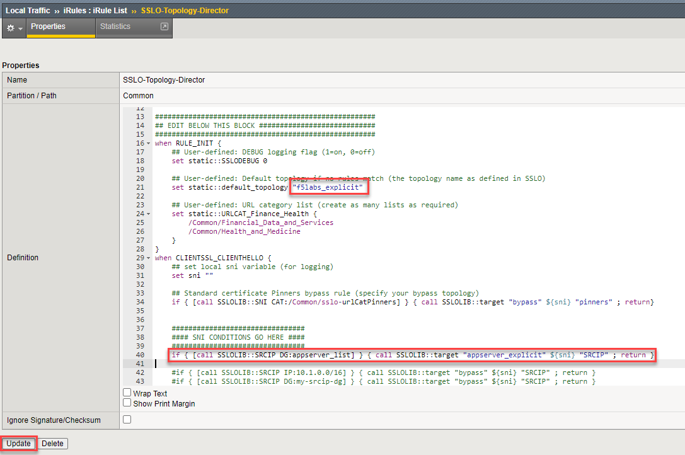
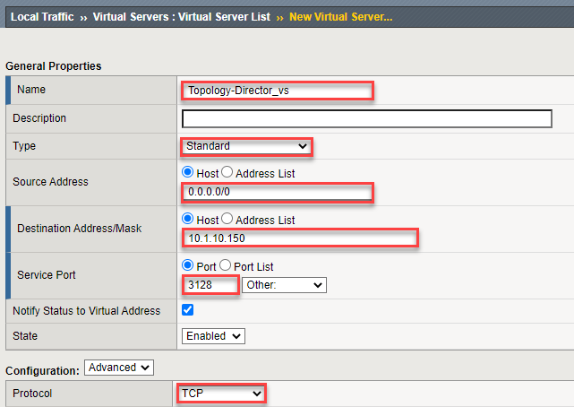
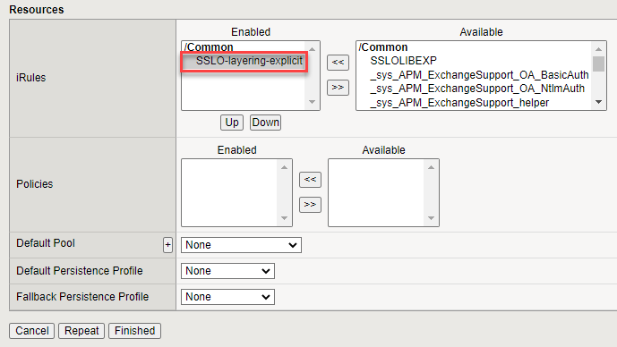

.. role:: red
.. role:: bred

Layered Virtual Server and Topology Steering iRule -- **BROKEN**
================================================================================

.. attention::
   :bred:`This section currently does not produce a working configuration. The topology steering iRule needs to be tweaked for explicit proxy topologies. Stay tuned for an update shortly.`

.. note::
   The **SSLOLIB** and **sslo-layer-rule.tcl** files from the `f5devcentral/sslo-script-tools <https://github.com/f5devcentral/sslo-script-tools/tree/main/internal-layered-architecture>`_ Github repository have already been imported for you. You will review the contents of these iRules shortly.

-  Navigate to  **Local Traffic > Virtual Servers > iRules > Datagroup List** to view the data groups.

.. image:: ../images/dg-appservers_list-1.png
   :alt: View Data Groups

-  Click on the **appserver_list** data group to view the list of server subnets/addresses. Traffic from these source IPs will be directed to the **appserver_explicit** topology. Note that IP address **10.1.10.50** is the **Ubuntu18.04 Client** machine (representing an application server).

-  Navigate to  **Local Traffic > Virtual Servers > iRules > iRules List** and review the two iRules.

|

The SSLOLIB iRule contains functions that allow the topology steering rule to easily match on various attributes and then target specific SSL Orchestrator topologies.

.. warning::
   Do not modify the SSLOLIB iRule.

|

The topology steering iRule ('SSLO-Topology-Director') contains your steering logic and defines the topology steering conditions.

-  Modify the **SSLO-Topology-Director** iRule with the following values:

   -  **Line 21:** Replace ``intercept`` with ``f5labs_explicit``. This defines the default SSL Orchestrator topology to use (if there is no other match).
   -  Insert 2 blank lines after **line 39**.
   -  Copy **line 43** into **line 40**.
   -  **Line 40**: Uncomment this line by removing the '#' from the beginning of the line.
   -  **Line 40**: Replace ``my-srcip-dg`` with ``appserver_list``. This defines the data group to check for source address matches.
   -  **Line 40**: Replace ``bypass`` with ``appsvr_explicit``. This defines the topology to use if there is a source address match.

.. attention::
   Ensure that there are not typographical errors in the iRule, or it will not function properly.

-  Click on the **Update** button to save the iRule changes.

|

-  Navigate to **Local Traffic > Virtual Servers > Virtual Server List** to create the topology steering virtual server.

-  Click on the **Create** button to add a new Virtual Server and configure the following settings:

   -  Name: ``Topology-Director_vs``
   -  Type: **Standard**
   -  Source: ``0.0.0.0/0``
   -  Destination Address: ``10.1.10.150``
   -  Destination Port: ``3128``
   -  Protocol: **TCP**
   -  VLAN and Tunnel Traffic > **Enabled On...**: **client-vlan**
   -  Address Translation: **disabled**
   -  Port Translation: **disabled**
   -  Default Persistence Profile: **ssl**
   -  iRule: **SSLO-Topology-Director**

|

.. image:: ../images/topology-director-vs-1b.png
   :alt: 

|

.. image:: ../images/topology-director-vs-1c.png
   :alt: 

|

- Click on **Finished** to create the new virtual server.