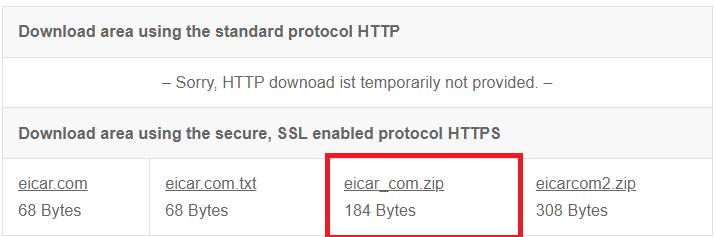
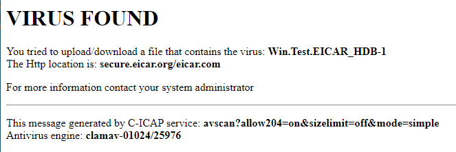
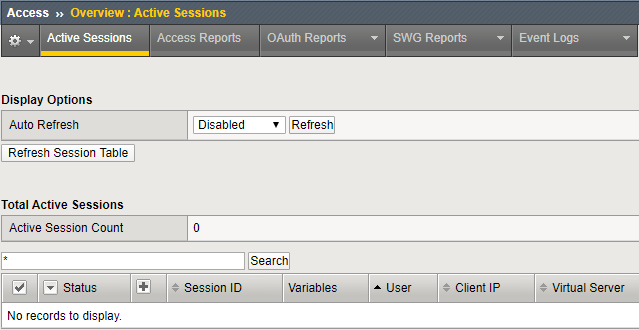
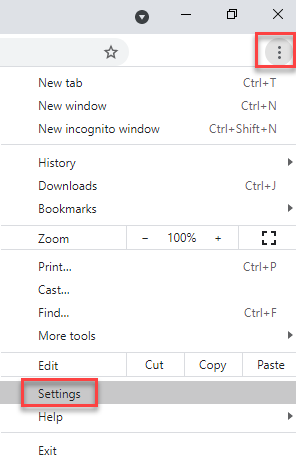
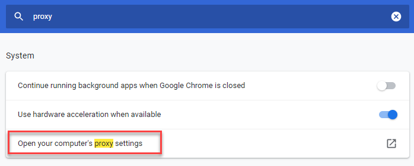
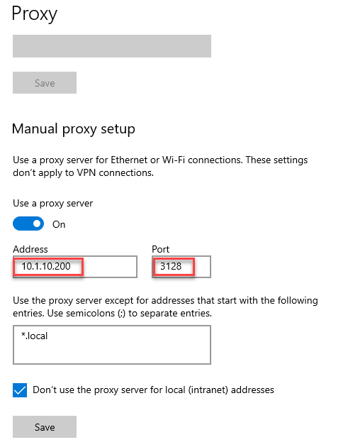
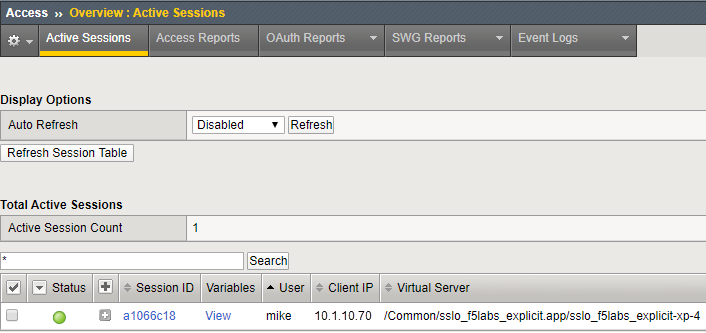

.. role:: red
.. role:: bred

Test SSL Orchestrator Deployment
======================================

Test Internet access from the two *client* machines to verify that the internal layered SSL Orchestrator deployment is working as designed.

Application Server Test
------------------------
Traffic from source addresses matching the **appserver_list** data group will be sent through the **appserver_explicit** topology.

-  RDP to the **Ubuntu18.04 Client** machine.

-  Launch **Firefox** and change the proxy settings to point to the new topology steering virtual server.

   -  Click on the menu (|ff-menu|) in the top right of the window.

   -  Select **Preferences** on the menu.
   
   -  In the **Find in Preferences** search field at the top, type ``proxy``
   
   -  Click on the **Settings...** button under Network Settings.
   
   -  Under **Manual proxy configuration**, enter ``10.1.10.200`` beside **HTTP Proxy**
   -  Leave the **Port** set to ``3128``
   
      .. image:: ../images/ff-connection-settings-2.png
         :alt: Firefox Connection Settings

-  Click on the **OK** button.

-  **Close and relaunch** the web browser.

-  Browse to a financial website (ex: Bank of America) and check the certificate that was received. The issuer should be **subrsa.f5labs.com** since the **appserver_explicit** topology does not bypass TLS decryption for financial websites.

-  Browse to https://www.eicar.org/?page_id=3950 and attempt to download the **eicar.com** malware test file.

-  This should be blocked by the antivirus service.

-  Check **Access > Overview > Active Sessions**. There should be no sessions listed since user authentication is not enabled for the **appserver_explicit** topology.

Corporate User Test
--------------------

All of the traffic that doesn't match the application server conditions (i.e., source address matching the **appserver_list** data group) will flow through the default **f5labs_explicit** topology.

-  RDP to the **Windows Client** machine.

-  Launch **Chrome** and change the computer's proxy settings to use the new topology steering virtual server. Click on the Chrome menu icon at top right corner.

- Enter ``proxy`` into the Search box.
- Click on **Open your computer's proxy settings**.

-  In the **Manual proxy setup** section, change the **Address** to ``10.1.10.200``

-  Leave the port set at ``3128``.

-  Click on the **Save** button.

-  **Close and relaunch** the web browser.

-  Browse to a financial website (ex: Bank of America) and check the certificate that was received. The issuer should **NOT** be **subrsa.f5labs.com** since the **f5labs_explicit** topology bypasses TLS decryption for financial websites.

-  Browse to https://www.eicar.org/?page_id=3950 and attempt to download the **eicar.com** malware test file. This should **NOT** be blocked since there is no antivirus service in the service chain for the **f5labs_explicit** topology.

-  Check **Access > Overview > Active Sessions**. There should be a user session listed for user **mike**.

.. attention::
   This is the end of this lab exercise.

.. |ff-menu| image:: ../images/ff-menu.png
   :width: 14px
   :height: 14px
   :alt: Firefox Menu