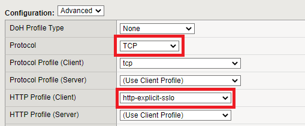

.. role:: red
.. role:: bred

Layered Virtual Server and Topology Steering iRule
================================================================================

.. note::
   The **SSLOLIBEXP** and **sslo-layering-exp-rule** files from the `f5devcentral/sslo-script-tools <https://github.com/f5devcentral/sslo-script-tools/tree/main/internal-layered-architecture>`_ Github repository have already been imported for you. You will review the contents of these iRules shortly.

-  Navigate to  **Local Traffic > iRules > Datagroup List** to view the data groups.

.. image:: ../images/dg-appservers_list-1.png
   :alt: View Data Groups

-  Click on the **appserver_list** data group to view the list of server subnets/addresses. Traffic from these source IPs will be directed to the **appserver_explicit** topology. Note that IP address **10.1.10.50** is the **Ubuntu18.04 Client** machine (representing an application server).

.. image:: ../images/dg-appservers_list-2.png
   :alt: Data Group: appservers_list

-  Navigate to  **Local Traffic > iRules > iRules List** and review the two iRules.

.. image:: ../images/internal-layered-irules-1.png
   :alt: Internal Layered Architecture iRules

|

The SSLOLIBEXP iRule contains functions that allow the topology steering rule to easily match on various attributes and then target specific SSL Orchestrator topologies.

.. warning::
   Do not modify the SSLOLIBEXP iRule.

.. image:: ../images/irule-sslolib.png
   :alt: View SSLOLIBEXP iRule

|

The topology steering iRule contains your steering logic and defines the topology steering conditions.

-  Modify the **SSLO-layering-explicit** iRule with the following values:

   -  **Line 21:** Replace ``interceptexp`` with ``f5labs_explicit`` (name of the original/existing L3 Explicit Topology). This defines the default SSL Orchestrator topology to use (if there is no other match).
   -  Insert 2 blank lines after **line 41**.
   -  Copy **line 45** into **line 42**.
   -  **Line 42**: Uncomment this line by removing the '#' from the beginning of the line.
   -  **Line 42**: Replace ``my-srcip-dg`` with ``appserver_list``. This defines the data group to check for source address matches.
   -  **Line 42**: Replace ``bypassexp`` with ``appsvr_explicit`` (name of the new L3 Explicit Topology that you created in the previous section). This defines the topology to use if there is a source address match.

.. attention::
   Ensure that there are no typographical errors in the iRule, or it will not function properly.

.. image:: ../images/irule-layering-explicit.png
   :alt: Changes to SSLO-Topology-Director iRule

-  Click on the **Update** button to save the iRule changes.

|

-  Navigate to **Local Traffic > Virtual Servers > Virtual Server List** to create the topology steering virtual server.

-  Click on the **Create** button to add a new Virtual Server and configure the following settings:

   -  **Name:** Enter ``Topology-Director_vs``
   -  **Type:** Leave the default - **Standard**
   -  **Source:** Leave the default - empty
   -  **Destination Address:** Enter ``10.1.10.150``
   -  **Destination Port:** Enter ``3128``
   -  **Protocol:** Leave the default - **TCP**
   -  **HTTP Profile (Client):** Select **sslo-default-http-explicit**
   -  **VLAN and Tunnel Traffic:** Select **Enabled On...** and then move **client-vlan** to the **Selected** column.
   -  **Address Translation:** Uncheck to disable
   -  **Port Translation:** Uncheck to disable
   -  **iRule:** Move the **SSLO-layering-explicit** iRule to the **Enabled** column.

.. image:: ../images/topology-director-vs-1.png
   :alt: 

|

|

.. image:: ../images/topology-director-vs-1b.png
   :alt: 

|

.. image:: ../images/topology-director-vs-1c.png
   :alt: 

|

.. image:: ../images/topology-director-vs-1d.png
   :alt: 

- Click on **Finished** to create the new virtual server.