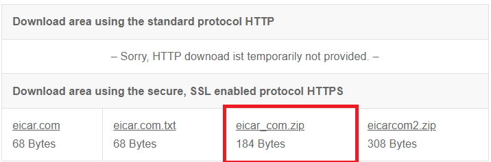

.. role:: red
.. role:: bred

Test Layered SSL Orchestrator Topology Deployment
================================================================================

Test Internet access from the two *client* machines to verify that the internal layered SSL Orchestrator deployment is working as designed.

Application Server Test
------------------------
Traffic from source addresses matching the **appserver_list** data group will be sent through the **appserver_explicit** topology.

-  RDP to the **Ubuntu18.04 Client** machine.

.. tip::

   If your previous RDP session timed out, the password for the **student** user is ``agility``.

-  Launch the **Firefox** web browser.

   Recall that the browser was configured to use 10.1.10.150:3128 as its Internet proxy. Since the new **Topology Director virtual server** is now listening on that address on the **client-vlan**, it will accept the explicit proxy connections from the web browser and steer the traffic according to the logic defined in the iRule.

-  Browse to a financial website (ex: Bank of America) and check the certificate that was received. The issuer should be **subrsa.f5labs.com** since the **appserver_explicit** topology does not bypass TLS decryption for financial websites.

.. note::
   You do not want this behavior for corporate user traffic since it may cause employee privacy concerns.

-  Browse to https://www.eicar.org/?page_id=3950 and attempt to download the **eicar.com** malware test file.

-  This should be blocked by the antivirus service.

.. image:: ../images/test-eicar-blocked.png
   :alt: Eicar malware download test

-  Check **Access > Overview > Active Sessions**. There should be no sessions listed since user authentication is not enabled for the **appserver_explicit** topology.

.. image:: ../images/test-apm-ubuntu.png
   :alt: APM user sessions

Corporate User Test
--------------------

All of the traffic that doesn't match the application server conditions (i.e., source address matching the **appserver_list** data group) will flow through the default **f5labs_explicit** topology.

-  RDP to the **Windows Client** machine.

-  Launch the **Chrome** web browser. 

   Recall that the browser was configured to use 10.1.10.150:3128 as its Internet proxy. Since the new **Topology Director virtual server** is now listening on that address on the **client-vlan**, it will accept the explicit proxy connections from the web browser and steer the traffic according to the logic defined in the iRule.

-  Browse to a financial website (ex: Bank of America) and check the certificate that was received. The issuer should **NOT** be **subrsa.f5labs.com** since the **f5labs_explicit** topology bypasses TLS decryption for financial websites.

-  Browse to https://www.eicar.org/?page_id=3950 and attempt to download the **eicar.com** malware test file. This should **NOT** be blocked since there is no antivirus service in the service chain for the **f5labs_explicit** topology.

-  Check **Access > Overview > Active Sessions**. There should be a user session listed for user **mike**.

.. image:: ../images/test-apm-windows.png
   :alt: APM user sessions

|

.. attention::
   This is the end of this lab exercise.

.. |ff-menu| image:: ../images/ff-menu.png
   :width: 14px
   :height: 14px
   :alt: Firefox Menu