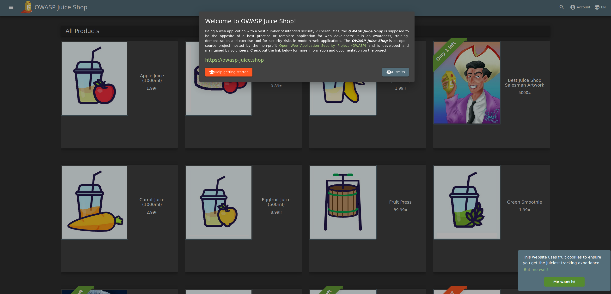

Scenario
================================================================================

**Background**

Your company has been leveraging SSL Orchestrator in order to provide SSL visibility for internal users accessing the internet as a forward proxy. This includes the use of authentication and leveraging an internal layered architecture in order to provide more scalable and granular levels of protection.

   
**New Requirement**

The CISO of your company has sent an email to your group stating that one of your Existing E-Commerce Applications called **Juice Shop** needs to be protected by a Web Application Firewall (WAF) policy. 

Your organization has deployed SSL Orchestrator for internal users who access the Internet and now wants to utilize it for an inbound use case to protect this vulnerable existing application **Juice Shop**.

Lab Overview
================================================================================

Customers have multiple options to support inbound reverse proxy use cases to provide protection to applications. Wouldn't it be nice to also be able to easily provide F5 WAF protection to these applications as well? SSL Orchestrator can be configured to provide this funcionality allowing administrators to deploy WAFaaS in a service chain supporting a L3 inbound topology. 

You will start by leveraging a simple SQL-injection attack that demonstrates that the company's Juiceshop application is indeed vulnerable and in need of protection afforded by **F5's Advanced Web Application Firewall**.

You will go through the step-by-step process of creating a new **WAFaaS** device that will be used to protect the vulnerable Juiceshop application. Once the WAFaaS device is created, we will create a new inbound **Existing Application** topology with WAFaaS and enable the protection on the application.

Note: The WAF policy used in this lab is pre-configured. For more information hands-on with F5 WAF policy creation, please check out our comprehensive WAF labs on `Clouddocs <https://clouddocs.f5.com/training/community/waf/html/>`_.
