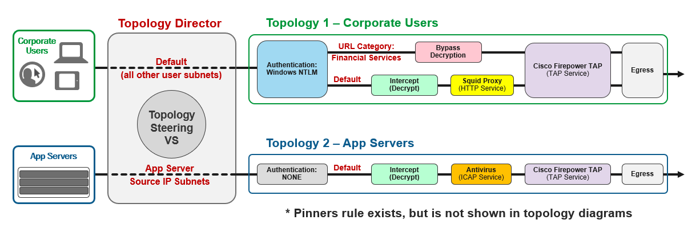

Scenario
================================================================================

**Background**

Your organization has deployed SSL Orchestrator for internal users who access the Internet. This is an L3 Explicit outbound topology with NTLM user authentication required for clients. The security policy rules are as follows:

   .. list-table:: **Security Policy Rules**
      :header-rows: 1
      :widths: auto

      *  - Traffic Classification
         - Actions to perform
         - Services (in Service Chain)
      *  - Websites known to use certificate pinning
         - Bypass TLS decryption
         - Cisco Firepower TAP service
      *  - Websites matching the "Finance and Data Services" URL category
         - Bypass TLS decryption
         - Cisco Firepower TAP service
      *  - Default (all other traffic)
         - Intercept (Decrypt TLS)
         - Squid Proxy and Cisco Firepower TAP services

**New Requirement**

You receive a request from the Applications team to inspect outbound traffic from their internal application servers (accessing Internet-based API services). However, these UNIX servers do not support NTLM authentication and this traffic must also be inspected by the Applications team's ICAP-based virus scanning solution.

Lab Overview
================================================================================

.. note::
   Completion of the first two lab exercises is a pre-requisite.

You will create a new LTM virtual server with an iRule to direct client traffic between two L3 Explicit topologies. The first one is the **f5labs_explicit** topology for corporate user traffic that you modified in the NTLM authentication exercise. The second one will be a new L3 Explicit topology that will decrypt TLS and send traffic to a service chain consisting of an ICAP-based antivirus service and the Cisco Firepower TAP service.

The following diagram illustrates the flows:

The **corporate users** reside on several /24 subnets that fall within the 10.1.0.0/16 block of IP addresses. You will use the **Windows Client** machine (10.1.10.70) to represent test users.

The **application servers** reside primarly on subnets 10.2.2.0/24 and 10.3.3.0/24. There is also a server attached to the corporate user subnet. You will use the **Ubuntu18.04 Client** machine (10.1.10.50) to represent this server for testing.

You will need to define the ICAP-based antivirus service and add it to a new service chain along with the Cisco Firepower TAP service.

Finally, you will test the solution from the two *client* machines.
