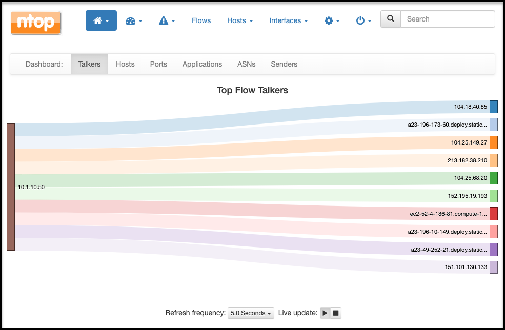

Appendix 5 - Using the NTOPNG Service for Traffic Analysis
==========================================================

This lab environment contains an additional traffic analysis service, running
on the inline L3 service, using the community version of NTOPNG. It is provided
here as an additional visual tool for displaying decrypted traffic flows.

Additional information about the NTOPNG utility can be found at:

- Primary reference: https://www.ntop.org
- Installation reference: http://packages.ntop.org/apt/

To access the UI:

#. Find the public IP address assigned to the Inline L3 service in Ravello.
   Click on the “Layer 3 Security” object in the Ravello UI and review its
   properties to reveal the assigned public address.
#. Open a new browser window and navigate to this IP, via HTTP on port 3000
   (http://IP:3000). If it prompts for credentials, login is ‘admin’ with
   password ‘ntopng’.
#. Configure an SSLO topology to include the Inline L3 service in a service
   chain.
#. Pass traffic through SSLO to view real-time analysis of traffic through the
   Inline L3 service.
