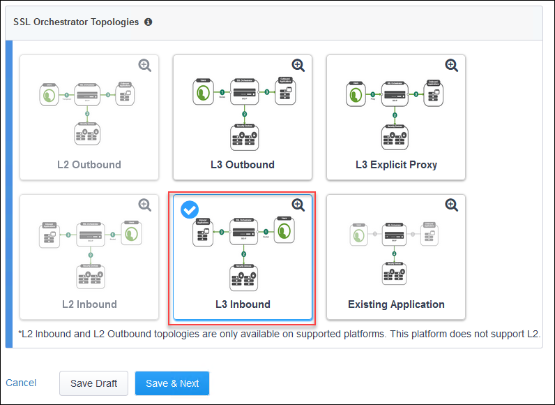
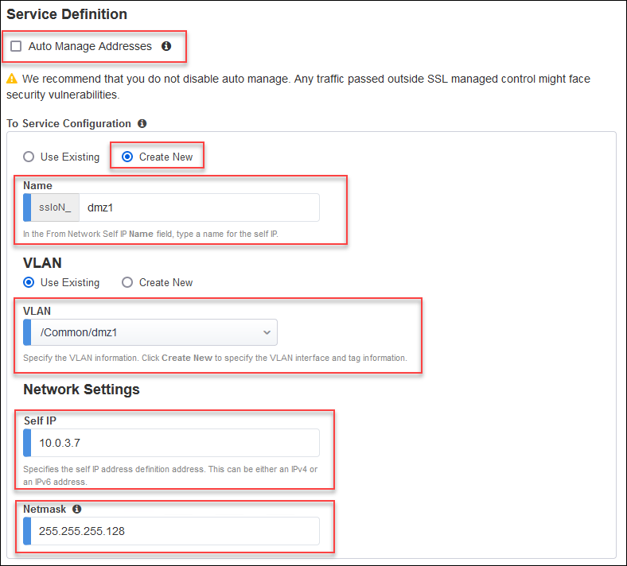
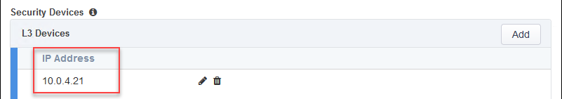
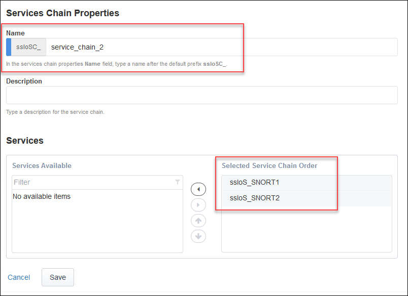
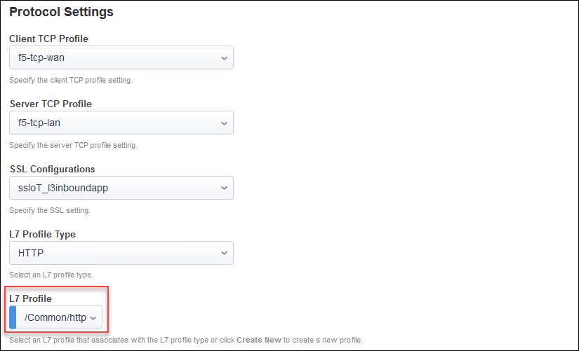
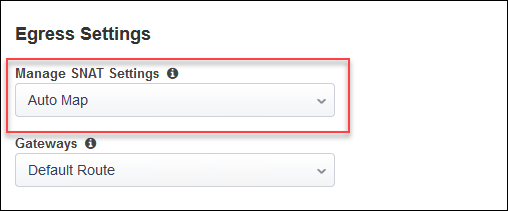

Configure and Deploy SSL Orchestrator Topology
================================================================================

If disconnected from the BIG-IP (SSL Orchestrator) TMUI, reconnect to: **https://<sslo_management_public_ip>**.

Login using the credentials provided earlier.

Install SSL Certificate
--------------------------------------------------------------------------------
Normally, you would use a trusted SSL certificate and key for the Application Virtual Server. This would be done before entering the SSL Orchestrator Guided Configuration UI.

For simplicity here, you will instead use the BIG-IP's default self-signed SSL certificate and key.

.. note::

   The default certificate is not trusted, so you will need to accept any SSL security warnings when accessing the application later in this lab.

Create SSL Orchestrator Topology
--------------------------------------------------------------------------------
In the left panel menu, click on **SSL Orchestrator > Configuration**. This will initialize the **SSL Orchestrator Guided Configuration UI**.

Scroll to the bottom of the Configuration introduction page and click on the **Next** button to start creating a new Topology.

|

Enter ``l3inboundapp`` as the topology name.

Select the **L3 Inbound** topology type.

Click on the **Save & Next** button to continue.

Scroll down to the bottom of the page and click on the **Save & Next** button.

Create SSL Configuration
--------------------------------------------------------------------------------
On the **SSL Configurations** page, leave the default Client-side SSL and Server-side SSL settings.

Click on the **Save & Next** button to continue.

Create Services
--------------------------------------------------------------------------------

Create the first inspection service:

- Click on the **Add Service** button.
- Enter ``generic`` in the search box.
- Select **Generic Inline Layer 3** from the service catalog and click on the **Add** button.

- Enter ``SNORT1`` as the name for the service.

.. image:: ./images/topology-svc1-2.png
   :align: left

- De-select the **Auto Manage Addresses** checkbox.

In the **To Service** section:

- Enter ``dmz1`` in the self IP name field.
- Select the **/Common/dmz1** VLAN.
- Select the **Use Existing** VLAN radio button.
- Enter ``10.0.3.7`` in the **Self IP** address field.
- Enter ``255.255.255.128`` in the **Netmask** field.

- Add an **L3 Device** with IP address of ``10.0.3.21`` (matches the value of the **inspection_service_ip_1** Terraform output)

In the **From Service** section:

- Enter ``dmz2`` in the self IP name field.
- Select the **/Common/dmz2** VLAN.
- Select the **Use Existing** VLAN radio button.
- Enter ``10.0.3.245`` in the **Self IP** address field.
- Enter ``255.255.255.128`` in the **Netmask** field.

- Leave the defaults for the remaining settings.

- Click on the **Save** button.

Create the second L3 inspection service:

- Click on the **Add Service** button.
- Enter ``generic`` in the search box.
- Select **Generic Inline Layer 3** from the service catalog and click on the **Add** button.
- Enter ``SNORT2`` as the name for the service.

In the **To Service** section:

- Enter ``dmz3`` in the self IP name field.
- Select the **/Common/dmz3** VLAN.
- Select the **Use Existing** VLAN radio button.
- Enter ``10.0.4.7`` in the **Self IP** address field.
- Enter ``255.255.255.128`` in the **Netmask** field.

- Add an **L3 Device** with IP address of ``10.0.4.21`` (matches the value of the **inspection_service_ip_2** Terraform output)

In the **From Service** section:

- Enter ``dmz4`` in the self IP name field.
- Select the **/Common/dmz4** VLAN.
- Select the **Use Existing** VLAN radio button.
- Enter ``10.0.4.245`` in the **Self IP** address field.
- Enter ``255.255.255.128`` in the **Netmask** field.

- Leave the defaults for the remaining settings.
- Click on the **Save** button.

Click on the **Save & Next** button to continue.

Create Service Chains
--------------------------------------------------------------------------------
 
Create first service chain:

- Enter ``service_chain_1`` in the name field.
- Add the **SNORT1** service to the service chain.
- Click on the **Save** button.

Create second service chain:

- Enter ``service_chain_2`` in the name field.
- Add the **SNORT1** and **SNORT2** services to the service chain.
- Click on the **Save** button.

Click on the **Save & Next** button to continue.

Security Policy
--------------------------------------------------------------------------------

Create a new rule above the default rule with the following options:

- Enter ``internal_traffic`` in the rule name field.
- Select the **Client IP Subnet Match** condition and enter ``10.0.0.0/8`` for the subnet value.
- Set **SSL Forward Proxy Action** to **Intercept**.
- Select **service_chain_1**.
- Click on the **OK** button.

Edit the default rule:

- Select **service_chain_2**.

.. image:: ./images/topology-policy-2.png
   :align: left

- Click on the **OK** button.

Click on the **Save & Next** button to continue.

Interception Rule
--------------------------------------------------------------------------------

Click on the **Show Advanced Setting** link at the top right corner. This is required to reveal the Pool selection option.

Enter ``10.0.2.200/32`` in the **Destination Address/mask** field.

Ener ``443`` in the **Port** field.

For the **Ingress Network**, select the **/Common/external** VLAN.

For the **L7 Profile**, select **/Common/http**. 

In the **Resources** section, click on the Pool drop-down list and select **create new**.

.. important:: 

   If you do not see the **Resources** section, then you need to return to the top of the page and click on the **Show Advanced Setting** link.

A new browser tab will open to allow you create the pool. Name the pool **webapp** and specify a pool member with IP address **192.168.1.200**.

Save the configuration and close the browser tab to return to the SSL Orchestrator Guided Configuration.

Click on the Pool drop-down list again and select the **webapp** pool.

Click on the **Save & Next** button to continue.

Egress Settings
--------------------------------------------------------------------------------
Enable **SNAT Auto Map** for traffic egress and use the default route as a gateway.

Click on the **Save & Next** button to continue.

Log Settings
--------------------------------------------------------------------------------

Leave the default log settings.

Click on **Save & Next**.

.. image:: ./images/topology-log.png
   :align: left

Click on the **Save & Next** button to continue.

Deploy Topology
--------------------------------------------------------------------------------

Click on the **Deploy** button to create the new Topology configuration.

Wait for the deployment to complete.

Click on the **OK** button to continue.

