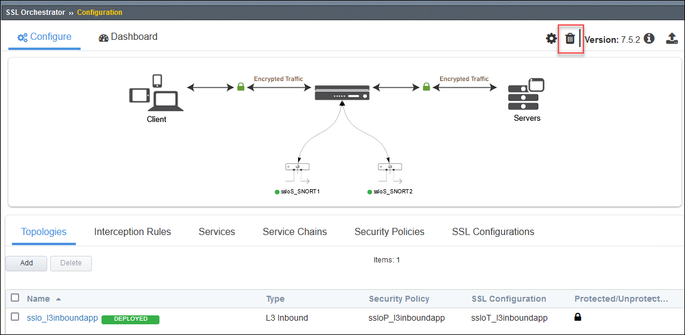
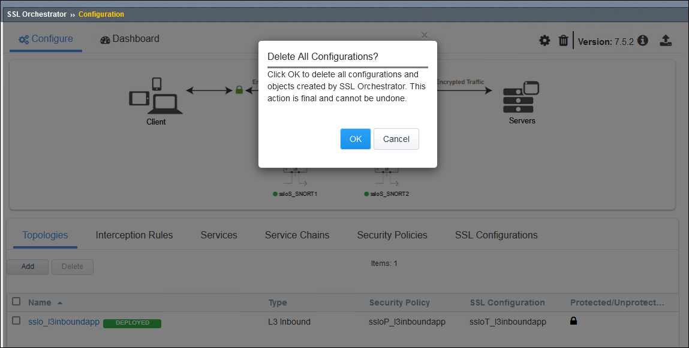
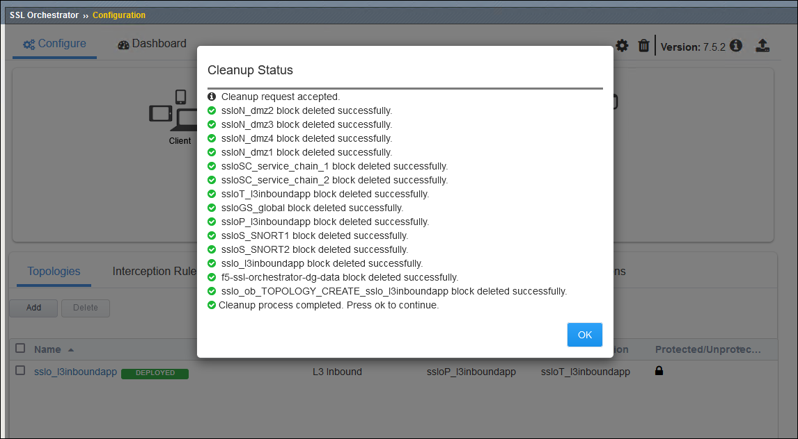

Delete the SSL Orchestrator Configuration
================================================================================

You must delete the SSL Orchestrator configuration to prepare for the next lab module.

Click on the Delete (trash can) icon.

|

Click on the **OK** button to confirm.

|

Click on the **OK** button when the cleanup process is complete.

|

Navigate to **Local Traffic > Pools** to delete the pool. Select the checkbox and click on the **Delete** button. Confirm by clicking on the **Delete** button again.

Navigate to **Local Traffic > Nodes** to delete the node. Select the checkbox and click on the **Delete** button. Confirm by clicking on the **Delete** button again.

|

.. attention::

   It is critical that you delete all configuration objects created in this section. If you do not, the Ansible playbook may fail with errors.

|

This is the end of the **Manual SSL Orchestrator Topology Configuration** module.
