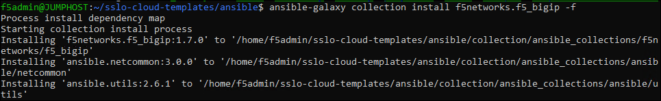

Install F5 Ansible Collections
================================================================================

To work with Ansible in this lab environment, you must first change the Ansible directory permissions and then switch to that directory.

   .. code-block:: bash

      cd ~/sslo-cloud-templates
      chmod o-x ansible
      cd ansible

While the SSL Orchestrator configuration modules are in the F5 Declarative collection, you will also need some of the modules from the F5 Imperative collection to perform this lab.

Install both F5 Ansible collections:

   .. code-block:: bash

      ansible-galaxy collection install f5networks.f5_bigip f5networks.f5_modules -f

