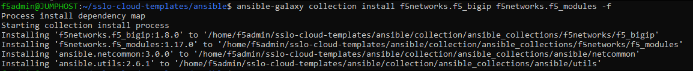

Install F5 Ansible Collection
================================================================================

To work with Ansible in this lab environment, you must first change the Ansible directory permissions and then switch to that directory.

   .. code-block:: bash

      cd ~/sslo-cloud-templates
      chmod 770 ansible
      cd ansible

Before you can use the SSL Orchestrator Ansible modules, you must install the Declarative F5 Ansible Collection.

   .. code-block:: bash

      ansible-galaxy collection install f5networks.f5_bigip -f

