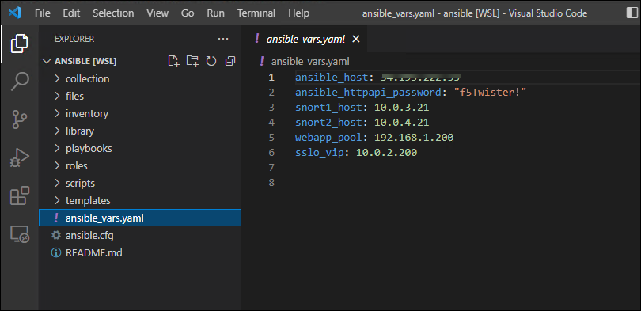

Review Ansible Variables File
================================================================================

An Ansible variables file was created by the accompanying Terraform from a previous lab exercise.

Copy the variables file from the Terraform working directory to the Ansible working directory:

   .. code-block:: bash

      cp ../terraform-aws-sslo/ansible_vars.yaml .

Review these files with **Visual Studio Code (VSCode)** by executing the following:

   .. code-block:: bash

      code .

   *'code' + <space> + <dot>*

Wait for VSCode to launch and display the file list in the left panel.

Click on **ansible_vars.yaml** to view the file. VSCode provides YAML syntax highlighting to help with format validation and readability.

|

Variables are set as follows:

.. list-table:: **Variables File**
   :header-rows: 1
   :widths: auto

   * - Variable
     - Description
   * - ansible_host
     - The public IP address of BIG-IP (SSL Orchestrator)
   * - ansible_httpapi_password
     - The 'admin' user password of BIG-IP (SSL Orchestrator)
   * - snort1_host
     - The **TO Service** IP address of the first L3 inspection device
   * - snort2_host
     - The **TO Service** IP address of the second L3 inspection device
   * - webapp_pool
     - The private IP address of the Wordpress application server
