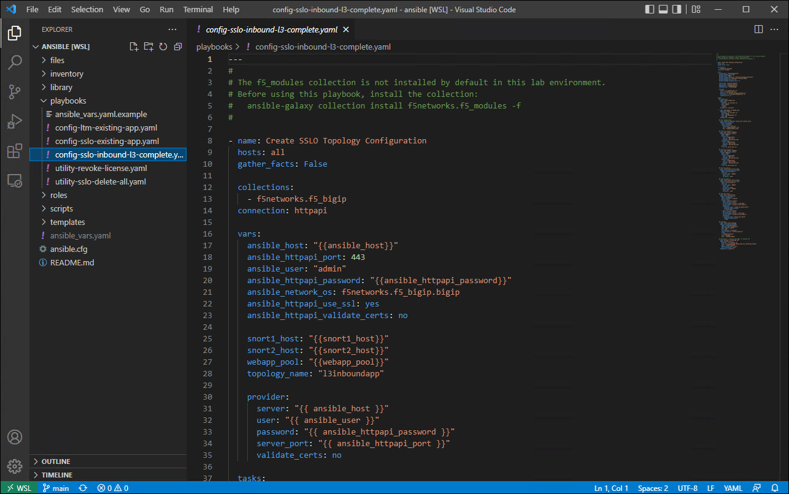

Review Ansible Playbook
================================================================================

Click on **playbooks > config-sslo-inbound-l3-complete.yaml** to view the playbook. You will use this to deploy an SSL Orchestrator Topology.

|

This playbook relies on variable values provided by the previously reviewed **ansible_vars.yaml** file. Variables to be substituted are denoted by **{{var_name}}**.

The playbook tasks are described below:

.. list-table:: **Ansible Tasks**
   :header-rows: 1
   :widths: auto

   * - Task Name
     - Module Name
     - Description
   * - Create web app pool
     - bigip_pool
     - Creates an application Pool with an HTTPS monitor.
   * - Add member to webapp pool
     - bigip_pool_member
     - Creates pool member - port 443.
   * - Create an SSLO SSL config with reverse proxy
     - bigip_sslo_config_ssl
     - Creates SSL Profile for reverse proxy.
   * - SSLO LAYER 3 (SNORT1)
     - bigip_sslo_service_layer3
     - Creates inline L3 Service #1 using *dmz1* (TO Service) and *dmz2* (FROM Service) VLANs.
   * - SSLO LAYER 3 (SNORT2)
     - bigip_sslo_service_layer3
     - Creates inline L3 Service #2 using *dmz3* (TO Service) and *dmz4* (FROM Service) VLANs.
   * - Create SSLO service chain
     - bigip_sslo_config_service_chain
     - Creates Service Chain 1 containing only the *SNORT1* service.
   * - Create SSLO service chain
     - bigip_sslo_config_service_chain
     - Creates Service Chain 2 containing both the *SNORT1* and *SNORT2* services.
   * - SSLO config policy
     - bigip_sslo_config_policy
     - Creates a Security Policy with 2 rules. The first rule sends clients from 10.0.0.0/8 to Service Chain #1. The second rule sends all other trafic (not matching the first rule) to Service Chain #2.
   * - Create SSLO Topology
     - bigip_sslo_config_topology
     - Creates an Inbound L3 Topology (reverse proxy) with listener address 10.0.2.200/32 and TCP port 443. SNAT Automap is enabled. The Topology references the previously created Pool, SSL Profile, and Security Policy.
