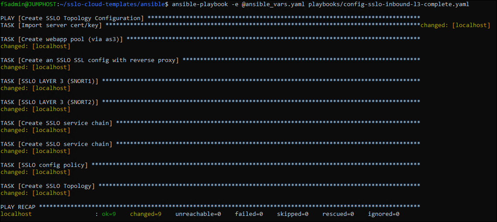

Deploy SSL Orchestrator Topology
================================================================================

Return to the BASH Terminal (you should still be in the *ansible* directory) to deploy an Inbound L3 Topology by executing the following:

   .. code-block:: bash

      ansible-playbook -e @ansible_vars.yaml playbooks/config-sslo-inbound-l3-complete.yaml

You will see each task being run in sequence. Wait for the playbook to complete.

When finished, you will see a summary ("play recap") indicating how many tasks made configuration changes.
