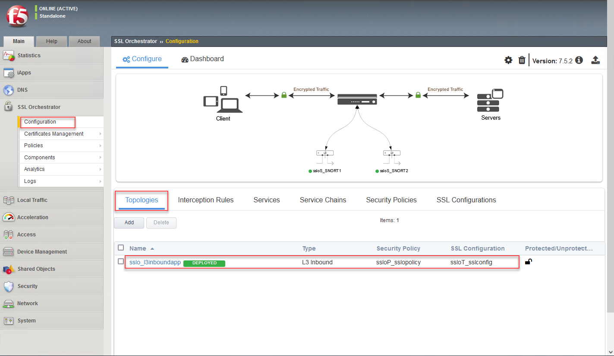
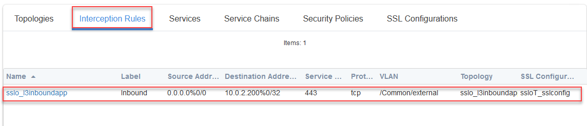
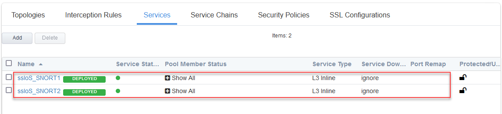
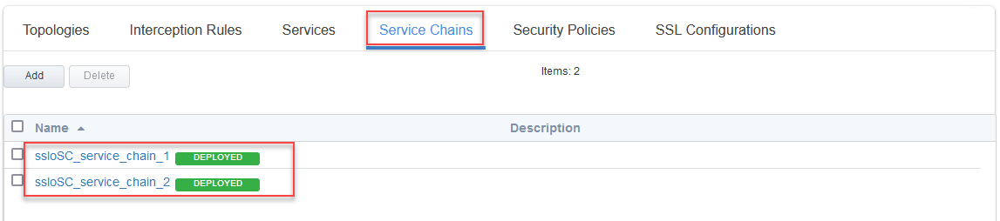
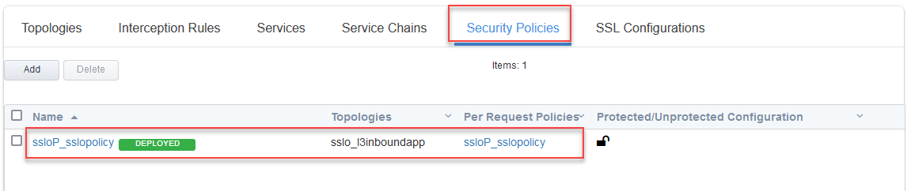
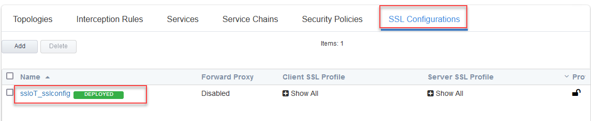

Verify Configuration
================================================================================

If disconnected from the BIG-IP (SSL Orchestrator) TMUI, reconnect to: **https://<sslo_management_public_ip>**.

Login using the credentials provided earlier.

Review LTM Pool
--------------------------------------------------------------------------------

Navigate to **Local Traffic > Pools**.

Confirm that the **webapp** pool was created.

Review SSL Orchestrator Topology
--------------------------------------------------------------------------------

Navigate to **SSL Orchestrator > Configuration**.

Confirm that the **sslo_l3inboundapp** Topology was created.

Review SSL Orchestrator Interception Rule
--------------------------------------------------------------------------------

Click on the **Interception Rules** tab.

Confirm that the **sslo_l3inboundapp** Interception Rule was created.

Review SSL Orchestrator Services
--------------------------------------------------------------------------------

Click on the **Services** tab.

Confirm that the **ssloS_SNORT1** and **ssloS_SNORT2** Services were created.

Review SSL Orchestrator Service Chains
--------------------------------------------------------------------------------

Click on the **Services** tab.

Confirm that the **ssloSC_service_chain_1** and **ssloSC_service_chain_2** Service Chains were created.

Review SSL Orchestrator Security Policy
--------------------------------------------------------------------------------

Click on the **Security Policies** tab.

Confirm that the **ssloP_sslopolicy** Security Policy was created.

Review SSL Orchestrator SSL Configuration
--------------------------------------------------------------------------------

Click on the **SSL Configurations** tab.

Confirm that the **ssloT_ssloconfig** SSL Configuration was created.

|

.. note::

   If you click on some of the individual components (for example, Services), you will see a red banner stating the configuration is in read-only mode. This is because the configuration was created outside of the SSL Orchestrator Guided Configuration UI.
