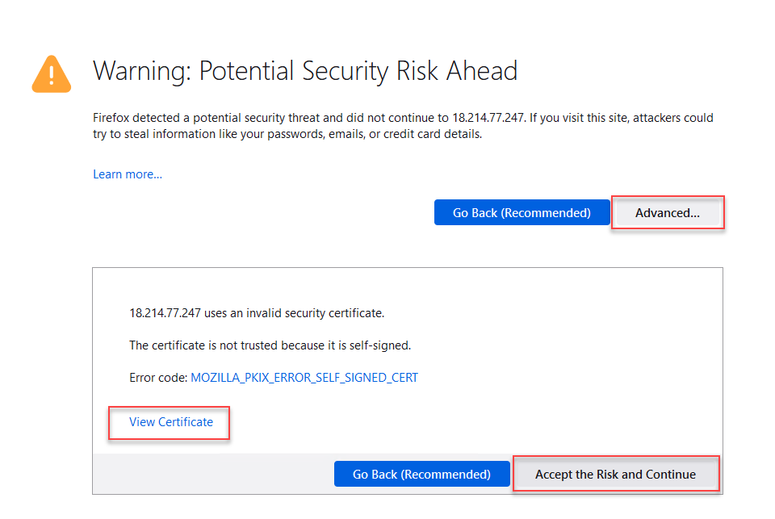
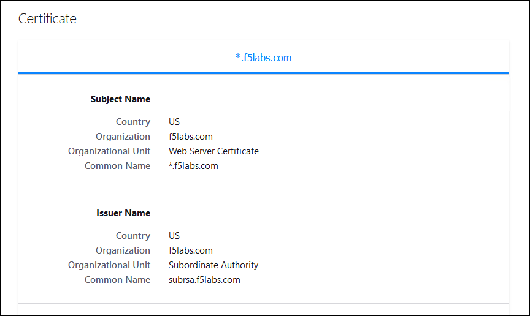
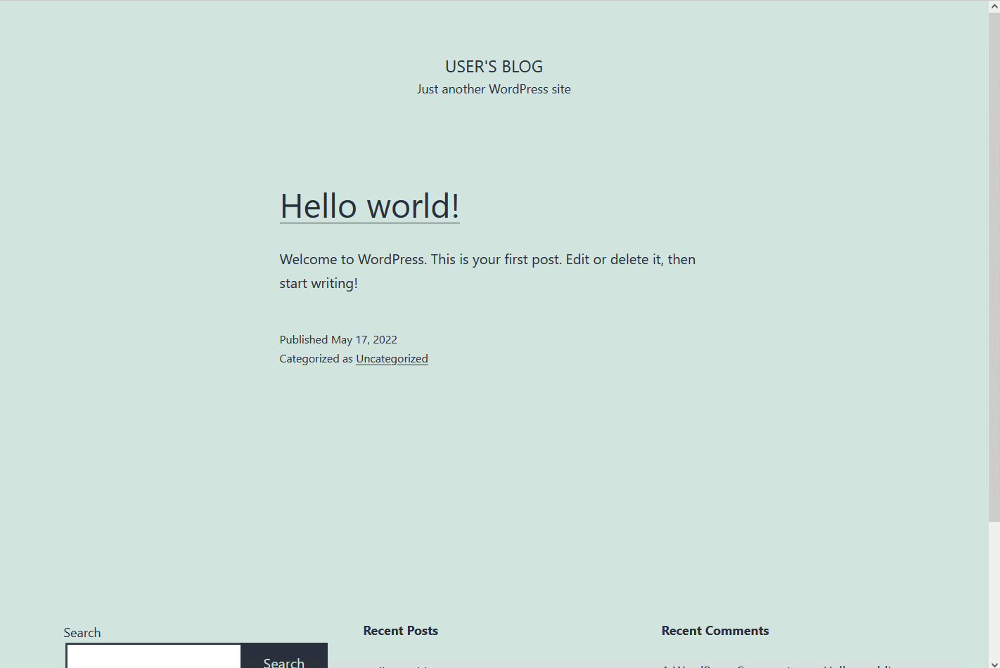
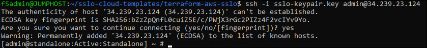
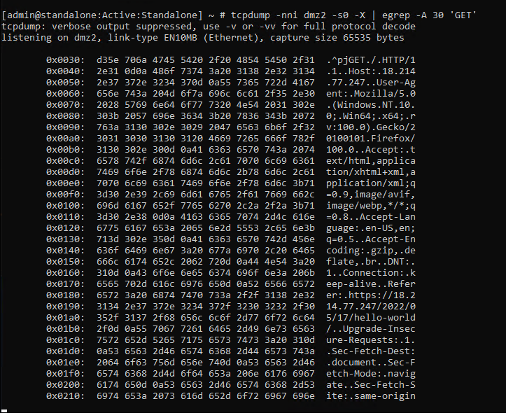
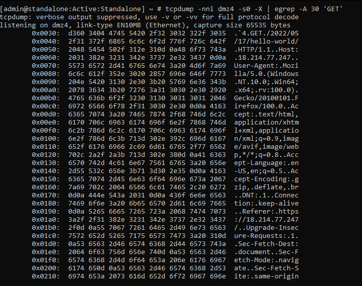

Test Application Access
================================================================================

Browse the Application VIP
--------------------------------------------------------------------------------

.. note::

   You will need the <sslo_vip> Public IP address from your Terraform outputs.

On the Windows jump host, open another web browser window and connect to: **https://<sslo_vip>**.

You should see an SSL warning since the certificate is not trusted (using default self-signed certificate).

|

Click on **View Certificate** to look at the custom certificate that was installed by the Ansible playbook.

|

Accept the warnings and then you should see the demo Wordpress web site.

|

View Decrypted Traffic
--------------------------------------------------------------------------------

To verify that decrypted traffic is flowing through the L3 services, you can run **tcpdump** on the SSL Orchestrator **FROM Service** VLANs (**dmz2** and **dmz4**). You will need the Public IP address of the BIG-IP (from Terraform output: <sslo_management_public_ip>).

Open a new BASH Terminal and SSH to the BIG-IP:

   .. code-block:: bash

      cd ~/sslo-cloud-templates/terraform-aws-sslo
      terraform output
      ssh -i sslo-keypair.key admin@<sslo_management_public_ip>

|

No password is required because you are using the SSH key that was generated by Terraform during the BIG-IP deployment.

|

Start a packet capture on the **dmz2** VLAN and show the next 30 lines when there is a match on 'GET':

.. code-block:: bash

      tcpdump -nni dmz2 -s0 -X | egrep -A 30 'GET'

|

Click on some of the Wordpress links to generate some traffic.

You should see plaintext content similar to the following:

|

Start a packet capture on the **dmz4** VLAN and show the next 30 lines when there is a match on 'GET':

.. code-block:: bash

      tcpdump -nni dmz4 -s0 -X | egrep -A 30 'GET'

|

Click on some of the Wordpress links to generate some traffic.

You should see plaintext content similar to the following:

|

Close this BASH Terminal window.

|

This is the end of the **Automating SSL Orchestrator Topology Configuration with Ansible** module.
