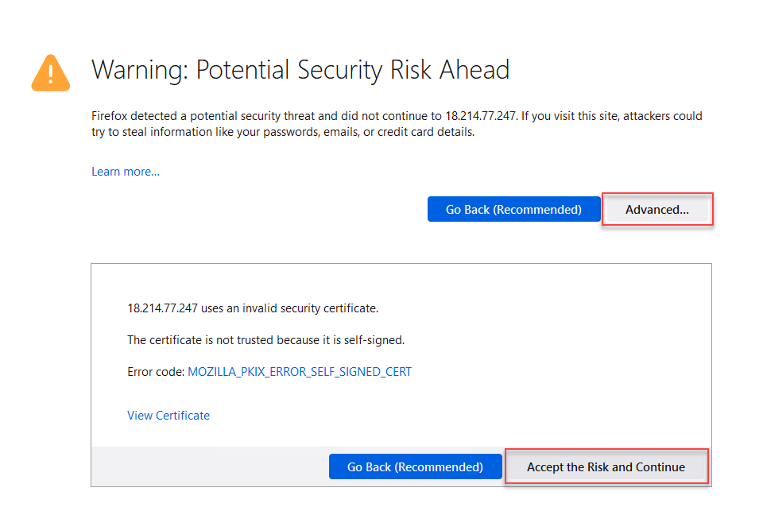

Test Application Access
================================================================================

.. note::

   You will need the <sslo_vip> Public IP address from your Terraform outputs.

On the Windows jump host, open another web browser window and connect to: **https://<sslo_vip>**.

You should see an SSL warning since the certificate is not trusted (using default self-signed certificate).

Accept the warnings and then you should see the demo Wordpress web site.

.. image:: ./images/webapp-2.png
   :align: left
   :scale: 60 %

|

This is the end of the **Automating SSL Orchestrator Topology Configuration with Ansible** module.
