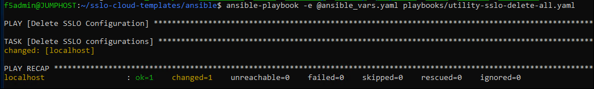

Delete the SSL Orchestrator Configuration (Ansible)
================================================================================

The F5 Ansible collection also includes a utility module to delete the entire SSL Orchestrator configuration.

In VSCode, click **playbooks > utility-sslo-delete-all.yaml** to view the example playbook.

This playbook relies on variable values provided by the previously reviewed **ansible_vars.yaml** file.

The playbook tasks are described below:

.. list-table:: **Ansible Tasks**
   :header-rows: 1
   :widths: auto

   * - Task Name
     - Module Name
     - Description
   * - Delete SSLO configurations
     - bigip_sslo_config_utility
     - Deletes the entire SSL Orchestrator configuration.

In the BASH Terminal, run the playbook:

   .. code-block:: bash

      ansible-playbook -e @ansible_vars.yaml playbooks/utility-sslo-delete-all.yaml

Wait for the Ansible playbook to complete.

|

In the BIG-IP (SSL Orchestrator) TMUI, click on **SSL Orchestrator > Configuration**. You should now see the Configuration introduction page again.
