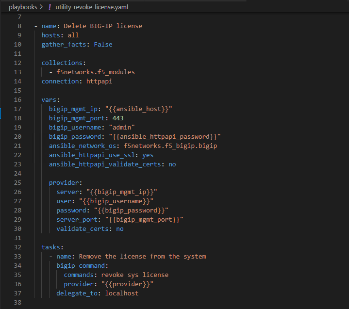
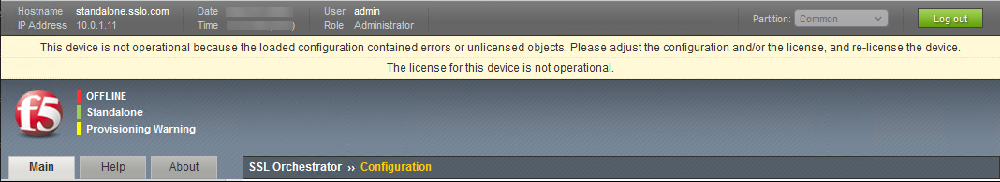

Revoke the BIG-IP VE License (Ansible)
================================================================================

The **sslo-cloud-templates** repository also includes an example playbook to revoke the BIG-IP VE license. This allows you to re-use a license without having to call F5 Support to release the activation lock.

.. note::

   The license that the instructor provided for this lab is valid for 30 days.

|

In VSCode, click **playbooks > utility-revoke-license.yaml** to view the example playbook.

|

This playbook relies on variable values provided by the previously reviewed **ansible_vars.yaml** file.

The playbook tasks are described below:

.. list-table:: **Ansible Tasks**
   :header-rows: 1
   :widths: auto

   * - Task Name
     - Module Name
     - Description
   * - Remove the license from the system
     - bigip_command
     - Revokes the BIG-IP (SSL Orchestrator) license using a TMSH command.

|

In the BASH Terminal, run the playbook:

   .. code-block:: bash

      ansible-playbook -e @ansible_vars.yaml playbooks/utility-revoke-license.yaml

Wait for the Ansible playbook to complete.

|

In the BIG-IP (SSL Orchestrator) TMUI, you should see a message indicating that the system is not operational due to licensing.

