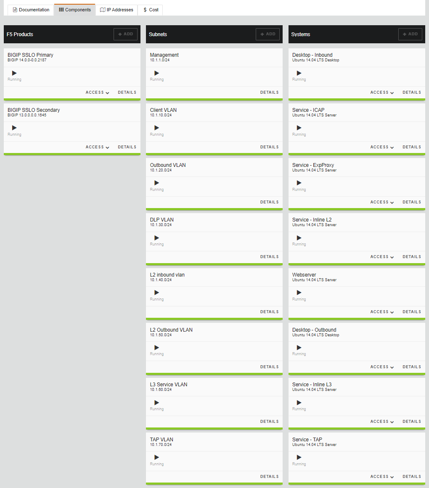

.. role:: red
.. role:: bred

SSL Orchestrator Lab Environment
================================

Accessing the Virtual Lab
-------------------------

If you are not familiar with the process for joining a training course, refer to:

- `How to join a training course <https://help.udf.f5.com/en/articles/3832165-how-to-join-a-training-course>`_
- `How to use the training course interface <https://help.udf.f5.com/en/articles/3832340-training-course-interface>`_

To access your lab and lookup the necessary IP addresses, you should have
received an email with your personal "Lab Portal Link". Once attached you
should have something similar to the following image. Highlighted is the "Lab
Guide" and the VM's you'll spend all of your time attached to.

.. NOTE::

   All of your lab exercise work will be done from a single jump hostname titled Ubuntu18.04 Client (accessed via the XRDP client).
   
   You will not need to use SSH to access the UDF lab environment, so no SSH Key needs to be conffigured.

From the :bred:`DEPLOYMENT` tab, you will access the :bred:`Ubuntu18.04 Client` system over XRDP. 
You can select the window resolution for the RDP session. An RDP file will be downloaded to your local
system and you will need to open it to connect.

|

Lab Details
-----------

Most of this lab can be accomplished by directly attaching to
the BIG-IP GUI.

.. IMPORTANT:: The lab environment for this guide has provided some
   prerequisite settings that you should be aware of. These are provided to
   make the lab simpler.

   The following information is based on a custom :bred:`UDF` blue print named
   :bred:`SSL Orchestrator 9.0 Lab`.

-  **Client side VLAN and subnet are pre-defined** - this is the VLAN
   that an internal client connects to for outbound traffic flows. SSLO
   does not define the client-side VLAN(s) and self-IP(s).

-  **Outbound side VLAN and subnet are pre-defined** - this is the VLAN
   that traffic egresses from SSLO to the Internet gateway. SSLO does
   not define the server-side VLAN(s) and self-IP(s).

-  **CA certificate and private key are installed** - this is the CA
   certificate and private key that are used to re-issue (forge) remote
   server certificates to internal clients for outbound traffic flows.

-  **Server certificate and private key are installed** - for the
   inbound (reverse proxy) traffic flow use case, SSL traffic is
   terminated at the F5, and re-encrypted on the way to the internal
   application environment. A wildcard server certificate is installed
   to facilitate using any name under the ":red:`.f5labs.com`" sub-domain.

TIP
================================

   It is a security best practice to isolate security devices
   within the protected network enclaves provided by SSLO. Customers will
   often desire NOT to move or change existing security services. However,
   while possible with SSLO 4.0 and beyond, passing this decrypted traffic
   to points on an existing network architecture could create multiple
   points of data exposure. Usernames, passwords, credit card numbers and
   other sensitive information could be exposed to other devices on that
   network. Each inline layer 3 security service definition includes an
   "Auto Manage" option. This option, enabled by default, provides internal
   network settings for security services to use, so that only the
   interface (and 802.1q VLAN tag as needed) is required to be defined for
   the inbound and outbound interfaces. Should customers opt to not follow
   security best practices, or simply need different networking settings,
   you can disable the Auto Manage option and define all of the required
   inbound and outbound networking setting manually.

.. list-table:: **SSL Orchestrator**
   :header-rows: 0
   :widths: auto

   * - BIG-IP SSLO Management IP
     - 10.1.1.x (UDF-managed)
     -
   * - Gateway IP/DNS
     - 10.1.20.1
     -
   * - Login
     - admin:admin \| root:default
     -
   * - Interfaces
     - client-VLAN
     - 1.1
   * -
     - outbound VLAN
     - 1.2
    * -
     - dlp-vlan
     - 1.3 tag 50
   * -
     - web-vlan
     - 1.3 tag 80

   * - Login
     - student:agility

SSL Orchestrator Consolidated Services Architecture (UDF Version)

A Docker Compose configuration to create all of the SSLO security services on a single Ubuntu 18.04 instance, to both simplify and dramatically reduce resource utlization in a virtual environment.

About
================================
This Docker Compose configuration supports the SSL Orchestrator lab environment, which itself supports 802.1Q VLAN tags. This also reduces the number of physical interfaces and connections required. The Docker Compose file contains all of the layer 3 services (ICAP, explicit proxy, layer 3 service, and web servers). Layer 2 and TAP services are defined directly on the host system and described in the "layer2-tap-config" readme file.

The following is a visual representation of this lab
environment. The numbers inside the right edge of the SSL Orchestrator
box indicate the port numbers assigned. The colored boxes to the right
of the services indicate a few product examples for each respective
service type.

.. image:: images/labinfo-3.png
   :align: center
