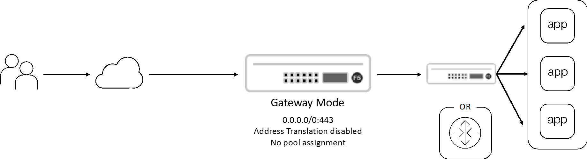
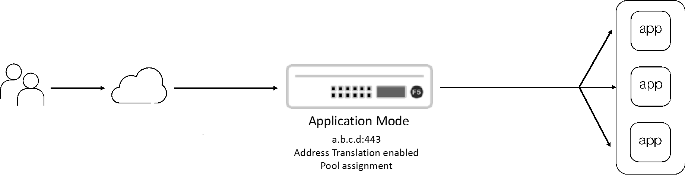

Create a Reverse Proxy SSLO
======================================

The SSL Orchestrator inbound L3 topology generally describes two
slightly different use cases for inbound traffic.

The default use case is a 'gateway' mode.
This is where SSLO sits in front of a separate
ADC/load balancer or routed path. The primary attributes of the gateway
mode are a wildcard (0.0.0.0/0) listener, no pool assignment and
disabled address translation (destination NAT). Destination addresses
from the external client therefore point to a location *behind* SSLO.

The alternate use case is an 'application' mode, where the client’s
destination address terminates at the F5. The primary attributes of the
application mode are an IP-specific listener address, backend server
pool assignment, and enabled address translation (destination NAT). An
SSLO inbound topology in application mode behaves very much like a
typical F5 BIG-IP reverse proxy virtual server, except that SSLO manages
the complete configuration workflow, including mandatory re-encryption
to the backend services.

The following lab instructions provide for both SSLO inbound L3 use
cases.

.. note:: This module consists of an abbreviated set of steps, as some of
   the objects created in Module 1 (SSL settings, services, service chains and
   security policies) are re\-usable here. If any of these objects have not
   been created, please review
   `Module 1 - Create a Transparent Forward Procy SSLO
   <../module1/module1.html>`_ for more detailed configuration instructions.

.. toctree::
   :maxdepth: 2
   :glob:

   lab*
