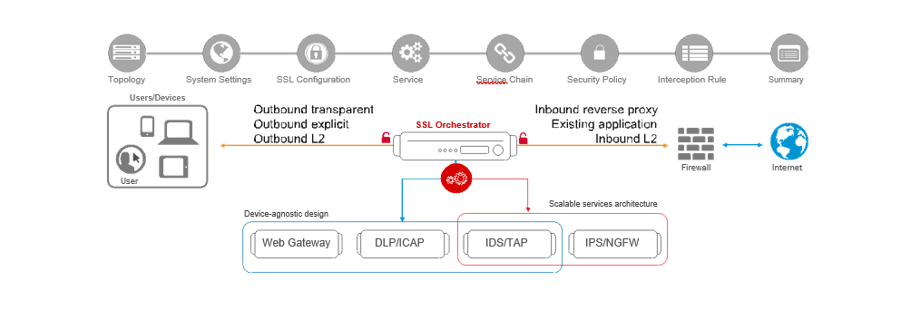

WHAT IS THE F5 SSL ORCHESTRATOR?
================================

F5 SSL Orchestrator (SSLO) provides an all-in-one appliance solution
designed specifically to optimize the SSL infrastructure, provide
security devices with visibility of SSL/TLS encrypted traffic, and
maximize efficient use of that existing security investment. This
solution supports policy-based management and steering of traffic flows
to existing security devices, designed to easily integrate into existing
architectures, and centralizes the SSL decrypt/encrypt function by
delivering the latest SSL encryption technologies across the entire
security infrastructure.

Multi-layered security
----------------------

In order to solve specific security challenges, security administrators
are accustomed to manually chaining together multiple point products,
creating a bare-bones “security stack” consisting of multiple services.
A typical stack may include components like Data Leak Prevention (DLP)
scanners, Web Application Firewalls (WAF), Intrusion Prevention and
Detection Systems (IPS and IDS), Malware Analysis tools, and more. In
this model, all user sessions are provided the same level of security,
as this “daisy chain” of services is hard-wired.

Dynamic service chaining
------------------------

Dynamic service chaining effectively breaks the daisy chain paradigm by
processing specific connections based on context provided by the
Security Policy, that then allows specific types of traffic to flow
through arbitrary chains of services. These service chains can include
five types of services: layer 2 inline services, layer 3 inline
services, receive-only services, ICAP services, and HTTP web proxy
services.

Topologies
----------

Different environments call for different network implementations. While
some can easily support SSL visibility at layer 3 (routed), others may
require these devices to be inserted at layer 2. SSL Orchestrator can
support all of these networking requirements with the following topology
options:

+-----+----------------------------------+---------+-----------------------------+
| •   |     Outbound transparent proxy   |     •   |     Inbound reverse proxy   |
+=====+==================================+=========+=============================+
| •   |     Outbound explicit proxy      |     •   |     Existing application    |
+-----+----------------------------------+---------+-----------------------------+
| •   |     Outbound layer 2             |     •   |     Inbound layer 2         |
+-----+----------------------------------+---------+-----------------------------+

Security Policy
---------------

The SSLO Security Policy provides a rich set of context-aware methods to
dynamically determine how best to optimize traffic flow through the
security stack. Context can minimally come from the following:

+---------------------------------------------------+---------------------------------------------------------+
| Source and destination address/subnet             |     Destination port                                    |
+===================================================+=========================================================+
| URL filtering and IP intelligence - Subscriptions |     IP geolocation                                      |
+---------------------------------------------------+---------------------------------------------------------+
| Host and domain name                              |     Protocol                                            |
+---------------------------------------------------+---------------------------------------------------------+
   
|image1|

WHAT’S NEW IN SSLO?
===================

**SSLO 4.0** provides significant architectural improvements over previous
versions. Here are just a few of those updates:

-  SSLO 4.0 replaces the complex iRules-based traffic classification 
       and service chaining functions of previous versions with an Access
       per-request policy engine, providing much greater flexibility in
       traffic management options.

-  SSLO 4.0 optimizes traffic flow through security services
       by replacing the complex “proxy hops” with a new “tee connector” –
       essentially a mid-proxy tap – that allows decrypted traffic to
       flow through security devices out-of-band from the main
       client-server proxy traffic. This is implemented as new “Service”
       and “Connector” profiles.

-  SSLO 4.0 introduces new “split session” client and server SSL
       profiles, that are now responsible for carrying SNI signaling
       information across the inspection zone.

-  SSLO 4.0 further optimizes traffic flow 
       by reducing the amount of iRule data plane management, also making it easier to add
       customization iRules.

-  SSLO 4.0 introduces three new network topologies 
       Along with the existing outbound transparent and explicit proxy flows, 4.0 now
       also supports inbound layer 3 (reverse proxy) inspection, and
       layer 2 transparent inbound and outbound topologies.

**SSLO 4.0** also includes the following new functionality features:

-  Explicit and transparent web proxy devices as an inline security
       service.

-  Front-end explicit proxy authentication via APM integration (relies
       on existing SWG-Explicit access policy).

-  FTPS (passive), SMTPS, POP3S, and IMAPS protocols inspection.

-  ICAP advanced filtering via LTM CPM policy (relies on an existing CPM
       policy).

-  URL filtering as a function of the Access per-request service
       chaining policy.

-  Authentication headers - ability to define additional HTTP headers to
       pass to inline security services.

-  vCMP support - ability to select existing VLANs for inbound and
       outbound to/from inline services.

**SSLO 5.0 includes the following updates:**

-  Guided Configuration user experience, a complete refresh of the SSLO
       UI based on the Access Guided Configuration engine.

-  Discreet “topology” definitions and the ability to define how SSLO
       listens for and processes traffic flows.

-  Re-entrant, wizard-driven workflows. Based on the selected topology,
       SSLO 5.0 presents an intuitive workflow UI that walks the user
       through a simplified object creation process.

.. note:: **Note**: Viprion chassis platform support is not available in SSLO 4.0
and 5.0.

**SSLO 6.0 includes the following updates:**

-  Transparent proxy captive portal authentication – In transparent
       forward proxy mode, an APM authentication profile
       (SWG-Transparent) can now be applied to perform captive
       portal-based client authentication.

-  Reverse proxy (inbound SSLO) TLS 1.3 support – TLS 1.3 can now be
       handled on both client and server side of SSLO for inbound SSLO
       topologies.

-  Service device monitor configuration – It is now possible to define
       the monitors applied to inline service definitions.

-  Improved analytics dashboard – SSLO now provides a separate analytics
       dashboard with enhanced statistical information.

-  Viprion chassis support – SSLO can now function on Viprion platforms,
       in both vCMP and non-vCMP configurations.

-  Improved stability over previous versions

WHAT’S NEW IN SSLO 7.1?
=======================

**SSL Orchestrator 7.1** adds the following new features:

-  **TLS 1.3 full proxy support for inbound and outbound flows** – SSLO
       6.0 included TLS 1.3 support for inbound (reverse proxy). This
       latest version now supports TLS 1.3 for outbound (forward proxy).
       A lab is dedicated to configuring TLS 1.3.

-  **Contextual security policies** – In previous versions SSLO made no
       distinction between inbound and outbound flows for security
       policies, allowing inconsistent rule options to break traffic.
       SSLO 7.1 now creates separate inbound and outbound security
       policy types.

-  **Access to full IP Intelligence categories** – This version provides
       access in the security policy to select specific IP Intelligence
       categories, versus simply ‘good’ or ‘bad’.

-  **Update fix to URL category lookup when URLDB/SWG not provisioned**
       – SSLO now correctly only queries custom URL categories if URLDB
       and/or SWG are not provisioned.

-  **Update fix to URL category lookup for custom categories** – SSLO
       now correctly queries the categories directly based on http://
       and https:// schemes. Previous versions only matched https://
       URLs.

-  **Update fix to inline service load balancing** – SSLO now correctly
       load balances inline services when port remapping is enabled.

-  **Strict Updates and modification enhancements** – In previous
       versions when strict-updates was disabled on a configuration
       object, that object would become read-only in the SSLO UI. In
       SSLO 7.1, for most object types, strictness can be disabled and
       still editable in the SSLO UI. If any non-strict changes are made
       to the objects, deployment provides an option to keep those
       non-strict changes or overwrite. A lab is dedicated to strict
       updates modification.

-  **New HA Status UI** – The HA Status UI provides a graphical view of
       HA state applicable to SSLO, including Gossip and Echo state. A
       lab is dedicated to configuring SSLO in HA mode.

-  **Several user interface, HA and upgrade stability enhancements** –
       This SSLO version is mainly targeted at stability improvements,
       including UI, HA and upgrades.

Please refer to the official SSLO 7.0 release notes for detailed update
information:

*https://techdocs.f5.com/kb/en-us/products/ssl-orchestrator/releasenotes/product/relnote-ssl-orchestrator-15-1-0-iapp-7-0.html*

Please refer to the official SSLO 7.1 release notes for details update
information:
*https://techdocs.f5.com/kb/en-us/products/ssl-orchestrator/releasenotes/product/relnote-ssl-orchestrator-15-1-0-iapp-7-1.html*

This lab guide and corresponding UDF lab environment are prepared for
SSLO 7.1 on a BIG-IP 15.1 instance.

.. |image2| image:: media/image003.png
   :width: 7.20972in
   :height: 0.60347in
