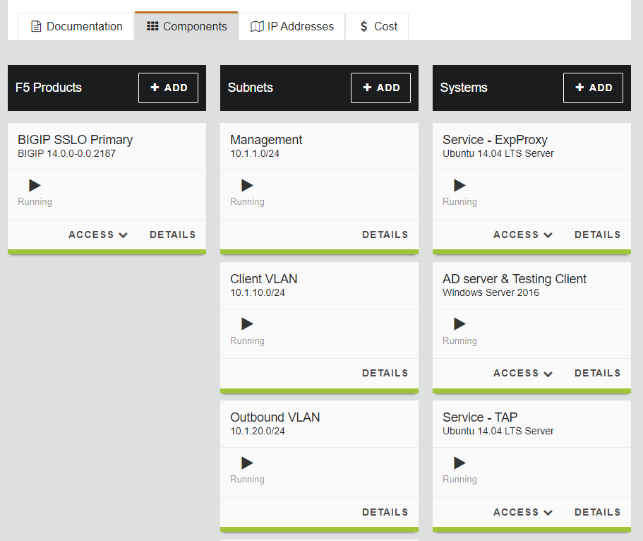
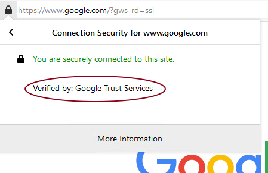
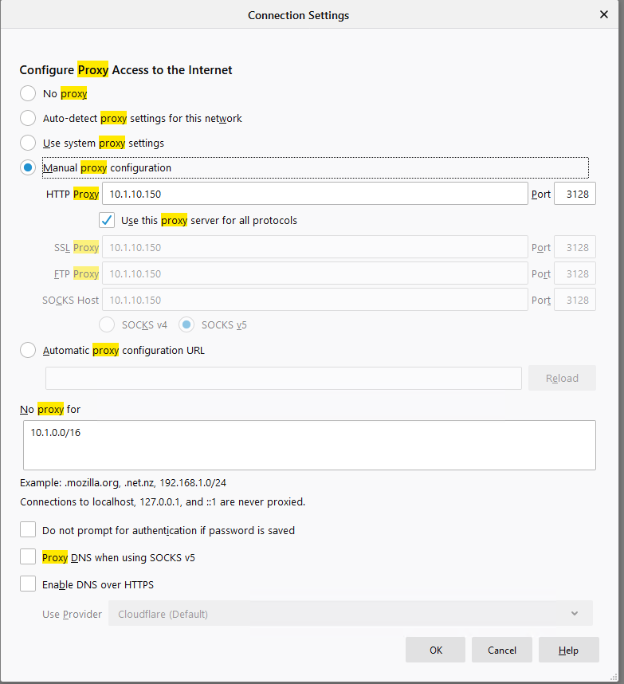

.. raw:: html
   

.. role:: red

Step 0: Verify that the current solution works
~~~~~~~~~~~~~~~~~~~~~~~~~~~~~~~~~~~~~~~~~~~~~~

-  **Validate that current SSLO deployment works**

   -  From the Lab deployment page, Select ***Components***. Screenshot
      shown below

|image5|

-  For the ***AD server & Testing Client*** system in the ***Systems***
   section of the interface click on ***Access->RDP***

-  Save the link for the RDP session and open the file

-  An RDP session to the AD server and Client should open using
   Microsoft RDP client

-  Login in as ***cs-user1/cs-user1*** for the domain ***f5labs***

-  Double-click on the FireFox icon on the desktop

-  Navigate to `*https://www.google.com* <https://www.google.com>`__

-  Click on the |image6|\ icon in the address bar

-  Click on the |image7|\ adjacent to the ***Connection Secure***

-  Verify the verification is done by ***Google Trust Services***.

|image8|

-  Modify proxy settings to traverse the SSLo setup

   -  Click on |image9|\ menu in FireFox to access FireFox settings

   -  Select ***Options*** and type in ***proxy*** in the Search box on
      the top right side of the FireFox window

   -  Select ***Settings*** for ***Configure how Firefox connects to the
      internet.*** menu option.

   -  Please modify the settings to reflect the screenshot below

|image10|

-  Click ***OK***

-  Close the ***Options*** tab and **close and re-open** the Firefox
   browser

-  Re-visit :red: `*https://www.google.com* <https://www.google.com>`__

-  Verify that verification is done by ***f5labs.com*** now

|image11|

-  Visit a financial institution (*example*
   :red: `*https://www.chase.com* <https://www.chase.com>`__) and verify that
   we are not intercepting traffic by ensuring that the verification is
   done by a trusted PKI issuer (*example JPMorgan Chase and
   Co./Entrust, Inc.*). If the traffic was intercepted we would see the
   that the verification would have been done by ***f5labs.com***. Since
   we are bypassing ***Financial Institutions*** and this website is a
   financial institution, the verification is done by the original
   issuer.

-  **Verify that the HTTP Proxy is seeing decrypted traffic**

-  From the lab deployment screen select ***Access->WEB SHELL*** from
   the ***Service - ExpProxy*** system

-  Type :red: *tail -F /var/log/squid3/access.log* in the web console terminal

-  Visit a few secure(https) websites in the RDP client and verify that
   access is being logged even though we are visiting a secure website.
   You should see the log scrolling by and logging the sites and URLs
   visited. Your screen should have something similar to the screenshot
   shown below.

|image12|

.. |image6| image:: ../media/image007.png
   :width: 0.23958in
   :height: 0.31250in
.. |image7| image:: ../media/image008.png
   :width: 0.42708in
   :height: 0.51042in

.. |image11| image:: ../media/image012.png
   :width: 4.57292in
   :height: 3.35417in
.. |image12| image:: ../media/image013.png
   :width: 7.05556in
   :height: 3.32778in
