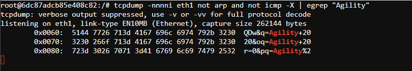

.. role:: raw-html(raw)
   :format: html

Step 6: Verify that everything is working as expected
~~~~~~~~~~~~~~~~~~~~~~~~~~~~~~~~~~~~~~~~~~~~~~~~~~~~~

-  Revisit the sites visited from **Step 0:**

-  Re-visit :raw-html:`<i>https://www.google.com</i>`

-  Verify that verification is done by **f5labs.com** now

   .. image:: ../media/image012.png

-  Visit a financial institution (*example*
   :raw-html:`<i>https://www.chase.com</i>`) and verify that
   we are not intercepting traffic by ensuring that the verification is
   done by a trusted PKI issuer (*example JPMorgan Chase and
   Co./Entrust, Inc.*). If the traffic was intercepted we would see the
   that the verification would have been done by **f5labs.com**. Since
   we are bypassing **Financial Institutions** and this website is a
   financial institution, the verification is done by the original
   issuer.

-  **Verify that the HTTP Proxy is seeing decrypted traffic**

   -  From the lab deployment screen select **Access->WEB SHELL** from
      the **Service - ExpProxy** system

   -  Type :raw-html:`<i>tail -F /var/log/squid3/access.log</i>` in the web console terminal

   -  Visit a few secure(https) websites in the RDP client and verify that
      access is being logged even though we are visiting a secure website.
      You should see the log scrolling by and logging the sites and URLs
      visited. Your screen should have something similar to the screenshot
      shown below.

   |image20|

-  **Verify that the Cisco TAP is seeing both intercepted and bypassed
   traffic**

   -  From the lab deployment screen select **Access->WEB SHELL** from
      the **Service – TAP** system

   -  Type the following command to verify that the traffic is being
      sent to the tap device: 
      -  :raw-html:`<i>tcpdump -nnnni eth1 not arp and not icmp
         -X</i>`

   -  Visit a financial website that is bypassed and verify that traffic
      is still flowing through the tap device

   -  Since the traffic is not de-crypted we will not be able to see any
      intelligible output

   -  Visit an intercepted website like https://www.google.com and we
      should see some recognizable text – to verify type the following
      commnd

      -  :raw-html:`<i>tcpdump -nnnni eth1 not arp and not icmp -X | egrep
         'Agility'</i>`

   -  While still visiting the an encrypted website, since we are
      intercepting and decrypting it, we are able to see the payload and
      therefore the search above should return results when we search
      for :raw-html:`<i>'Agility 2020'</i>` in the browser.

   -  We should see something similar to the screenshot below

   |image21|

.. |image20| image:: ../media/image013.png
   :width: 7.05556in
   :height: 3.32778in

