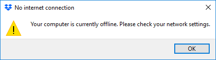

.. role:: raw-html(raw)
   :format: html

Step 0: Verify complaint
~~~~~~~~~~~~~~~~~~~~~~~~

-  On the Firefox browser in the **AD server & Testing Client**, visit
   :raw-html:`<i>https://www.dropbox.com</i>`

-  Verify that the SSL Orchestrator is intercepting it by checking the
   entity verifying the certificate

   |image22|

-  Start the Dropbox client. The Dropbox client will be unable to
   connect to the server and show the following error. This error occurs
   because as we can see from the previous step, Dropbox.com is being
   intercepted by the SSL Orchestrator and client uses Certificate
   Pinning.

   |image23|

-  To handle such issues, the default SSL Orchestrator Security Policy
   includes a rule called **Pinners\_Rule** that is the first rule in
   any Security Policy.

   |image24|

.. |image22| image:: ../media/image021.png
   :width: 7.05556in
   :height: 3.04444in

.. |image24| image:: ../media/image023.png
   :width: 7.05556in
   :height: 1.43264in
