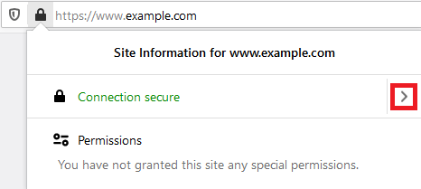
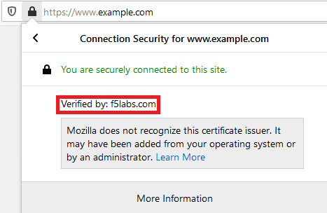
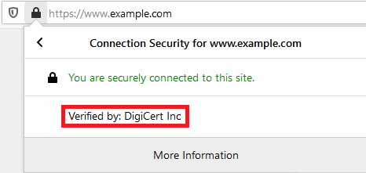
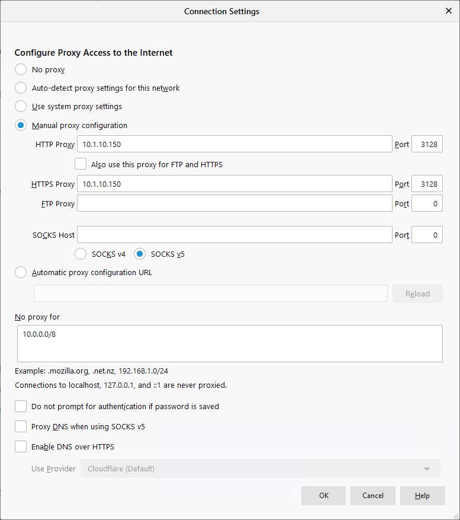
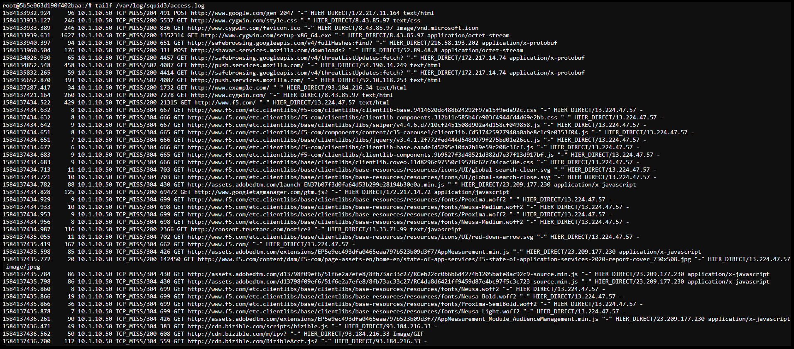

.. role:: raw-html(raw)
   :format: html

Test Access to Client & Update Proxy Settings
~~~~~~~~~~~~~~~~~~~~~~~~~~~~~~~~~~~~~~~~~~~~~~

-  Start an RDP session to the **Windows 10 Desktop** *(Components > Windows 10 Desktop > ACCESS > RDP)*

-  Login in as **f5labs\\mike** (pw: **agility**)

-  Open the **Firefox** browser

-  Browse to ``https://www.example.com/``

-  Click on the padlock icon in the address bar

   |ff-padlock|

-  Click the arrow to the right of **Connection secure**

   |ff-conn-expand|

-  Confirm that the connection/certificate is verified by **DigiCert Inc**

   |ff-digicert-verified|

-  Modify the client's proxy settings to point to F5 SSL Orchestrator

   -  In Firefox, click on the menu (|ff-menu|) in the top right of the window

   -  Select **Options** on the menu
   
   -  In the **Find in Options** search field at the top, type ``proxy``
   
   -  Click the **Settings...** button
   
   -  Select the **_M_anual proxy configuration** radio button. Ensure the proxy settings appear as follows before proceeding:
   
      |ff-connection-settings|

-  Click the **OK** button

-  **Close and relaunch** the Firefox browser

-  Browse to ``https://www.example.com/`` once again

-  Confirm that the connection/certificate is now verified by **f5labs.com**

   |ff-f5labs-verified|

-  Visit a financial institution (ex. \https://www.chase.com) and verify that SSL Orchestrator is not intercepting by confirming that the verification is done by a trusted CA (ex. Entrust, Inc.). If the traffic was intercepted the connection/certificate would have been verified by f5labs.com. Because we are bypassing **Financial Institutions** in the SSL Orchestrator Security Policy and this website is a financial institution, the origin server's public certificate is presented to the client.

-  Confirm that the explicit proxy service is seeing decrypted traffic:

   -  Start a console session to **Service - ExpProxy** *(Components > Service - ExpProxy > ACCESS > Web Shell)*

   -  Type ``tailf /var/log/squid3/access.log`` in the web console

   -  Visit a few secure (HTTPS) websites (non-banking) using Firefox on the Windows 10 Desktop and confirm that access is being logged even though we are visiting a secure website. You should see log entries of the sites and URLs visited, similar to the example below:

      |proxy-access-log|

