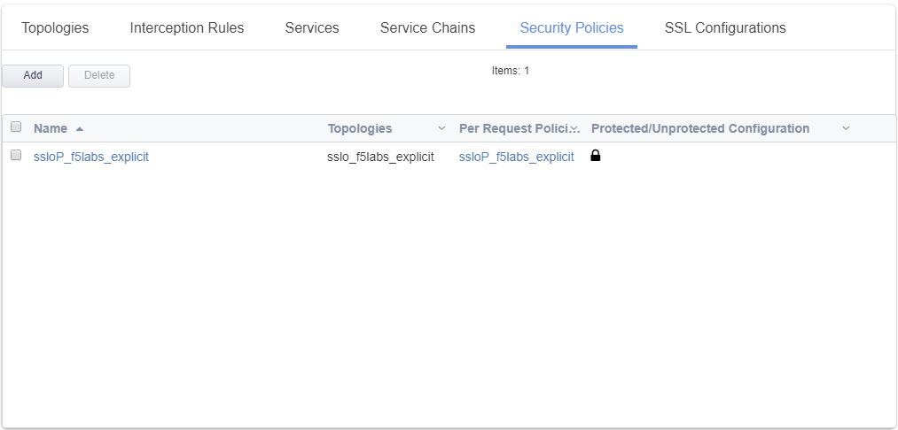

Step 1: Review the current SSL Orchestrator deployment
~~~~~~~~~~~~~~~~~~~~~~~~~~~~~~~~~~~~~~~~~~~~~~~~~~~~~~

-  Select **SSL Orchestrator** from the Main Menu and select
   **Configuration** from the submenu. The following existing
   deployment should be present. It will take a few seconds to render
   this page.

   |image13|

-  Select **Security Policies** from the screen shown above. You
   should now be presented with following screen.

   |image14|

-  Select the **ssloP\_f5labs\_explicit** security policy and you should
   be able to see the security policy that is currently present as shown at
   the start of this lab.

.. |image13| image:: ../images/image014.png
   :width: 7.05556in
   :height: 5.79861in

