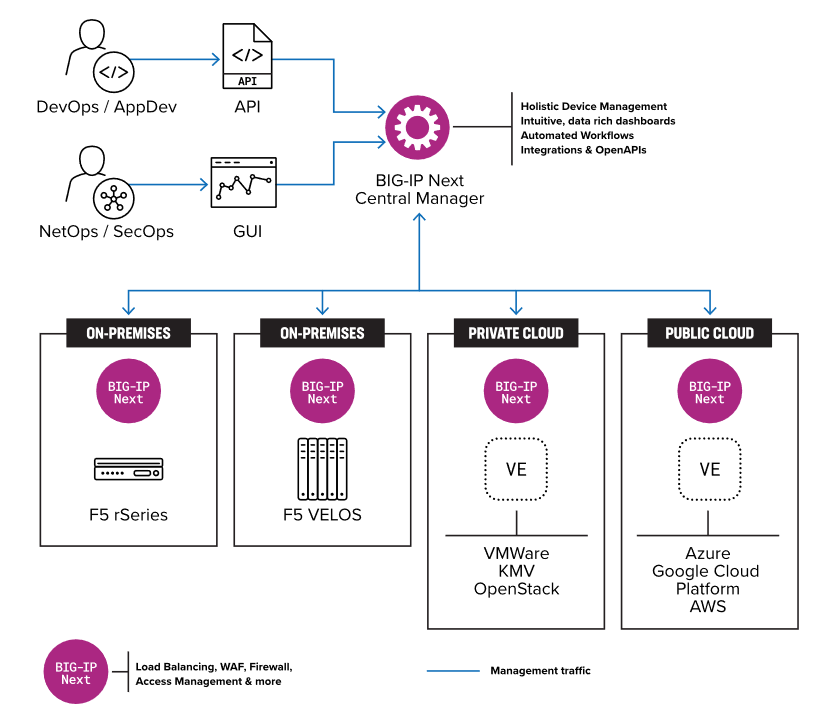

Introduction to BIG-IP Next
==============================================================================

Overview
------------------------------------------------------------------------------

F5® BIG-IP® Next™ is the next generation of BIG-IP software built to
reduce operational complexity, improve performance, strengthen security,
and enhance observability. A modernized software framework provides the
foundation for significantly improved control plane scale and
performance, rapid service upgrades, and reduced instance footprints in
cloud environments. BIG-IP Next also reimagines operational workflows by
introducing a centralized, API-centric, and automation-friendly
framework, making it faster and easier for DevOps, NetOps, SecOps, and
other BIG-IP reliant teams to deploy and manage critical application
services. With an accelerated software development cadence, BIG-IP Next
keeps pace with the evolving threat landscape by delivering new
protective functionality and vulnerability patches faster than ever
before, ensuring the security of your apps and environments. Carrying
forward the comprehensive suite of advanced BIG-IP TMOS functionality
developed over the past 20 years, BIG-IP Next continues to deliver
everything from local and global traffic management and DNS Services to
application security and access controls—along with the same breadth of
deployment form factors and consumption models as its predecessor.

Benefits of BIG-IP Next
------------------------------------------------------------------------------

BIG-IP Next greatly simplifies day-to-day ADC operations and accelerates
application time-to-market through automation, meaning you can spend
less time on menial tasks and more on what really matters: getting your
apps online and keeping them there. Beyond the capabilities already
stated, BIG-IP Next provides the following additional benefits:

-  Accelerated and automated application deployments
-  Rapid, effortless software upgrades
-  Superior control plane efficiency and scale
-  Improved application resiliency
-  Rapid security updates
-  Faster vulnerability patches
-  Security-centric software development
-  Insightful application analytics and dashboards
-  Third party telemetry streaming
-  Centralized monitoring, alerting, and reporting
-  Centralized control with BIG-IP Next Central Manager

The BIG-IP Next and Central Manager Architecture
------------------------------------------------------------------------------

Every BIG-IP Next deployment consists of two key components: BIG-IP Next
instances and the F5® BIG-IP® Next™ Central Manager. BIG-IP Next
instances are generally deployed close to applications, providing the
data plane and control plane necessary to direct application traffic,
block threats, and enforce specific policies. The BIG-IP Next Central
Manager delivers the management plane, capable of centrally managing
hundreds of BIG-IP Next instances to significantly reduce operational
complexity. After BIG-IP Next instances have been deployed, the BIG-IP
Next Central Manager is the sole interface for managing all connected
BIG-IP Next instances, which can be accomplished via either the BIG-IP
Next Central Manager's GUI, CLI, or API. BIG-IP Next Central Manager
provides a centralized console for gaining insights into application and
device health, automating application deployments and policy changes,
and performing all instance lifecycle tasks for BIG-IP Next instances
deployed anywhere across distributed environments.

Figure: BIG-IP Next and Central Manager Architecture

