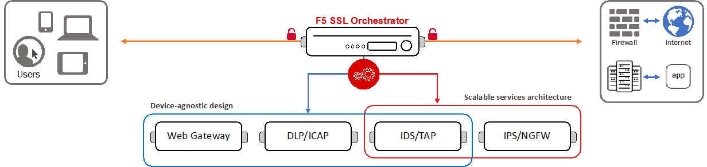

What is F5 SSL Orchestrator?
==============================================================================

Overview
------------------------------------------------------------------------------

F5 SSL Orchestrator provides an all-in-one solution designed
specifically to optimize the enterprise security inspection
infrastructure, provide security devices with visibility of SSL/TLS
encrypted traffic, and maximize efficient use of that existing security
investment. This solution supports policy-based management and steering
of traffic flows to security devices, designed to easily integrate into
existing architectures, and centralizes the decrypt and re-encrypt
functions by delivering the latest TLS cryptography technologies across
the entire security infrastructure.

Multi-layered security
------------------------------------------------------------------------------

To solve specific security challenges, security administrators are
accustomed to manually chaining together multiple point products,
creating a barebones “security stack” consisting of multiple services. A
typical stack may include components like Data Leak Prevention (DLP)
scanners, Web Application Firewalls (WAF), Intrusion Prevention and
Detection Systems (IPS and IDS), Malware Analysis tools, and more. In
this model, all user sessions are provided the same level of security,
as this “daisy chain” of services is hard-wired.

Dynamic service chaining
------------------------------------------------------------------------------

Dynamic service chaining effectively breaks the daisy chain paradigm by
processing specific connections based on context provided by the
Security Policy, that then allows specific types of traffic to flow
through arbitrary chains of services. These service chains can include
five types of services: layer 2 inline services, layer 3 inline
services, receive-only services, ICAP services, and HTTP web proxy
services.

Security Policy
------------------------------------------------------------------------------

The SSL Orchestrator Security Policy provides a rich set of
context-aware methods to dynamically determine how best to optimize
traffic flow through the security stack. Context can minimally come from
the following:

- Source and destination address/subnet
- Source and destination port
- IP Protocol
- IP Version
- TLS ClientHello Server Name (SNI)

