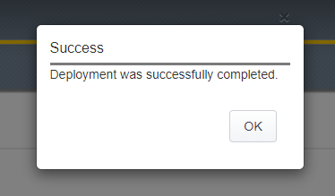

.. role:: raw-html(raw)
   :format: html

Create a new "Cisco Firepower Only" Service Chain
~~~~~~~~~~~~~~~~~~~~~~~~~~~~~~~~~~~~~~~~~~~~~~~~~~~~~~~~~~~~~~~~~~~~~~~
You now need to create a new Service Chain containing only the Cisco Firepower TAP service.

-  On the **Service Chain List** screen click the **Add** button to create a new Service Chain

-  On the **Service Chain Properties** screen enter the following values:

   -  **Name -** provide a unique name for this service chain (ex. :raw-html:`<i>Cisco_TAP</i>`)

   -  **Description -** provide a description for this service chain (ex. :raw-html:`<i>Cisco Firepower TAP only</i>`)

   -  **Services -** select the Cisco Firepower service (ex. :raw-html:`<i>ssloS_Cisco_FP</i>`) under **Services Available** and move it to **Selected Service Chain Order**

-  Click the **Save** button

-  You will be returned to the **Service Chain List**. You should now have three Service Chains in the **Service Chain List**

-  Click the **Save & Next** button

-  Click the **Deploy** button. This action will take a moment. Verify that the deployment was successful with no errors.

-  When successfully deployed, the following pop-up should appear:

   |successful_deploy|

-  Click the **OK** button to return to the SSL Orchestrator Configuration screen.

