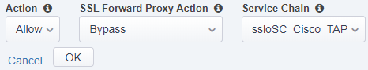
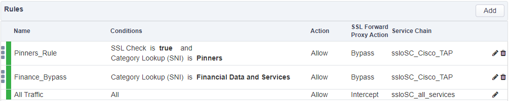

.. role:: raw-html(raw)
   :format: html

Update Service Chains on existing Security Policy Rules
~~~~~~~~~~~~~~~~~~~~~~~~~~~~~~~~~~~~~~~~~~~~~~~~~~~~~~~~~~~~~~~~~~~~~~~
Update the existing Security Policy rules to use the new Service Chains you just created.

From the SSL Orchestrator **Configuration** screen:

-  Click the **Security Policies** tab in the middle of the main display area.

-  Click the Security Policy named **ssloP\_f5labs\_explicit**. This should be the only security policy in the list at this time.

-  Click on the pencil icon (|image17|) next to the **Pinners\_Rule** to modify this rule.

-  In the properties section that appears, select **ssloSC\_Cisco\_TAP** from the **Service Chain** dropdown.

|policy_rule_Cisco-TAP|

-  Click the **OK** button

-  Repeat the same process for the **Finance\_Bypass** rule

-  Now modify the **All Traffic** rule and select the **ssloSC\_all\_services** Service Chain and click the **OK** button.

-  The Security Policy Rules should now look like this:

|updated_rules|

-  Click the **Deploy** button and then click the **OK** button on the pop-up to confirm you want to make the changes.

.. |image17| image:: ../images/image017.png
   :width: 0.22917in
   :height: 0.25000in

