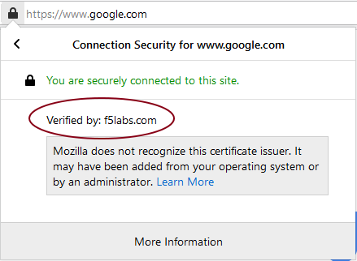
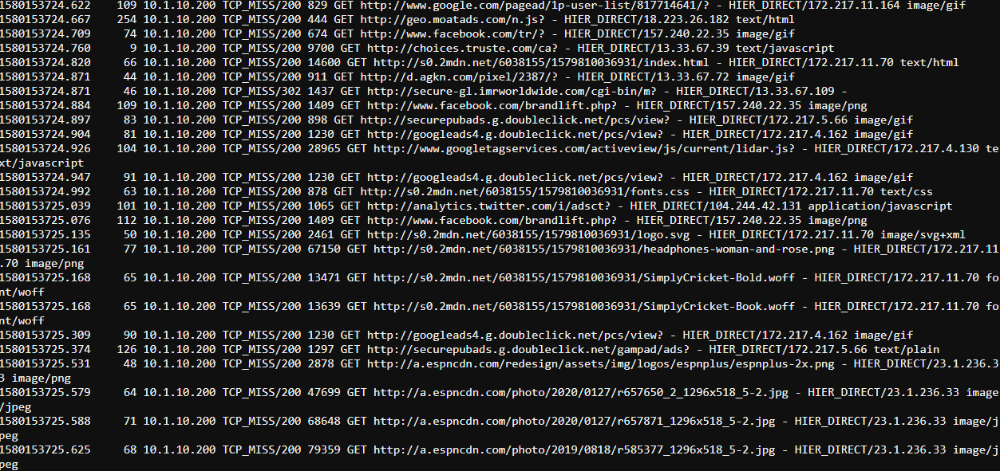

.. role:: raw-html(raw)
   :format: html

Confirm Service Chain and Security Policy Rules are working as expected
~~~~~~~~~~~~~~~~~~~~~~~~~~~~~~~~~~~~~~~~~~~~~~~~~~~~~

-  Browse to :raw-html:`<i>https://www.google.com</i>` on your Windows client

-  Verify that :raw-html:`<i>https://www.google.com</i>` is still being intercepted by confirming the certificate is signed/verified by **f5labs.com** 

   |image12|

-  Visit a financial institution (ex. :raw-html:`<i>https://www.chase.com</i>`) and verify that we are not intercepting this traffic by ensuring that the verification is done by a public CA (ex. *Entrust, Inc.*). If the traffic was intercepted we would see the that the verification was done by **f5labs.com**. Since we are bypassing **Financial Institutions** in our Security Policy and this website belongs to a financial institution, the verification is done by the original issuer.

-  **Verify that the Squid Proxy is seeing decrypted traffic**

   -  From the lab deployment screen select **ACCESS -> WEB SHELL** from the **Service - ExpProxy** system

   -  Type :raw-html:`<i>tail -F /var/log/squid3/access.log</i>` in the web console terminal and hit Enter

   -  Visit a few secure (HTTPS) websites on the Windows client and verify that access is being logged even though we are visiting a secure website. You should see the log scrolling by and logging the sites and URLs visited. Your screen should have something similar to the screenshot shown below.

      |image13|

-  **Verify that the Cisco Firepower TAP is seeing both intercepted and bypassed traffic**

   -  From the lab deployment screen select **ACCESS -> WEB SHELL** from the **Service - TAP** system

   -  Type the following command to verify that traffic is being sent to the TAP service:

         :raw-html:`<i>tcpdump -nnnni eth1 not arp and not icmp -X</i>`

   -  Visit a financial website that is bypassed and verify that traffic is still flowing through the TAP device

   -  Since the traffic is not intercepted/decrypted we will not be able to see any intelligible output

   -  Visit https://www.google.com and you should see some recognizable text in the packet dump - to verify, type the following command:

         :raw-html:`<i>tcpdump -nnnni eth1 not arp and not icmp -X | egrep 'Agility'</i>`

   -  Since we are intercepting/decrpyting https://www.google.com, we are able to see the payload and therefore the grep filter we applied should display output when we search for :raw-html:`<i>'Agility 2020'</i>` in the browser.

   -  We should see something similar to the screenshot below:

      |image20|

.. |image20| image:: ../images/image020.png
   :width: 810px
   :height: 140px
