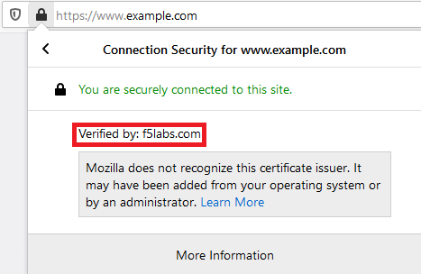

.. role:: raw-html(raw)
   :format: html

Confirm Service Chain and Security Policy rules are working as expected
~~~~~~~~~~~~~~~~~~~~~~~~~~~~~~~~~~~~~~~~~~~~~~~~~~~~~

-  Browse to ``https://www.example.com`` on your Windows client

-  Verify that :raw-html:`<i>https://www.example.com</i>` is still being intercepted by confirming the certificate is signed/verified by **f5labs.com** 

   |ff-f5labs-verified|

-  Verify that the Squid Proxy is seeing decrypted traffic:

   -  Start a console session to **Service - ExpProxy** (Components > Service - ExpProxy > ACCESS > Web Shell)

   -  Type ``tailf /var/log/squid3/access.log`` in the web console and hit Enter

   -  Visit a few secure (HTTPS) websites (non-banking) using Firefox on the Windows 10 Desktop and confirm that access is being logged. You should see log entries of the URLs visited.
   
   -  Visit a financial institution (ex. https://www.chase.com) and verify that SSL Orchestrator is not intercepting by confirming that the verification is done by a trusted CA (ex. Entrust, Inc.). If the traffic was intercepted the connection/certificate would have been verified by f5labs.com. Because you are bypassing **Financial Institutions** in the SSL Orchestrator Security Policy and this website is a financial institution, the origin server's public certificate is presented to the client.
   
   -  Confirm that the explicit proxy service is not seeing this bypassed (encrypted) traffic

-  Verify that the Cisco Firepower TAP is seeing both intercepted and bypassed traffic:

   -  Start a console session to **Service - TAP** (Components > Service - TAP > ACCESS > Web Shell)

   -  Type the following command to verify that traffic is being sent to the TAP service:

         ``tcpdump -nnni eth1 not arp and not icmp -X``

   -  Visit a financial institution website that is bypassed and verify that a copy of the traffic is seen on the TAP device

   -  Since the traffic is not intercepted/decrypted you will not be able to see any intelligible output (ex. an HTTP GET request)

   -  Visit ``https://www.google.com/`` and you should see some recognizable text in the packet dump
   
      -  To verify, type the following command:

            ``tcpdump -nnni eth1 not arp and not icmp -X | egrep 'Agility'``

   -  Since SSL Orchestrator is intercepting/decrypting https://www.google.com, you are able to see into the payload of this communication and therefore the grep filter you applied should display output when you search for ``'Agility 2020'`` in the browser, similar to the example below:

      |image20|

.. |image20| image:: ../images/image020.png
   :width: 810px
   :height: 140px
