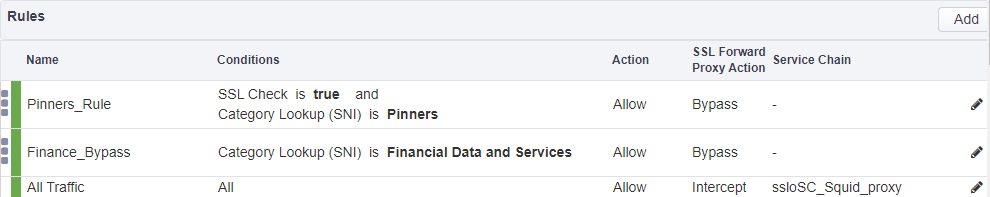

Scenario
--------

With the increase in the number of security incidents that have made the news lately, your organization has updated its security policy to log all user traffic flowing through the SSL Orchestrator irrespective of whether the traffic has been inspected or bypassed. A new appropriately sized Cisco Firepower TAP device has been purchased and has been cabled to the SSL Orchestrator device. As the Administrator of SSL Orchestrator, your manager is asking you to do the following:

1) In addition to sending Internet-bound traffic to a Squid proxy, this traffic now needs to be copied to a Cisco Firepower

2) Traffic that was previously bypassed and sent directly to the Internet (skipping the Squid proxy) needs to be copied (still encrypted) to the Cisco Firepower

Lab Overview
------------

This lab assumes familiarity with SSL Orchestrator. The lab is pre-staged with a deployment that is configured with the following Security Policy:

By the end of this module you will have modified the above Security Policy to satisfy the requirements from the scenario described.
